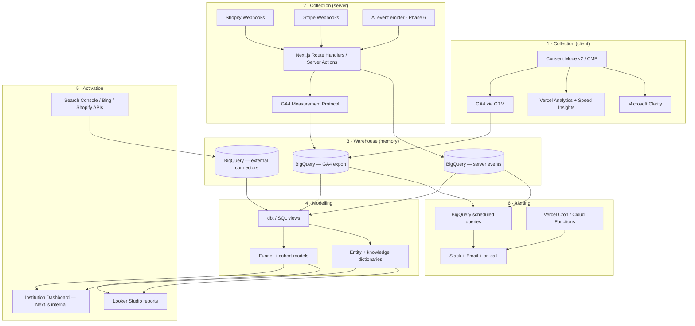
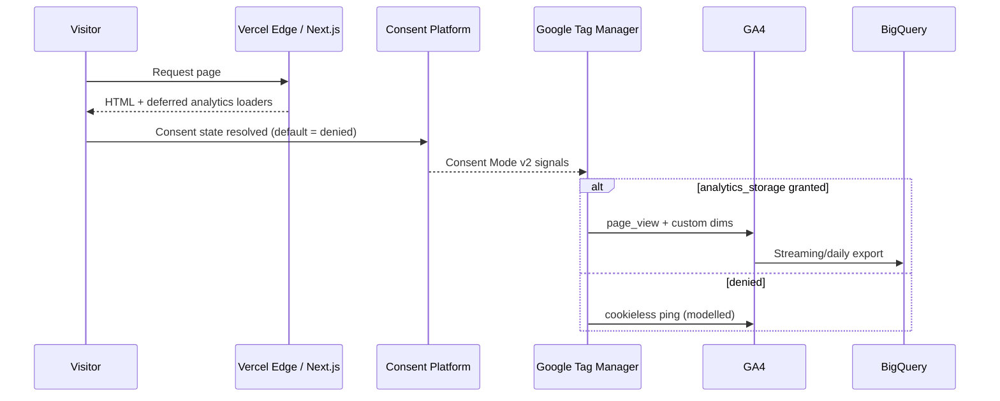
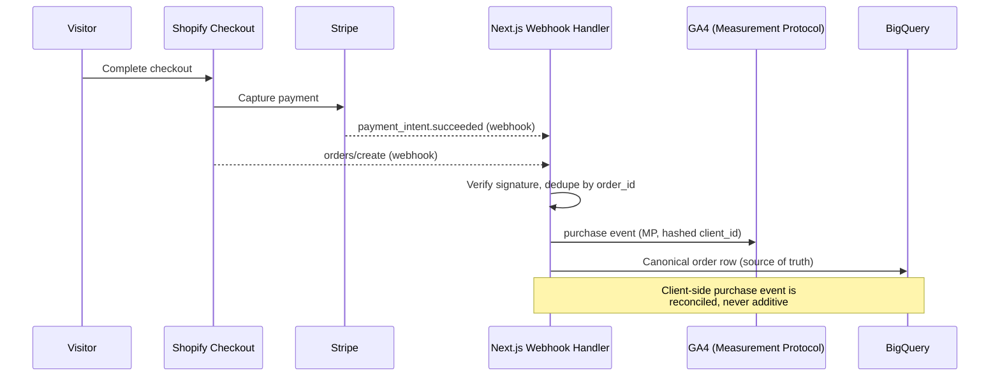
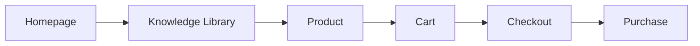
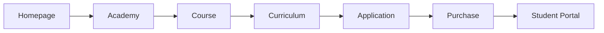
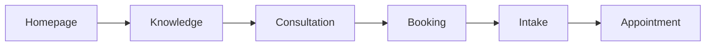
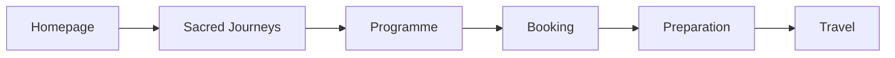
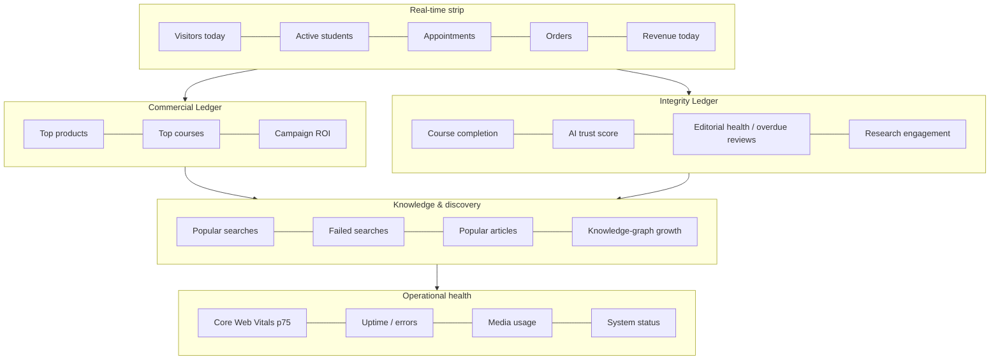

# Sunnah Remedies — Phase 7
## Institutional Intelligence Platform
### Engineering Specification for Cursor

---

**Document type:** Implementation specification (non-code blueprint)
**Phase:** 7 of the Sunnah Remedies build programme
**Status:** Ready for engineering
**Depends on:** Phase 1 (Design System), Phase 2 (Sanity CMS), Phase 3 (Cloudinary), Phase 4 (Shopify + Stripe), Phase 5 (Search/SEO/Knowledge), Phase 6 (AI Institution)
**Prepared by:** Chief Data & Institutional Intelligence Architect

---

## 0. Scope & Guardrails

This phase installs an intelligence layer *on top of* the existing institution. It observes; it does not alter.

**In scope**
- Measurement, collection, warehousing, modelling, visualisation and alerting of institutional behaviour and performance.

**Explicitly out of scope — do not touch**
- No redesign of the website.
- No changes to typography, the five-typeface system, or the design tokens.
- No changes to layouts, grids, or the isnād brass rule.
- No changes to routing, content models, or commerce/clinical flows except to *emit events* from them.

The only permitted modifications to existing surfaces are (a) the insertion of tracking hooks, (b) the addition of `data-analytics-*` attributes, and (c) server-side event emission from existing API routes and webhooks. These must be invisible to the visitor and must not affect rendered output.

---

## 1. Objective

The deliverable is not analytics. It is **institutional intelligence**: a real-time, warehouse-backed platform through which leadership can understand — and continuously improve — education, clinical service, research, commerce, editorial quality, AI performance and operational excellence.

Analytics answers *what happened*. This platform is built to answer *what is happening now*, *why*, and *what the institution should do next*.

### 1.1 The governing principle — "Two Ledgers, One Standard"

The institution's integrity principle carries directly into its measurement. Every metric is classified into one of two ledgers:

- **The Integrity Ledger** — trust, editorial soundness, hadith sourcing fidelity, clinical safety, AI truthfulness, knowledge completeness.
- **The Commercial Ledger** — revenue, conversion, order value, enrolment, campaign performance.

The Integrity Ledger holds **veto power** over the Commercial Ledger. This is enforced in the platform: no commercial metric is ever displayed on the executive dashboard without its paired integrity metric beside it (e.g. course revenue is never shown without course completion *and* knowledge-gap rate). The data model makes it structurally impossible to optimise commerce while blind to trust.

---

## 2. Analytics Philosophy (Part One)

**Every important action becomes measurable — and every measurement serves a decision.**

Ten measurement domains, each mapped to an owner and a ledger:

| # | Domain | Measures | Primary ledger |
|---|--------|----------|----------------|
| 1 | Learning | enrolment, progression, completion, mastery | Integrity |
| 2 | Trust | return visits, dwell, citation clicks, review recency | Integrity |
| 3 | Knowledge consumption | article reads, scroll completion, entity views | Integrity |
| 4 | Commerce | views → cart → purchase, AOV, repeat rate | Commercial |
| 5 | Clinical engagement | consultation funnel, intake completion, attendance | Integrity |
| 6 | Editorial quality | completion rate, freshness, review dates, gaps | Integrity |
| 7 | Research engagement | reference clicks, citation depth, download depth | Integrity |
| 8 | Search behaviour | queries, zero-result rate, refinement, exits | Both |
| 9 | AI interactions | questions, confidence, citation, fallback, satisfaction | Integrity |
| 10 | Operational efficiency | web vitals, uptime, error rates, deploy health | Commercial |

**Design principles**
1. **Decision-first** — no metric is collected unless a named person would act on it. Vanity metrics are prohibited.
2. **Warehouse as institutional memory** — GA4 and vendor tools are collectors; BigQuery is the single source of truth. All reporting resolves to the warehouse.
3. **Server-truth for money and safety** — commerce, clinical and AI events are emitted server-side (Measurement Protocol + webhooks), never trusted from the browser alone.
4. **Privacy is a precondition, not a patch** — Consent Mode v2 gates collection from the first byte.
5. **Performance budget is inviolable** — the intelligence layer may not regress Core Web Vitals (see Part Fifteen).
6. **Semantic, stable taxonomy** — one event dictionary governs every tool.

---

## 3. System Architecture

Six layers, from browser to boardroom.



**Layer responsibilities**

1. **Collection (client)** — GA4 loaded through Google Tag Manager (single container, consent-gated), Vercel Analytics + Speed Insights (first-party, script-free via `@vercel/analytics`), Microsoft Clarity (behavioural), all held behind the Consent Management Platform.
2. **Collection (server)** — the reliable path for money, clinical and AI events. Next.js route handlers and server actions emit to GA4 via the Measurement Protocol and write a canonical copy to BigQuery. Shopify and Stripe webhooks are the *source of truth* for revenue.
3. **Warehouse** — GA4 → BigQuery native export (daily + streaming) plus first-party server events plus external connectors (Search Console, Bing, Shopify Admin). This is institutional memory and is never purged on GA4's 14-month cycle.
4. **Modelling** — dbt (or scheduled SQL views) transforms raw events into funnels, cohorts, entity dictionaries and the two-ledger marts.
5. **Activation** — a custom internal Next.js dashboard (the "Institution Dashboard") for real-time leadership view; Looker Studio for scheduled reporting; live API pulls for SEO and commerce.
6. **Alerting** — scheduled queries and cron jobs detect anomalies and route them to Slack, email and on-call.

### 3.1 Why this architecture

- **GTM over hard-coded gtag** — lets non-engineers manage tags without redeploys, and centralises consent.
- **Server-side for commerce** — ad-blockers and Consent Mode denial suppress ~15–30% of client purchase events; webhooks recover 100% of revenue truth.
- **BigQuery as spine** — GA4's UI is sampled and time-boxed; the warehouse is unsampled, permanent and joinable to Shopify, Sanity and AI logs.
- **Custom dashboard, not just Looker** — leadership needs one screen honouring the two-ledger rule; Looker serves analysts.

### 3.2 Data flow — a page view



### 3.3 Data flow — a purchase (server-truth)



---

## 4. Google Analytics 4 (Part Two)

**Property model:** one GA4 property, one data stream per domain, unified under a single GTM container. Cross-domain tracking links the primary site, the student portal, and the booking subdomain.

### 4.1 Configuration matrix

| Area | Specification |
|------|---------------|
| Property | Single GA4 property `Sunnah Remedies — Production`; separate `— Staging` property, never mixed |
| Data streams | Web stream(s) per domain; cross-domain list configured in stream settings |
| Enhanced measurement | Enabled: scrolls, outbound clicks, site search, file downloads, video. Form-interaction left off (custom events used instead) |
| Enhanced Ecommerce | Full item-scoped schema (see §4.4) emitted for both Shopify products and Academy courses |
| Google Signals | **Off** by default (privacy posture); revisited only with DPIA sign-off |
| Reporting identity | Blended (device + modelled), never PII |
| Data retention | Event data 14 months (max); warehouse holds the permanent record |
| IP handling | GA4 does not store IP; documented for the ROPA |
| Internal traffic | Filtered by internal IP list + `traffic_type` |
| BigQuery link | Enabled day one — daily export **and** streaming export |

### 4.2 Event taxonomy rules

- **Naming:** `snake_case`, `object_action` order (e.g. `course_enrol`, `article_complete`, `search_zero_result`).
- **Reserved names** (GA4 automatic/recommended) are used where they exist (`purchase`, `add_to_cart`, `view_item`, `sign_up`, `login`, `search`, `select_content`). Custom domains extend, never rename.
- **No PII in any parameter, ever** — no email, name, phone, address, DOB. Patient/student identity lives only in first-party systems and is joined in the warehouse by pseudonymous keys.
- Max 25 parameters/event, 500 distinct event names — governed by the tracking plan, not ad hoc.

### 4.3 Custom event catalogue (by domain)

| Domain | Events |
|--------|--------|
| Editorial | `article_view`, `article_read_25/50/75/100`, `article_complete`, `citation_click`, `reference_click`, `internal_link_click`, `topic_view` |
| Knowledge | `search`, `search_refine`, `search_zero_result`, `entity_view` (disease/herb/hadith/verse), `graph_traverse`, `faq_expand` |
| Commerce | `view_item`, `view_item_list`, `select_item`, `gallery_interact`, `add_to_cart`, `remove_from_cart`, `begin_checkout`, `add_shipping_info`, `add_payment_info`, `purchase`, `refund` |
| Academy | `course_view`, `curriculum_view`, `course_application_start`, `course_enrol`, `lesson_start`, `lesson_complete`, `video_progress`, `quiz_attempt`, `quiz_complete`, `certificate_issued`, `revision_open`, `tutor_query` |
| Clinical | `consultation_view`, `booking_start`, `intake_start`, `intake_complete`, `appointment_booked`, `appointment_attended` |
| Journeys | `journey_view`, `programme_view`, `journey_booking_start`, `journey_deposit`, `preparation_open` |
| AI | `ai_query`, `ai_response`, `ai_citation_shown`, `ai_fallback`, `ai_recommendation`, `ai_feedback`, `translation_used` |
| Trust/system | `newsletter_signup`, `account_create`, `error_boundary`, `consent_update` |

### 4.4 Enhanced Ecommerce item schema

Item-scoped parameters standardised across products **and** courses so commerce and Academy report through one funnel model:

`item_id`, `item_name`, `item_brand` (= "Sunnah Remedies"), `item_category` (Apothecary / Academy / Sacred Journeys), `item_category2` (sub-pillar), `item_variant`, `price`, `quantity`, `currency`, `coupon`, `item_list_name`, `index`.

### 4.5 Custom dimensions (registered)

| Dimension | Scope | Example values |
|-----------|-------|----------------|
| `pillar` | event | apothecary / academy / journeys / knowledge |
| `content_type` | event | article / product / course / entity / consultation |
| `entity_type` | event | disease / herb / product / hadith / verse |
| `hadith_grade` | event | sahih / hasan / daif — Integrity Ledger tag |
| `content_freshness` | event | fresh / due_review / stale |
| `ai_confidence_band` | event | high / medium / low |
| `funnel_stage` | event | threshold / corridor / pathway |
| `user_segment` | user | visitor / patient / student / researcher / customer |
| `student_status` | user | prospect / applicant / enrolled / graduate |
| `consent_state` | user | granted / denied / modelled |

### 4.6 Custom metrics

`reading_seconds`, `scroll_pct`, `video_pct`, `quiz_score`, `ai_confidence`, `citation_count`, `search_refinements`.

### 4.7 User properties

`user_segment`, `student_status`, `preferred_language`, `first_pillar_touched`, `lifecycle_stage`. Set server-side where possible; never contain PII.

### 4.8 Conversions (key events) & goals

Marked as key events, each paired with an integrity guard in reporting:

| Key event | Ledger | Integrity pair shown alongside |
|-----------|--------|-------------------------------|
| `purchase` | Commercial | refund rate, product review recency |
| `course_enrol` | Commercial | completion rate, knowledge-gap rate |
| `appointment_booked` | Integrity | intake completion, attendance rate |
| `journey_deposit` | Commercial | preparation-material engagement |
| `newsletter_signup` | Integrity | subsequent article completion |
| `certificate_issued` | Integrity | average mastery score |

### 4.9 Content groups

`pillar`, `content_type`, `topic_cluster` (from the Phase 5 knowledge taxonomy) — enabling "how does the Academy perform vs the Apothecary vs the Library" reporting natively.

### 4.10 Audience segments

Behavioural, non-PII: *Engaged Readers* (3+ article completes/30d), *Course Considerers* (curriculum view, no enrol), *Cart Abandoners*, *Returning Patients*, *Researchers* (high citation-click depth), *AI Power Users*. Used for reporting and, later, consented remarketing only.

### 4.11 Attribution

Data-driven attribution as the model of record; cross-channel; 90-day lookback for acquisition, documented so commerce and editorial credit are not conflated.

### 4.12 BigQuery export

Enabled from day one (daily + streaming). The warehouse is the reporting spine. Named dataset `analytics_ga4_prod`. Partition by event date; cluster by `event_name`. See Part Fifteen for cost controls.

### 4.13 Consent Mode v2

`analytics_storage`, `ad_storage`, `ad_user_data`, `ad_personalization` all **default = denied** (region = EEA + UK, and applied globally as institutional posture). Updated only on explicit CMP grant. Advanced consent mode enabled so cookieless pings feed GA4 modelling. Detailed in Part Fourteen.

---

## 5. Vercel Analytics & Speed Insights (Part Three)

First-party, privacy-light, edge-native — the operational-health collector.

| Capability | Specification |
|------------|---------------|
| Web Analytics | `@vercel/analytics` — cookieless page/traffic counts, no PII, immune to most ad-blockers |
| Speed Insights | `@vercel/speed-insights` — **field** Core Web Vitals (LCP, INP, CLS, FCP, TTFB) at real-user p75 |
| Attribution | Route- and component-level vitals to find slow templates without lab guesswork |
| Server metrics | Function duration, cold starts, invocation counts via Vercel Observability |
| Edge performance | Edge middleware latency, cache HIT/MISS ratios, region distribution |
| API performance | Route-handler p50/p95/p99 latency and error rate per endpoint |
| Deployment metrics | Build duration, deployment frequency, and vitals **regression per deploy** (release-gated) |
| Traffic | Top paths, referrers, device/geo — corroborates GA4 where consent suppresses it |

**Rule:** Vercel field vitals — not Lighthouse lab scores — are the source of truth for the performance budget. Every deploy is checked against the previous release's p75; a regression beyond threshold blocks promotion (see Part Fifteen & roadmap).

---

## 6. Microsoft Clarity (Part Four)

The qualitative, "why" layer — free, unsampled, consent-gated. Answers what the funnels cannot: *where friction lives*.

| Capability | Use |
|------------|-----|
| Heatmaps | Attention on article, product and course pages — validates the manuscript grid without changing it |
| Scroll depth | Corroborates GA4 `_read_` events; finds premature drop-off |
| Click maps | What visitors actually tap, including non-interactive elements |
| Session recordings | Sampled, consent-gated, PII-masked replays for funnel-break diagnosis |
| Dead clicks | Elements users expect to be clickable but aren't |
| Rage clicks | Repeated frustrated clicking — a frustration signal |
| Quick backs | Immediate back-navigation — a relevance/expectation-mismatch signal |
| Frustration score | Clarity's composite, tracked per template and per pillar |
| Journey visualisation | Path exploration into and out of key pages |
| Device / mobile / desktop | Split behaviour analysis; mobile-first diagnosis |

**Privacy hardening (mandatory):** input masking = **strict** (all text inputs masked), recordings gated behind consent, intake/clinical/checkout fields excluded from capture, PII scrubbing on. Clarity is configured never to record the student portal's authenticated PII surfaces.

**Integration:** GA4 ↔ Clarity linked so a GA4 segment (e.g. cart abandoners) can be opened as Clarity recordings for root-cause analysis.

---

## 7. Institutional Funnels (Part Five)

Funnels are modelled in BigQuery over the event stream (not only GA4's UI funnel explorer), so every stage-to-stage conversion is queryable, cohortable and alertable. Each funnel maps to the institution's **Threshold → Corridors → Pathways** model.

### 7.1 Commerce (Apothecary) funnel



Stage events: `page_view`(home) → `article_view`/`entity_view` → `view_item` → `add_to_cart` → `begin_checkout` → `purchase`.
Tracked conversions: home→knowledge, knowledge→product, product→cart, cart→checkout, checkout→purchase, plus **end-to-end** knowledge-attributed revenue (does the Library drive the shop?).

### 7.2 Course (Academy) funnel



Stage events: `page_view` → `course_view` (Academy list) → `course_view` (detail) → `curriculum_view` → `course_application_start` → `purchase`(course item) → first `lesson_start`.
Key insight metric: **application-to-enrol** and **enrol-to-first-lesson** (activation), because a course sold but never started is an Integrity-Ledger failure.

### 7.3 Consultation (Clinical) funnel



Stage events: `page_view` → `entity_view`/`article_view` → `consultation_view` → `booking_start` → `intake_complete` → `appointment_attended`.
Integrity guard: **intake completion rate** and **attended vs booked** are primary; booking volume alone is never celebrated.

### 7.4 Journey (Sacred Journeys) funnel



Stage events: `page_view` → `journey_view` → `programme_view` → `journey_booking_start`/`journey_deposit` → `preparation_open` → travel confirmation.
Duty-of-care guard: **preparation-material engagement before travel** is a tracked, alerting metric.

### 7.5 Funnel model outputs (all funnels)

For every funnel the model produces: stage counts, stage-to-stage conversion %, overall conversion %, median time-between-stages, biggest drop-off stage, and a 30/90-day trend. Segmented by device, pillar, source, and `user_segment`. Drop-off stages feed Clarity recording queries automatically.

---

## 8. Tracking Plan & Event Taxonomy (Architecture Deliverable)

The tracking plan is the **contract** between design, engineering and data. It lives as a versioned file in the repo (`/analytics/tracking-plan.yaml`) and is the single source every tool derives from. No event ships that is not in the plan; no plan entry ships without an owner and a decision it serves.

### 8.1 Tracking plan schema (per event)

| Field | Meaning |
|-------|---------|
| `event_name` | canonical `object_action` name |
| `trigger` | precise user/system action |
| `surface` | page/component that emits it |
| `source` | client (GTM) / server (MP) / webhook |
| `parameters` | typed list with allowed values |
| `custom_dimensions` | which registered dims attach |
| `ledger` | integrity / commercial / both |
| `key_event` | yes/no |
| `decision_served` | the named decision this enables |
| `owner` | accountable person/role |
| `consent_category` | analytics / ads / functional |
| `pii_risk` | asserted none, with reviewer |

### 8.2 Governance

- Additions/changes go through a lightweight schema PR reviewed by the data owner.
- CI validates emitted events against the plan in staging (contract test) — see Testing Checklist.
- A quarterly taxonomy review prunes unused events and confirms every event still serves a live decision.

---

## 9. Course Analytics (Part Six)

Source of truth blends GA4 behavioural events with the LMS/portal's own progress records (server events), joined in the warehouse.

| Metric | Definition | Ledger |
|--------|------------|--------|
| Enrolments | `course_enrol` (server-confirmed) | Commercial |
| Lesson completion | `lesson_complete` / `lesson_start` per course | Integrity |
| Drop-off | Lesson index where cohorts stall | Integrity |
| Completion rate | Certificates ÷ enrolments per cohort | Integrity |
| Quiz performance | Attempts, pass rate, distribution | Integrity |
| Average score | Mean `quiz_score` per lesson/course | Integrity |
| Certificates issued | `certificate_issued` count | Integrity |
| Student engagement | Sessions/week, active-days ratio | Integrity |
| Time spent | `reading_seconds` + `video_pct` aggregated | Integrity |
| Video completion | `video_progress` 25/50/75/100 | Integrity |
| Downloads | Resource `file_download` per lesson | — |
| Revision activity | `revision_open` re-visits post-completion | Integrity |
| AI tutor usage | `tutor_query` volume + satisfaction | Integrity |
| Popular lessons | Ranked by completes + engagement | — |
| **Knowledge gaps** | Lessons/quizzes with high fail or high tutor-query density → curriculum signal | Integrity |

**Knowledge-gap model:** any lesson whose quiz pass rate falls below threshold *or* whose `tutor_query` density spikes is flagged as a curriculum weakness and surfaced to the Academy owner. This is the Academy's continuous-improvement loop.

---

## 10. Commerce Analytics (Part Seven)

Revenue truth is **Shopify + Stripe webhooks**, reconciled against GA4 for behavioural attribution. GA4 is never trusted for revenue totals.

| Metric | Source | Notes |
|--------|--------|-------|
| Product views | GA4 `view_item` | by pillar, list, source |
| Gallery interaction | `gallery_interact` | Cloudinary asset engagement |
| Add to cart | `add_to_cart` | + cart-abandon segment |
| Wishlist (future) | reserved `add_to_wishlist` | schema stubbed now |
| Checkout | `begin_checkout` → `add_payment_info` | step completion |
| Purchase | webhook (truth) | GA4 reconciled |
| Revenue / net revenue | Stripe | gross, discounts, refunds netted |
| Average order value | warehouse | by cohort, campaign, country |
| Repeat purchase rate | warehouse | pseudonymous customer key |
| Refunds | `refund` + Stripe | rate as Integrity guard |
| Discount usage | `coupon` param | margin impact |
| Bundles | item-list analysis | attach rate |
| Popular products | ranked | views, conversion, revenue |
| **Low-conversion products** | high view / low buy | merchandising + content signal |
| Stock performance | Shopify inventory | sell-through, low-stock alerts |
| Country performance | GA4 geo + Shopify | conversion by market |
| Campaign performance | UTM + attribution | CAC vs AOV where knowable |

**Integrity guards on commerce:** refund rate, product-review recency, and "purchased-but-low-review" flags sit beside every revenue view. Low-conversion products are examined for *content* gaps (missing knowledge links) before price changes.

---

## 11. Editorial Analytics (Part Eight)

The Library's quality loop. Joins GA4 engagement with Sanity's editorial metadata (author, review date, hadith grades, citations).

| Metric | Definition |
|--------|------------|
| Most read | `article_view` ranked |
| Most shared | outbound share events |
| Most cited | `citation_click` inbound depth |
| Most bookmarked (future) | reserved event, stubbed |
| Average reading time | `reading_seconds` p50 |
| Completion rate | `article_complete` ÷ views |
| Scroll depth | `scroll_pct` distribution |
| Citation usage | `citation_click` per article |
| Reference clicks | `reference_click` — research depth |
| Internal link clicks | `internal_link_click` — corridor traversal |
| Popular topics | content-group rollup |
| Trending topics | 7-day acceleration vs baseline |
| **Editorial gaps** | high search demand + low/no content |
| Content freshness | `content_freshness` dim from review date |
| Review dates | overdue-review count (Integrity alert) |

**Editorial-gap model** (joins Part Twelve/Nine): where `search_zero_result` or high-demand queries have no matching article, the platform produces a ranked commissioning list for editorial. **Freshness** drives an alert when hadith-bearing or clinical content passes its review date — a direct Integrity-Ledger safeguard.

---

## 12. Knowledge Analytics (Part Nine)

Instruments the Phase 5 knowledge graph and search. This is where the institution learns what people are *seeking*.

| Metric | Signal |
|--------|--------|
| Most searched diseases | demand for clinical content |
| Most searched herbs | demand for Apothecary/monographs |
| Most searched products | commercial intent |
| Most searched hadith | scholarly demand |
| Most searched Qur'anic verses | scholarly demand |
| Popular ingredients | cross-links product ↔ knowledge |
| Popular research | reference/download depth |
| Popular FAQs | `faq_expand` ranking |
| Most connected entities | graph centrality × views |
| Knowledge graph usage | `graph_traverse` paths |
| **Failed searches** | `search_zero_result` — the gap engine |
| **Knowledge gaps** | demand − supply per entity |

**The gap engine:** `search`, `search_zero_result` and `search_refine` are the institution's most valuable intelligence. Every zero-result and every high-refinement query is logged with its term, normalised against the entity dictionary, and rolled into a weekly **Knowledge Gap Report** that drives both editorial commissioning (Part Eleven) and Academy curriculum. Search demand with no supply is treated as a standing institutional to-do list.

---

## 13. SEO Intelligence (Part Ten)

A complete SEO dashboard fed by external connectors into BigQuery, joined to on-site behaviour. Split into **classic search** and **generative-engine (AI) visibility** — the latter is an emerging discipline (GEO) and is specced pragmatically.

### 13.1 Classic search — connectors & metrics

| Metric | Source |
|--------|--------|
| Keywords, rankings | Search Console API (+ optional Ahrefs/Semrush connector) |
| Traffic, CTR, impressions | Search Console API → BigQuery daily |
| Backlinks | Third-party connector (Ahrefs/Semrush) |
| Internal links | Crawl job over the Sanity content graph |
| Schema coverage | Crawl + Rich Results validation; % of pages with valid JSON-LD |
| Indexation | Search Console coverage API; indexed vs submitted |
| Core Web Vitals | Vercel field data + CrUX (Part Five) |
| Bing metrics | Bing Webmaster Tools API |
| Image rankings | Search Console (image search) |
| Video rankings | Search Console (video) |
| Featured snippets | SERP position 0 tracking (rank tracker) |

**Connector cadence:** Search Console and Bing pull nightly into `analytics_seo_prod`; crawl-based checks (schema, internal links, broken links) run on a scheduled job and on content publish (Sanity webhook).

### 13.2 Generative-engine visibility (AI citations)

Tracking whether Sunnah Remedies is *cited by* AI answer engines. No single API exposes this cleanly, so a triangulated approach:

| Signal | Method |
|--------|--------|
| ChatGPT / Claude / Perplexity / Google AI Mode **referral traffic** | Referrer + landing-page analysis in GA4/BigQuery; classify `chat.openai.com`, `perplexity.ai`, `claude.ai`, Google AI surfaces into an "AI referral" channel group |
| **Citation presence** | Scheduled prompt-panel test: a fixed set of institutional queries run against public AI engines (via their APIs where permitted, or a monitored manual/agent panel), logging whether the domain is cited and in what position |
| Third-party GEO monitors | Optional connector to an AI-visibility tool for share-of-voice |
| Schema & entity readiness | % of entities with complete structured data and citations — the on-site lever that improves AI citability |

**Reporting:** an "AI Visibility" panel shows referral trend by engine, citation rate on the institutional prompt panel, and citation position, with the honest caveat that this discipline is nascent and estimates carry uncertainty. This is treated as *directional intelligence*, not exact measurement.

---

## 14. AI Analytics (Part Eleven)

Instruments the Phase 6 AI Institution. Every metric here sits on the **Integrity Ledger** — the AI must be *trustworthy* before it is *useful*.

| Metric | Definition | Why it matters |
|--------|------------|----------------|
| Questions asked | `ai_query` volume, by topic | demand signal |
| Topics | clustered query themes | feeds editorial + curriculum gaps |
| Knowledge retrieval | which sources the RAG pulled | grounding transparency |
| Confidence scores | `ai_confidence` band per response | quality gate |
| Citation usage | % responses with a cited source | **trust metric** |
| Fallback responses | `ai_fallback` rate | where the AI declines/defers |
| Knowledge gaps | queries with low confidence + no citation | direct content commission |
| **Hallucination prevention** | rate of grounded vs ungrounded answers; uncited-claim flags | safety guard |
| Recommended products | `ai_recommendation` → downstream `view_item`/`purchase` | assistive value |
| Recommended courses | `ai_recommendation` → `course_view`/`enrol` | assistive value |
| Consultation recommendations | AI → `consultation_view`/`booking` | clinical routing quality |
| Translation usage | `translation_used` by language pair | reach + Arabic-fidelity check |
| AI satisfaction | `ai_feedback` (thumbs/rating) | user-perceived quality |

**Hallucination-prevention model:** every AI response logs whether each factual claim is grounded in a retrieved, cited source. Responses with uncited claims — especially any touching hadith, Qur'anic verses, or clinical guidance — are flagged, sampled for human review, and counted in a **trust score** shown on the executive dashboard. A rising uncited-claim rate triggers an immediate Integrity alert. Low-confidence + zero-citation queries feed the same gap engine as failed searches.

---

## 15. Institution Dashboard (Part Twelve)

A custom, real-time executive view — a protected Next.js route inside the existing app (e.g. `/intelligence`), behind role-based auth, querying the warehouse through a secured server-side API. **Not** a redesign of the public site; a separate internal surface using existing design tokens for consistency.

### 15.1 Layout — "health at a glance," two-ledger enforced

Every commercial tile is paired with its integrity tile. Leadership can never read revenue without reading trust.



### 15.2 Tiles (all required by the brief, ledger-tagged)

Visitors today · Active students · Appointments · Orders · Revenue · Top products · Top courses · Popular articles · Popular searches · AI conversations · Editorial health · SEO performance · Course completion · Research engagement · Knowledge-graph growth · Media usage · System health.

### 15.3 Technical model

- **Data:** server route reads pre-aggregated marts from BigQuery (never raw scans on page load); real-time strip reads GA4 Realtime API + streaming inserts.
- **Caching:** marts refreshed on schedule (see roadmap); dashboard queries hit cached materialised views with a short TTL. Cost-safe (Part Fifteen).
- **Auth:** role-based; leadership (full), analyst (full + drill), domain owners (their pillar). Every load is audit-logged.
- **Drill-down:** each tile links to the relevant Looker Studio report or Clarity segment.
- **Refresh:** real-time strip ~60s; ledgers 15 min; SEO/operational hourly–daily per source cadence.

---

## 16. Alerts & Reporting (Part Thirteen)

### 16.1 Scheduled reports

| Report | Cadence | Audience | Contents |
|--------|---------|----------|----------|
| Daily pulse | daily | leadership | traffic, orders, revenue, appointments, AI trust score, any red alerts |
| Weekly institution | weekly | leadership + owners | funnel conversions, top/bottom content, knowledge-gap list, SEO movement |
| Monthly board | monthly | board | full two-ledger review, cohort trends, growth |
| Editorial | weekly | editorial | reads, completion, overdue reviews, commissioning list |
| Commerce | weekly | commerce | revenue, AOV, refunds, low-conversion products, stock |
| SEO | weekly | growth | rankings, CTR, indexation, AI-visibility trend, broken links |
| AI | weekly | AI + scholarly | queries, confidence, citation rate, uncited-claim flags, fallbacks |
| Course | weekly | Academy | enrol, completion, drop-off, quiz gaps, tutor usage |
| Operational | daily | engineering | vitals, uptime, errors, deploy regressions |

Reports are generated from BigQuery scheduled queries → rendered to Looker Studio / email digest. No manual assembly.

### 16.2 Real-time alerts (threshold + anomaly)

| Alert | Trigger | Route |
|-------|---------|-------|
| Traffic spike/drop | ±N σ vs baseline | Slack #alerts |
| SEO issue | ranking/indexation drop, coverage errors | Slack + email |
| Broken links | crawl/`error_boundary` detection | Slack |
| Failed searches | `search_zero_result` rate spike | Slack (editorial) |
| Low stock | Shopify threshold | Slack (commerce) + email |
| Checkout failures | `begin_checkout` with no `purchase` webhook spike | **PagerDuty/on-call** |
| Performance degradation | CWV p75 regression > threshold | Slack (eng) + block deploy |
| **AI trust drop** | uncited-claim / low-confidence rate spike | **Integrity on-call** |
| Overdue reviews | hadith/clinical content past review date | Slack (scholarly) |

Alert design follows severity tiers (info / warn / page) with de-duplication and quiet hours to prevent fatigue.

---

## 17. Privacy & Compliance (Part Fourteen)

Given clinical and student data, this is a **first-order** requirement, not a footnote. The institution operates under UK GDPR and GDPR.

### 17.1 Consent

- **Certified CMP** implementing Google Consent Mode v2, IAB TCF-aligned.
- **Default = denied** for all storage categories (`analytics_storage`, `ad_storage`, `ad_user_data`, `ad_personalization`) before any interaction.
- Granular categories: strictly-necessary (always on), analytics, functional, marketing. No pre-ticked boxes; reject is as easy as accept.
- **Consent applied globally** as institutional posture, not only EEA/UK.
- Consent state stored, versioned, and logged (`consent_update` event); re-prompt on policy change.
- Advanced Consent Mode → GA4 behavioural modelling fills denied gaps without cookies.

### 17.2 GDPR / UK GDPR obligations

| Requirement | Implementation |
|-------------|----------------|
| Lawful basis | Consent for analytics; legitimate interest documented where used; explicit consent for any clinical data |
| Data minimisation | Only events serving a decision; no PII in analytics ever |
| PII protection | Patient/student identity stays in first-party systems; warehouse joins by salted pseudonymous keys |
| Purpose limitation | Tracking-plan `decision_served` field enforces it |
| Data retention | GA4 14 months; warehouse retention policy per data class, documented; auto-expiry on raw event tables |
| DSAR / erasure | Runbook to locate and delete a subject's pseudonymous records across GA4 (User Deletion API) + BigQuery |
| ROPA | This spec's data map feeds the Record of Processing Activities |
| DPIA | Required before enabling Google Signals or any remarketing; template referenced |
| Sub-processors | Google, Vercel, Microsoft, Shopify, Stripe listed with DPAs on file |
| International transfers | SCCs/adequacy documented per vendor |

### 17.3 Access & audit

- **Role-based access control** on the dashboard, BigQuery datasets, and GTM. Least privilege.
- **Audit logging** of every dashboard load, warehouse query, and config change (who, what, when).
- Clarity input-masking strict; recordings exclude all authenticated/clinical/checkout surfaces.
- Quarterly access review; offboarding revokes within SLA.

---

## 18. Performance Strategy (Part Fifteen)

**Non-negotiable: the intelligence layer must not regress Core Web Vitals.** The Phase 3/5 performance budget stands.

| Technique | Specification |
|-----------|---------------|
| Consent-gated loading | No analytics script executes before consent resolves; denied = no third-party JS |
| Deferred / async scripts | GTM, Clarity loaded `async`/`defer`, post-hydration, idle-time |
| Lazy loading | Non-critical tags fire on interaction or `requestIdleCallback` |
| Server-side events | Commerce/AI/clinical events emitted server-side — zero client weight, ad-block-proof |
| Edge collection | Vercel Analytics is edge-native and first-party |
| Batching | Client events batched/debounced (scroll, video progress) to limit beacons |
| Background reporting | All heavy aggregation runs in BigQuery scheduled queries, never in the browser |
| Caching | Dashboard reads cached materialised marts, not live scans |
| Script budget | Hard cap on added third-party bytes; measured per deploy |
| Regression gate | Vercel Speed Insights p75 checked each deploy; regression beyond threshold blocks promotion |

**Budget guardrail:** added analytics JavaScript (post-consent) must stay within an explicit KB budget defined in the tracking plan; INP and LCP p75 must not degrade release-over-release. Field data (not lab) is the arbiter.

---

## 19. Security Considerations (Architecture Deliverable)

| Area | Control |
|------|---------|
| Server credentials | GA4 MP secret, BigQuery service account, connector API keys in Vercel encrypted env / secret manager — never in client or repo |
| Webhook integrity | Shopify/Stripe signature verification; idempotency keys; replay protection |
| Warehouse access | Service accounts least-privilege; dashboard queries via a scoped read-only account |
| Dashboard | Auth + RBAC + rate limiting on the data API; no raw SQL from client |
| PII isolation | Enforced by schema; automated scans reject PII in analytics tables |
| Consent enforcement | Server refuses to store analytics rows lacking a valid consent flag |
| Supply chain | Pin analytics SDK versions; SRI where applicable; review GTM tag changes |
| Audit | Immutable audit log for config, access, deletion actions |

---

## 20. Folder Structure

The intelligence layer is additive and self-contained. It does not restructure existing app code.

```text
/analytics
  tracking-plan.yaml            # single source of truth (the contract)
  event-taxonomy.md             # human-readable dictionary
  /lib
    consent.ts                  # CMP + Consent Mode v2 wiring
    gtm.ts                      # GTM bootstrap (consent-gated)
    events.ts                   # typed client event emitters
    server-events.ts            # Measurement Protocol + BigQuery writer
    ecommerce.ts                # item schema builders (products + courses)
  /server
    /webhooks
      shopify.ts                # order truth
      stripe.ts                 # payment truth
      sanity.ts                 # publish → crawl/freshness triggers
    ai-events.ts                # Phase 6 AI event ingestion
    measurement-protocol.ts
  /warehouse
    /schemas                    # BigQuery table + view definitions
    /dbt                        # models: staging → funnels → marts → two-ledger
      /staging
      /funnels
      /marts
    /scheduled-queries          # reports + alert detectors
  /connectors
    search-console.ts
    bing-webmaster.ts
    shopify-admin.ts
    ai-visibility.ts            # GEO / referral classifier
  /dashboard                    # internal Next.js route (/intelligence)
    /api                        # secured, server-side warehouse reads
    /components                 # ledger-paired tiles (existing tokens)
  /alerts
    thresholds.yaml
    routes.ts                   # Slack / email / on-call
  /docs
    ropa.md  dpia-template.md  runbooks.md
/config
  gtm-container.json            # exported, version-controlled
  clarity-config.md
```

---

## 21. Implementation Roadmap

Phased so value lands early and privacy is never retrofitted.

| Stage | Focus | Key deliverables |
|-------|-------|------------------|
| **7.0 Foundations** | Consent + plumbing | CMP + Consent Mode v2 live; GA4 property + streams; GTM container; tracking-plan.yaml v1; staging property |
| **7.1 Core collection** | Client + server events | Editorial, knowledge, commerce, course, clinical, journey, AI events emitting; server-truth webhooks; Vercel Analytics + Speed Insights; Clarity (masked) |
| **7.2 Warehouse** | Memory | BigQuery export (daily + streaming); server-event tables; dbt staging models |
| **7.3 Models** | Meaning | Funnel models (all four); cohorts; entity + knowledge-gap dictionaries; two-ledger marts |
| **7.4 Connectors** | External intelligence | Search Console, Bing, Shopify Admin, AI-visibility classifier → warehouse |
| **7.5 Dashboard** | At-a-glance | Internal `/intelligence` route; ledger-paired tiles; real-time strip; RBAC + audit |
| **7.6 Reporting & alerts** | Automation | Scheduled reports; threshold + anomaly alerts; on-call routing |
| **7.7 Hardening** | Trust & speed | Privacy runbooks (DSAR/erasure); performance regression gate; security review; taxonomy governance |

Each stage ends with the relevant acceptance criteria (§24) met before the next begins.

---

## 22. Testing Checklist

- [ ] Every tracking-plan event fires with correct name, params, and custom dimensions (staging contract test in CI).
- [ ] No event carries PII (automated scanner on staging event stream).
- [ ] Consent denied → no analytics cookies/JS; only strictly-necessary present.
- [ ] Consent granted → events flow; `consent_update` logged.
- [ ] Consent Mode v2 signals verified in GA4 DebugView (granted, denied, modelled).
- [ ] Enhanced Ecommerce validates for both products and courses end-to-end.
- [ ] Server purchase (webhook) reconciles with client `purchase`; no double-count.
- [ ] All four funnels resolve correct stage counts vs manual query.
- [ ] BigQuery export populating (daily + streaming) with expected schema.
- [ ] Clarity masking verified on intake, checkout, portal — no PII in recordings.
- [ ] Cross-domain tracking preserves session across site ↔ portal ↔ booking.
- [ ] Dashboard tiles match warehouse ground-truth queries.
- [ ] Alerts fire on simulated conditions (low stock, checkout failure, CWV regression, AI trust drop).
- [ ] Performance: added JS within budget; CWV p75 unchanged vs pre-Phase-7 baseline.
- [ ] RBAC: each role sees only permitted data; audit log records access.
- [ ] Staging and production properties fully isolated.

---

## 23. Production Readiness Checklist

- [ ] CMP certified, Consent Mode v2 default-denied, tested across regions.
- [ ] ROPA updated; DPIA completed for any elevated processing; DPAs on file for all sub-processors.
- [ ] DSAR + erasure runbook tested against GA4 User Deletion API + BigQuery.
- [ ] Secrets in secret manager; no keys in client/repo; webhook signatures enforced.
- [ ] BigQuery cost controls: partitioning, clustering, query quotas, budget alerts.
- [ ] Materialised marts + caching in place; dashboard does no raw scans on load.
- [ ] Alert routing (Slack/email/on-call) verified with severity tiers + de-dup.
- [ ] Performance regression gate wired into deploy pipeline.
- [ ] Data retention policies applied and automated (expiry on raw tables).
- [ ] Runbooks + taxonomy governance documented and owned.
- [ ] Rollback plan: GTM/version pin to disable collection without a code deploy.

---

## 24. Acceptance Criteria

The platform is accepted when:

1. **Every institutional action in the tracking plan is measurable** and validated in the warehouse.
2. **Consent is default-denied**, fully compliant with UK GDPR/GDPR, with no PII anywhere in analytics.
3. **Revenue truth reconciles** between Shopify/Stripe and GA4 with zero double-counting.
4. **All four funnels** report stage-to-stage conversion, segmentable and cohortable.
5. **The Institution Dashboard** shows real-time health at a glance, with every commercial metric paired to its integrity metric (two-ledger rule enforced structurally).
6. **The gap engine** (failed searches + AI low-confidence + editorial demand) produces an actionable weekly commissioning list.
7. **AI trust** (citation rate, uncited-claim flags) is measured and alerting.
8. **Scheduled reports and alerts** run automatically with no manual assembly.
9. **Core Web Vitals p75 are not regressed** by the intelligence layer (field data).
10. **RBAC + audit logging** are enforced across dashboard and warehouse.

---

## 25. Future Scalability

- **BigQuery as the growth spine** — new sources (Riyadh/Copenhagen operations, new pillars) attach as datasets without re-architecture.
- **Predictive layer** — cohort and churn models, purchase-propensity, at-risk-student prediction, LTV — built on the existing warehouse.
- **Reverse-ETL / activation** — consented audiences pushed back to email/ads once DPIA-cleared.
- **Multi-region / multi-language** — `preferred_language` and locale dims already in the taxonomy; per-market reporting scales natively.
- **Wishlist, bookmarks, offline/POS** — reserved events already stubbed; dispensary POS and clinic systems join by pseudonymous key.
- **Warehouse-native BI expansion** — additional Looker Studio / semantic-layer models without touching collection.
- **Server-side GTM** — optional future move for fuller first-party collection and durability.

---

## 26. Migration Strategy

Phase 7 is largely greenfield instrumentation, but is introduced safely:

1. **Parallel run** — new GA4 + warehouse run alongside any existing measurement for one full reporting cycle; reconcile before decommissioning legacy.
2. **Backfill** — where historical Shopify/Search Console data exists, backfill the warehouse so trends don't start at zero.
3. **Staged rollout** — collection enabled behind a flag, first on staging, then a traffic percentage, then full — watching the performance gate at each step.
4. **Taxonomy versioning** — tracking plan is versioned; event schema changes are additive and backward-compatible; deprecations are announced, dual-emitted, then retired.
5. **Reversible** — GTM version pinning allows disabling any tag without a code deploy; warehouse is append-only, so no destructive migrations.
6. **Legacy sunset** — only after parallel-run reconciliation and sign-off against §24.

---

*End of Phase 7 specification. This document is the implementation blueprint for Cursor. It defines what to build and to what standard; it deliberately contains no code.*
