# Sunnah Remedies — Phase 8
## Operational Backbone & Workflow Automation
### Implementation Specification (Cursor Blueprint)

---

**Document type:** Engineering implementation specification
**Prepared for:** Cursor (build agent) and the Sunnah Remedies engineering team
**Phase:** 8 — Operational Excellence
**Status:** Ready for implementation
**Prerequisite phases:** 1 (Design System), 2 (Sanity CMS), 3 (Cloudinary), 4 (Shopify + Stripe), 5 (Search/SEO/Knowledge), 6 (AI Institution), 7 (Analytics & Institutional Intelligence) — all complete.

**Scope boundary (non-negotiable):** This phase adds an operational and automation layer *behind* the existing product. It does **not** redesign the website, alter typography, change layouts, or modify the institutional design language. Every visible surface produced by this phase (emails, dashboard, notifications) inherits the established identity — deep clinical green `#0A2B21`, the brass isnād rule, and the sanctioned type system (Fraunces, Newsreader, IBM Plex Mono, Amiri, Reem Kufi). No new visual language is introduced.

---

## 0. How to use this specification with Cursor

This document is the single source of truth for Phase 8. It is deliberately code-free: it defines architecture, data models, events, workflows, roles, and acceptance criteria. When implementing, Cursor should treat each Part as a work package, implement against the **event contract** (Section 3) rather than wiring services point-to-point, and satisfy the **acceptance criteria** (Section 24) before a package is considered done.

Three rules govern everything below:

1. **The website stays a fast, static-first reading surface.** No automation runs in the request/response path of a page render. All operational work happens in background functions, on webhooks, or on schedules.
2. **Publish once, propagate everywhere.** Editors and administrators perform one action; the system fans that action out to every downstream surface. Nobody updates the same fact twice.
3. **The Integrity Ledger holds a veto.** Any workflow that touches clinical claims, hadith sourcing, ʿaqīdah, or religious authority passes through a human approval gate. Automation prepares, sequences, and routes — it never grants scholarly or clinical approval.

**Assumed runtime stack** (confirm before building; substitutions are noted where they matter): Next.js (App Router) deployed on Vercel; Sanity as content source of truth; Cloudinary for media; Shopify for commerce catalogue and orders; Stripe for payments; the new operational services introduced in this phase are named in each Part.

---

# PART ONE — Operations Philosophy

## 1.1 Purpose

Phase 8 builds the operational backbone of the institution: the layer that makes publishing, commerce, education, consultations, journeys, communications, and administration run with consistency and minimal manual intervention. The goal is not automation for its own sake. The goal is to remove repetitive work so that scholars, practitioners, editors, and administrators spend their attention only where human judgement is required.

## 1.2 Design principles

Every workflow in this phase is designed to reduce manual work, increase consistency, improve quality, reduce human error, and support editors, practitioners, students, administrators, leadership, and customer experience simultaneously. Automation assists people; it does not replace them.

Concretely, a workflow qualifies for automation only if it is repetitive, rule-governed, and reversible or gated. If a task requires expertise, discretion, or authority, automation may *prepare* and *route* it, but a named human owns the decision.

## 1.3 Sacred boundaries — what is never automated

This is the operational expression of the institution's governing principle, **"Two Ledgers, One Standard."** The Integrity Ledger holds veto power over the Commercial Ledger. In Phase 8 this is enforced structurally, not merely by policy:

| Never automated | Why | Enforcement mechanism |
|---|---|---|
| Clinical judgement | Patient safety and duty of care | Consultation workflows brief the clinician; the clinician decides. No system issues clinical advice, dosing, or diagnosis. |
| Religious authority | Scholarly integrity | No auto-publication of hadith, fiqh, or ʿaqīdah content. A qualified reviewer must approve. |
| Hadith sourcing and grading | Sourcing integrity | Citation-validation automation *flags*; a scholar *confirms*. Grading is never machine-assigned. |
| Final publication of Knowledge/clinical content | Standard of the institution | Human "Integrity approval" state is a required gate in the publishing state machine (Section 5.4). |
| Refund approvals above threshold, and any goodwill or duty-of-care exception | Judgement and reputation | Finance and clinical exceptions require named human approval (Parts Eight, Twelve). |

**Rule for Cursor:** wherever a workflow could touch the categories above, implement a *human-approval state* as a first-class node in the state machine, with an audit record of who approved, when, and on what basis. The absence of approval blocks propagation.

---

# OVERALL OPERATIONS ARCHITECTURE

## 2.1 The shape of the system

Phase 8 introduces an **event-driven orchestration layer** that sits between the systems already built in Phases 1–7. Every meaningful change in any system emits an **event**. An orchestration engine routes events to **durable functions** (workflows) that perform side effects across other systems. This decouples systems from each other: Sanity does not call Shopify; both simply emit and consume events.

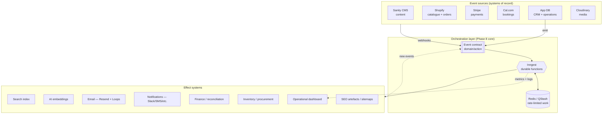

## 2.2 New services introduced in Phase 8

| Concern | Recommended service | Role | Confirm-before-build note |
|---|---|---|---|
| Workflow orchestration | **Inngest** | Event routing, durable multi-step functions, retries, scheduling, fan-out | Managed cloud only (not self-hostable); see 3.5 on keeping PII/PHI out of payloads |
| Transactional email | **Resend + React Email** | All system-triggered email, brand-templated | — |
| Lifecycle / marketing email | **Loops** | Newsletter, editorial and research broadcasts, nurture sequences | Can be deferred to sub-phase 8.5 |
| Operational / relationship data | **App database (Postgres)** — Neon or Supabase | Canonical CRM + operations tables | Patient clinical data isolated (Part Five, Part Twelve) |
| Marketing/pipeline CRM | **HubSpot** | Non-clinical leads, partners, affiliates, campaigns | Synced one-way from app DB; never holds clinical records |
| Booking | **Cal.com** | Consultations, courses, events, journeys, faculty | Self-host or Cal.com Platform for white-label + data residency |
| Notification routing | **Novu** (or a thin custom dispatcher) | Fan notifications to Slack, SMS, WhatsApp, email, in-app | Start with Slack + email; add channels later |
| Rate-limited / scheduled utility work | **Upstash Redis + QStash** | Rate limiting, debounced jobs, lightweight cron | Vercel Cron acceptable for simple schedules |
| Error + performance monitoring | **Sentry** | Exceptions, tracing | — |
| Log aggregation | **Axiom** or **Better Stack** | Structured logs, alerting | — |

**Why these choices** (summarised; full evaluations in Parts Three, Five, Six):

- **Inngest** fits the institution's core pattern exactly — *"publish once → many side effects."* Its event-driven, fan-out, step-durable model turns a single `content.published` event into dozens of downstream steps that each retry independently. It slots into a Next.js/Vercel app with no worker pool to operate. The one trade-off — it is a managed service and cannot be self-hosted — is handled by never sending sensitive personal or clinical data through it (Section 3.5). If self-hosting of the orchestrator later becomes a hard requirement, **Trigger.dev** (Apache-2.0, self-hostable) is the drop-in-philosophy alternative.
- **Postgres app DB as the canonical CRM** keeps sensitive relationship and clinical data on infrastructure the institution controls, rather than in a third-party sales CRM. HubSpot is used only for non-clinical marketing and pipeline.
- **Cal.com** is the only mature open-source, API-first, white-labelable, self-hostable scheduling platform — the right long-term choice for an institution with data-residency obligations and a bespoke booking experience.

---

# THE AUTOMATION BACKBONE — Event contract

## 3.1 Principle

Systems communicate through a **shared event vocabulary**, never by calling each other directly. This is the single most important architectural decision in Phase 8: it is what lets the institution "run itself," add new automations without touching existing ones, and reason about the whole system as a set of named facts.

## 3.2 Event naming convention

`domain.action`, past tense, lower-case, dot-separated. Domains: `content`, `product`, `course`, `journey`, `consultation`, `order`, `student`, `patient`, `inventory`, `finance`, `email`, `media`, `system`.

## 3.3 Core event catalogue (illustrative, not exhaustive)

| Event | Emitted when | Primary consumers |
|---|---|---|
| `content.published` | Editor publishes any Sanity document that has cleared Integrity approval | Search index, embeddings, sitemaps, OG images, related-content graph, newsletter queue, dashboard |
| `content.updated` | Published content changes materially | Same as above (re-sync), link-check |
| `content.review_due` | Scheduled review date reached | Editorial ops, notifications |
| `product.launched` | Product moved to public + approved | Homepage, collections, social snippets, newsletter, search, embeddings, analytics |
| `course.launched` | Course opened for enrolment | Homepage, emails, calendar, waiting-list, student portal, SEO, analytics |
| `journey.published` | Sacred Journey opened | Homepage, emails, capacity tracking, dashboard |
| `consultation.booked` | Cal.com booking confirmed | Confirmation email, calendar, questionnaire dispatch, clinician briefing schedule |
| `consultation.completed` | Session marked complete | Follow-up sequence, feedback request, knowledge recommendations |
| `order.paid` | Stripe/Shopify confirms payment | Order + shipping emails, inventory decrement, invoice, finance ledger, CRM |
| `order.refunded` | Refund processed | Refund email, finance ledger, inventory, CRM |
| `cart.abandoned` | Cart idle past threshold | Abandonment sequence (reminder → education → recovery) |
| `inventory.low` | Stock below reorder point | Restock workflow, supplier notification, dashboard alert |
| `inventory.batch_expiring` | Batch nearing expiry window | Dispensary alert, quarantine workflow |
| `student.enrolled` | Enrolment confirmed | Welcome, reminders, portal provisioning, CRM |
| `certificate.earned` | Course completion criteria met | Certificate generation + email, portal, CRM |
| `email.bounced` / `email.complained` | ESP webhook | Suppression list, CRM flag, deliverability alert |
| `system.job_failed` | Any workflow exhausts retries | Alerting, dashboard, on-call notification |

## 3.4 Event contract rules

- Events carry **references (IDs), not payloads of record** — e.g. `{ productId, sanityRevision }`, never the full product body. Consumers fetch current state from the system of record. This keeps events small, avoids stale duplication, and keeps sensitive data out of the bus.
- Every event has: a stable `id`, `name`, `occurredAt`, `source`, `version`, and a correlation id for tracing a whole workflow.
- Events are **versioned**. A schema change increments the version; consumers declare which versions they accept.
- Producers never assume consumers exist. Adding a consumer must never require changing a producer.

## 3.5 Sensitive-data rule (critical)

Clinical/patient data (PHI) and special-category personal data **must not travel through the orchestration engine or any third-party queue**. Workflows that touch such data pass **opaque references** and read the actual data inside a step, directly from the controlled store, over the institution's own boundary. This preserves the data-residency posture even though the orchestrator is a managed service.

---

# PART TWO — Automated Publishing

## 5.1 Objective

Publishing becomes event-driven. An editor publishes a piece of content **once**; the system synchronises every dependent surface automatically. No editor ever manually updates a homepage module, a "related articles" list, a sitemap, or a social preview.

## 5.2 What a single publish propagates to

On `content.published` (or the typed variants `product.launched`, `course.launched`, `journey.published`), the orchestration engine fans out to every surface below. Each is an independent, individually-retriable step.

| Surface | Action |
|---|---|
| Homepage sections | Recompute "featured" and "recently published" modules from current published set |
| Featured products / courses / journeys | Re-derive from editorial flags + rules |
| Related articles / products / courses / research | Recompute relationship graph for the new node and its neighbours |
| Knowledge graph | Insert/refresh node and edges |
| Search index | Upsert document |
| RSS feeds | Regenerate |
| XML / image / video sitemaps | Regenerate affected sitemap(s) |
| Open Graph images | Generate branded OG image via existing template |
| SEO metadata | Compute canonical, meta, structured data |
| Social previews | Generate platform-specific snippets (draft, not auto-posted — see 5.5) |
| Newsletter content | Queue item into next issue's candidate list |
| Recently published / Trending | Update derived lists |
| Author pages | Refresh author's works |
| Institution timeline | Append entry |
| AI embeddings | Generate/refresh vector embedding |
| Internal links | Recompute internal link suggestions |
| Content recommendations | Refresh recommendation set |

## 5.3 Publishing architecture

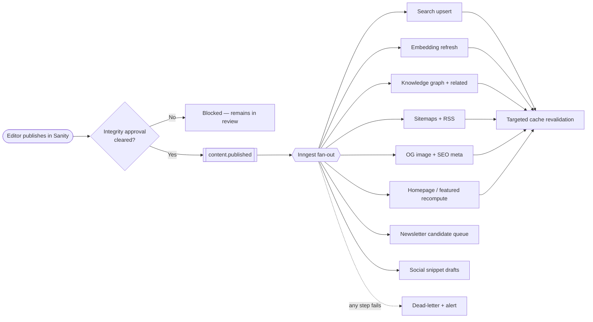

## 5.4 The publishing state machine (with Integrity gate)

`draft → in_review → integrity_review → approved → scheduled → published → (needs_reattention) → archived`

- `integrity_review` is **mandatory** for Knowledge, clinical, and religious content types. It cannot be skipped by automation. Approval is recorded with approver identity, timestamp, and note (feeds the audit log, Part Twelve).
- Only the transition **into `published`** emits `content.published`. Nothing propagates before the gate clears.
- `needs_reattention` is entered automatically when a link-check, citation-validation, or review-due job flags a live document; it does **not** unpublish, but it raises an editorial alert.

## 5.5 What publishing does *not* auto-do

Social snippets are **generated as drafts**, not auto-posted. Public posting is an approval action (Part Twelve). Newsletter items are **queued as candidates**; a human curates and sends the issue. The system removes drudgery (drafting, formatting, sequencing) while preserving editorial voice and the institution's public register.

## 5.6 Consistency guarantee

Because every surface is *derived* from the published set rather than *duplicated* into it, the surfaces cannot drift. A nightly reconciliation job re-derives all computed surfaces and compares against live state; any divergence emits `system.consistency_drift` with a diff for review.

---

# PART THREE — Email Platform

## 6.1 Evaluation

The institution needs both **transactional** email (order confirmations, certificates, password resets, consultation confirmations — must be reliable, fast, brand-controlled) and **lifecycle/marketing** email (newsletter, editorial updates, research announcements, nurture sequences — need segmentation, scheduling, non-developer authoring). These are two different jobs.

| Platform | Strengths | Limitations for this institution | Verdict |
|---|---|---|---|
| **Resend** | Best developer experience; React Email lets templates be authored as components with full pixel control; clean API; signed webhooks; ideal for Next.js | Marketing/broadcast side is younger than dedicated tools | **Recommended — transactional core** |
| **Loops** | Purpose-built lifecycle + broadcast; visual editor for non-developers; event-triggered sequences; clean modern templates | Marketing-first; not a transactional replacement; relies on events pushed from the app | **Recommended — lifecycle/marketing layer** |
| **Brevo** | All-in-one (email + SMS + WhatsApp), EU data residency, GDPR-native, generous free tier | Deliverability and DX below best-in-class; dated interface | Strong fallback if EU data residency for *all* email becomes a hard requirement |
| **Mailchimp** | Mature newsletters, huge integration catalogue | Weak behavioural automation; not developer-centric; brand templating constrained | Not recommended |
| **ConvertKit** | Good creator newsletters | Narrow; weak transactional; not institution-shaped | Not recommended |
| **Postmark** | Gold-standard transactional deliverability/speed | Transactional only; no React Email authoring; would still need a marketing tool | Viable transactional alternative to Resend if raw deliverability is prioritised over DX |

## 6.2 Recommendation — hybrid architecture

**Resend + React Email for all transactional email; Loops for lifecycle and marketing.** This is the current best-practice pairing for a Next.js institution and lets each tool do the job it is built for. Use **separate sending sub-domains** (e.g. `mail.` for transactional, `news.` for marketing) so a marketing reputation issue can never affect delivery of a password reset or certificate. If, at implementation time, EU/UK data residency across *all* email is mandated by counsel, consolidate onto **Brevo** and keep React Email templates rendered to HTML.

## 6.3 Institutional email system (shared design layer)

All email — regardless of sender — is composed from **one reusable React Email component library** that encodes the established identity: the clinical-green palette, the brass isnād rule as a section divider, the sanctioned typefaces (with email-safe fallbacks), and a fixed masthead/footer. Templates never restyle; they compose sanctioned components. This guarantees every message "looks like the institution" without any per-email design work.

Shared components: masthead, isnād divider, body prose block, call-to-action, product/course card, receipt table, Arabic block (RTL-aware, Amiri/Reem Kufi with fallback), signature, legal/footer with unsubscribe + physical address.

## 6.4 Email categories and routing

| Category | Type | Platform | Trigger event |
|---|---|---|---|
| Welcome | Lifecycle | Loops | `contact.created` |
| Newsletter | Marketing | Loops | Manual send from curated queue |
| Course enrolment | Transactional | Resend | `student.enrolled` |
| Course reminders | Transactional | Resend (scheduled) | `course.session_upcoming` |
| Consultation confirmation | Transactional | Resend | `consultation.booked` |
| Consultation reminders | Transactional | Resend (scheduled) | `consultation.upcoming` |
| Journey preparation | Transactional | Resend | `journey.enrolled` + schedule |
| Journey follow-up | Transactional/Lifecycle | Resend/Loops | `journey.completed` |
| Product order | Transactional | Resend | `order.paid` |
| Shipping | Transactional | Resend | `order.shipped` |
| Refund | Transactional | Resend | `order.refunded` |
| Invoice | Transactional | Resend | `invoice.issued` |
| Certificate | Transactional | Resend | `certificate.earned` |
| Password reset | Transactional | Resend | `auth.reset_requested` |
| Verification | Transactional | Resend | `auth.verify_requested` |
| Waiting list | Transactional | Resend | `waitlist.spot_available` |
| Editorial updates | Marketing | Loops | Broadcast |
| Research publications | Marketing | Loops | `research.published` → broadcast queue |
| System alerts | Operational | Resend/Slack | `system.*` |
| Internal staff notifications | Operational | Slack + Resend | operational events |

## 6.5 Deliverability and compliance requirements

- SPF, DKIM, DMARC configured on all sending sub-domains **before** first production send; new domains warmed gradually.
- Bounce and complaint webhooks flow back into the app DB suppression list; suppressed addresses are never re-sent and unsubscribes sync across Resend and Loops (guard against divergence).
- Transactional and marketing consent tracked separately; marketing carries one-click unsubscribe and the institution's postal address.
- All email content is templated and reviewed; no free-typed clinical or religious claims in automated email.

---

# PART FOUR — Workflow Automation

## 7.1 Method

Every repetitive task is modelled as a **workflow**: a named durable function triggered by an event, composed of steps, each retriable, with human-approval gates where the sacred boundaries apply. Below are the four canonical workflows from the brief, specified as state, then a diagram. All other workflows (enrolment, refunds, waiting-list, etc.) follow the same pattern.

## 7.2 Product launch

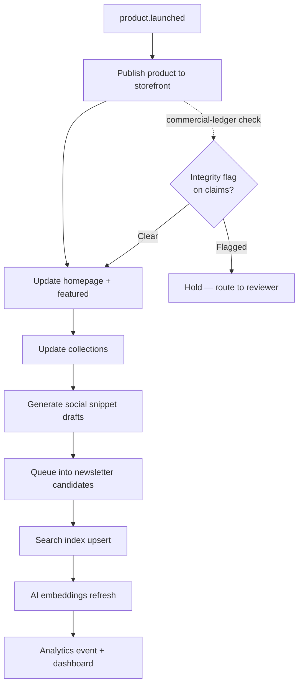

## 7.3 Course launch

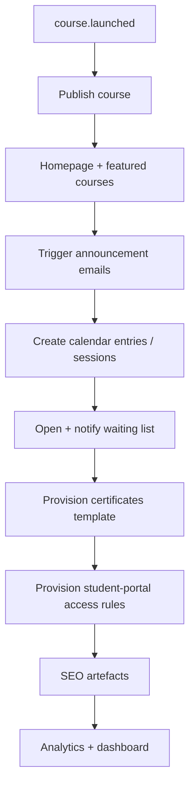

## 7.4 Consultation

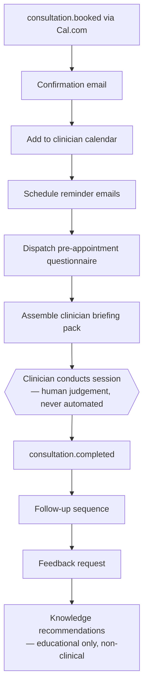

**Boundary:** steps A–F and H–K are automation. Step G is human. The briefing pack *summarises intake for the clinician*; it never proposes diagnosis or treatment. Knowledge recommendations are general educational content, never personalised clinical advice.

## 7.5 Shopping-cart recovery

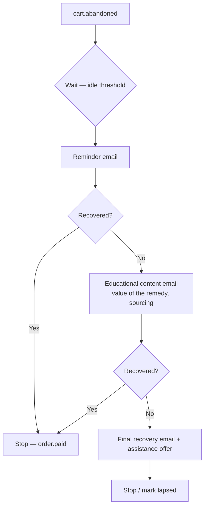

## 7.6 Workflow inventory (build these; all share the pattern above)

Product launch · Course launch · Journey launch · Consultation lifecycle · Enrolment lifecycle · Cart abandonment/recovery · Order fulfilment · Refund handling · Waiting-list promotion · Certificate issuance · Content review-due · Broken-link remediation · Citation-validation flagging · Low-stock restock · Batch-expiry quarantine · Supplier reorder · Invoice + reconciliation · Newsletter assembly · Research-publication broadcast · Email suppression sync · Consistency reconciliation.

## 7.7 Workflow standards

Every workflow must: be idempotent (safe to replay), carry a correlation id, record start/finish/failure to the operations log, retry transient failures with backoff, dead-letter after exhausting retries and raise `system.job_failed`, and expose its status to the dashboard. Human-gated workflows must persist the gate decision and block downstream steps until the decision exists.

---

# PART FIVE — CRM

## 8.1 The distinguishing constraint

The institution's "contacts" span eleven relationship types — patients, students, customers, practitioners, faculty, researchers, partners, leads, affiliates, volunteers, suppliers — and one of them (patients) carries **special-category health data** under UK GDPR. A generic sales CRM is the wrong home for clinical records. This constraint drives the whole recommendation.

## 8.2 Evaluation

| Option | Strengths | Limitations | Verdict |
|---|---|---|---|
| **HubSpot** | Excellent marketing automation, pipelines, forms, reporting; large ecosystem | Not appropriate as system of record for clinical/patient data; per-seat cost grows; data lives on vendor infra | **Recommended for marketing/pipeline only** |
| **Pipedrive** | Simple sales pipeline | Sales-shaped; narrow for a multi-relationship institution | Not recommended |
| **Salesforce** | Enterprise depth, extensibility | Heavy, costly, over-scoped for current stage | Defer (future option if scale demands) |
| **Custom CRM (app DB)** | Full control of the people/relationship graph; clinical data stays on owned infra; models institution-specific concepts (isnād of a practitioner's ijāza, journey cohorts) natively | Build and maintenance cost | **Recommended as canonical system of record** |

## 8.3 Recommendation — canonical custom CRM, HubSpot as the marketing satellite

Build the **canonical relationship graph in the app database (Postgres)** as the single source of truth for people and their ties to the institution. **Sync only non-clinical contacts one-way into HubSpot** for marketing automation and pipeline management. **Patient clinical records never leave the controlled store** and are never mirrored to HubSpot.

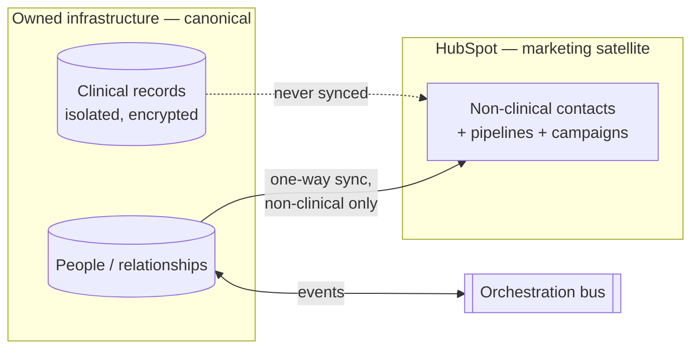

## 8.4 Canonical data model (specification, not code)

**Person** — the root entity. Fields: `id`, `displayName`, `contactChannels` (email/phone with consent state per channel), `locale`, `createdAt`, `source`, `tags`, `preferences`, `marketingConsent`, `dataResidencyFlags`.

**Relationship roles** (a person may hold several simultaneously): `patient`, `student`, `customer`, `practitioner`, `faculty`, `researcher`, `partner`, `lead`, `affiliate`, `volunteer`, `supplier`. Each role is its own record linked to the Person, carrying role-specific attributes (e.g. practitioner → ijāza/credentials; supplier → terms; affiliate → payout details).

**Tracked across all roles:** interactions, orders, courses, consultations, journeys, communications (email sends/opens where consented), membership, history/timeline, notes, tags, preferences, and automation state.

**Clinical partition:** patient consultation records, questionnaires, and clinician notes live in a separate, access-restricted store keyed by an opaque patient reference. The CRM knows a person is a patient; it does not hold their clinical detail alongside marketing data.

## 8.5 CRM automation

Contact created → welcome; role changes → provisioning; order/enrolment/booking events → timeline entries; deduplication on ingest; consent changes propagate to suppression lists and to HubSpot. All automation respects the clinical partition: no clinical field ever triggers a marketing action.

---

# PART SIX — Booking Platform

## 9.1 Evaluation

| Option | Strengths | Limitations | Verdict |
|---|---|---|---|
| **Cal.com** | Open-source, self-hostable, API-first, full white-label, GDPR/data-residency friendly, Stripe payments, workflows + webhooks, round-robin/collective, routing forms, built-in video; Next.js-native | Thinner native CRM integrations than Calendly; self-hosting needs engineering ownership | **Recommended — long-term booking backbone** |
| **Calendly** | Polished, fast rollout, deep native CRM integrations | Closed SaaS; limited deep customisation/white-label; data on vendor infra; per-seat cost | Not recommended for an institution needing white-label + data residency |
| **Microsoft Bookings** | Cheap if already on M365; simple | Limited customisation; weak API/embedding; not brand-controllable | Not recommended |
| **Fully custom booking** | Total control | Rebuilds calendar sync, availability, reminders, payments — high cost, low differentiation | Not recommended (Cal.com already provides the primitives) |

## 9.2 Recommendation

**Cal.com — self-hosted or on the Cal.com Platform for white-label — as the single booking backbone** across every appointment type. It is the only mature open-source, API-first scheduler; its data-ownership and white-label properties match the institution's obligations and design standards; its Stripe integration and webhook workflows plug directly into the orchestration bus.

## 9.3 Booking coverage and integration

One booking layer serves consultations, courses, events, Sacred Journeys, workshops, faculty appointments, and clinical sessions — each as a distinct event type with its own availability, intake, duration, capacity, and pricing rules. Cal.com emits webhooks that the bus normalises into `consultation.booked`, `course.session_booked`, etc.

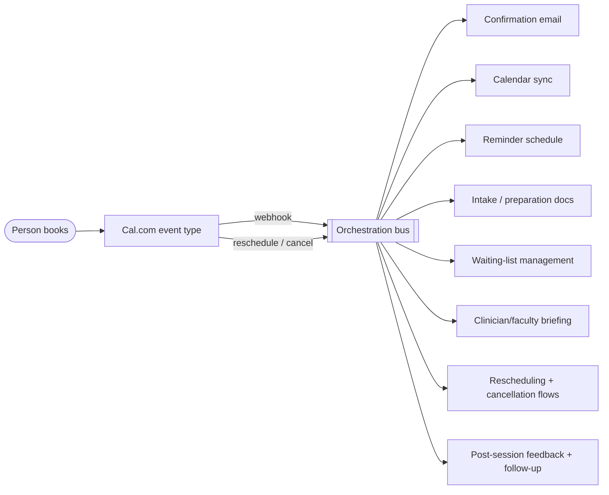

## 9.4 Booking automation

Automate: booking, reminders (multi-touch, timezone-aware), calendar sync, waiting lists, preparation/document dispatch, feedback, follow-up, cancellation, and rescheduling. Clinical-session intake and briefing follow the consultation boundary rule: assemble for the clinician; never advise the patient.

---

# PART SEVEN — Inventory Operations

## 10.1 The constraint

The institution dispenses natural remedies — herbs, oils, honey-based preparations — which are **batch-tracked and expiry-sensitive**. Shopify's native inventory tracks stock levels well but does not model batches, expiry, purchase orders, or supplier procurement. Inventory therefore has two layers.

## 10.2 Architecture — Shopify as stock source, custom procurement layer on top

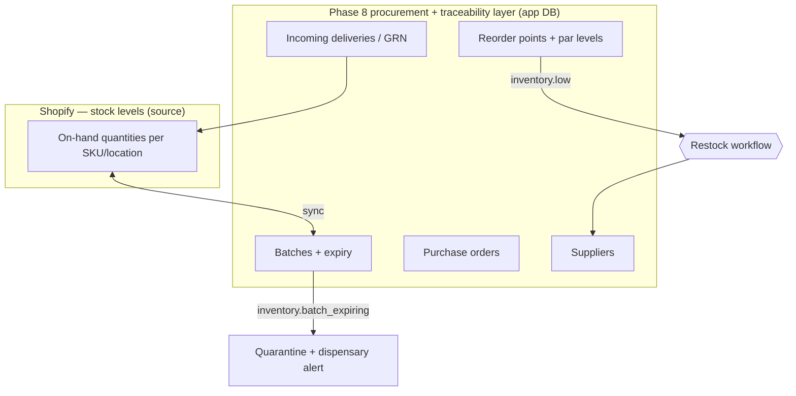

## 10.3 What is tracked

Stock, suppliers, purchase orders, incoming deliveries, warehouse/location, expiry dates, batch numbers, inventory alerts, low-stock and out-of-stock states, supplier notifications, restocking, and product-launch stock readiness. The model is designed for **future multi-warehouse** support: every quantity is location-scoped from day one, even while only one location exists.

## 10.4 Inventory automation

Reorder point crossed → `inventory.low` → draft purchase order → supplier notification (human approves the PO before it is sent — procurement is a spend decision, Part Twelve). Batch nearing expiry → `inventory.batch_expiring` → dispensary alert and quarantine workflow (expired stock is never auto-dispensed). Delivery received → goods-received record updates batch + stock. Out-of-stock → storefront availability + waiting-list interplay. Product launch checks stock readiness before `product.launched` propagates commercially.

## 10.5 Food-safety and dispensary integrity

Expiry and batch controls are a safety matter, not merely operational. Automation *enforces* quarantine and *blocks* dispensing of expired or recalled batches; it never overrides a dispensary hold. Recalls are a human-initiated action that the system then propagates.

---

# PART EIGHT — Finance Operations

## 11.1 Architecture — Stripe as transaction source of truth

Stripe (Phase 4) remains the source of truth for payments. Phase 8 adds an **operational finance layer** that derives invoices, VAT handling, refunds, reconciliation, and reporting from Stripe and Shopify events, and prepares clean exports for accounting.

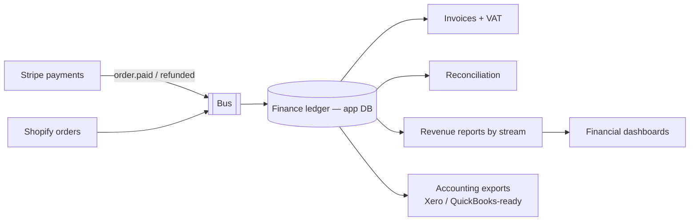

## 11.2 Scope

Invoices, VAT (via Stripe Tax where applicable; validated against UK rules), refunds, accounting exports, payment reconciliation, tax reports, and revenue reports segmented by stream: **course revenue, journey revenue, product revenue, and total institution revenue.** Financial dashboards surface these to leadership (Part Ten).

## 11.3 Reconciliation and controls

A scheduled reconciliation job matches Stripe payouts to orders to ledger entries and flags any mismatch as `finance.reconciliation_exception` for human review. **Refunds above a configurable threshold, and any goodwill or duty-of-care exception, require named human approval** (Part Twelve) — this is a Commercial-Ledger decision that the Integrity standard governs. Exports are generated in Xero- and QuickBooks-ready formats now, with **native Xero and QuickBooks integration designed for a future sub-phase** (the ledger schema is built to map cleanly to both).

## 11.4 Boundary

The system produces financial *operations and reporting*. It does not provide tax or accounting *advice*; regulated determinations remain with the institution's accountant.

---

# PART NINE — Editorial Operations

## 12.1 Objective

Keep the published corpus accurate, current, and sound with minimal manual auditing — while preserving the human authority over scholarship. Editorial automation *watches, flags, and schedules*; scholars and editors *decide*.

## 12.2 Automated editorial jobs

| Job | Behaviour | Human role |
|---|---|---|
| Review reminders | Each document carries a review date; on arrival emits `content.review_due` | Editor reviews and re-approves |
| Publication schedules | Scheduled publish honours the Integrity gate | Approver clears gate |
| Expiry dates | Time-sensitive content flagged for refresh or archive | Editor decides |
| Content audits | Periodic sweep for stale, thin, or orphaned content | Editor triages |
| Broken links | Scheduled link-check; failures set `needs_reattention` + alert | Editor fixes |
| Citation validation | Hadith/reference citations checked for structural integrity; anomalies flagged | **Scholar confirms — grading never machine-assigned** |
| SEO review | Metadata/structured-data completeness checks | Editor completes |
| AI review | AI drafts *suggestions* (summaries, internal links, alt text) | Editor accepts/edits — never auto-applied to Knowledge/clinical content |
| Translation workflow | Routes content through translation stages; tracks status | Translator + reviewer |
| Image optimisation | Cloudinary transforms applied automatically | — (fully automated) |
| Media approvals | New media routed for approval before publication | Approver signs off |

## 12.3 Boundary

For Knowledge, clinical, and religious content, AI output is **advisory only** and always passes through a human editor. Citation validation may flag a suspicious reference; it may never assign or alter a hadith grading. This directly enforces the sourcing-integrity commitment.

---

# PART TEN — Operational Dashboard

## 13.1 Objective

A single leadership surface giving a real-time overview of the whole institution. Built as an internal, access-controlled section of the app (inheriting the existing design language — no new visual system), reading from the app DB and integration APIs, updated by the same events that drive workflows.

## 13.2 Panels

Orders · Students · Patients (aggregate, non-identifying by default) · Bookings · Revenue (by stream) · Inventory (stock, low/expiring) · Publishing (throughput, review backlog) · Emails (sends, deliverability, bounces) · SEO (coverage, issues) · AI (job health, embedding coverage) · Analytics (from Phase 7) · Operational alerts · Editorial health (review-due, broken links, citation flags) · Research activity · Media usage · System health (job success rates, webhook health, queue depth).

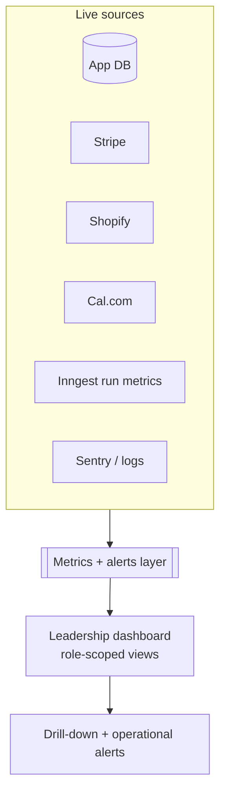

## 13.3 Principles

Read-only where possible; each panel drills into detail; views are **role-scoped** (a finance lead and a chief editor see different defaults, Part Twelve); patient data is aggregated and access-gated. The dashboard never becomes a place where clinical or scholarly decisions are made — it surfaces state and routes to the right owner.

---

# PART ELEVEN — Alerts & Notifications

## 14.1 Objective

Intelligent, routed, de-duplicated alerts that reach the right person on the right channel — never noise.

## 14.2 Notification architecture

A single **notification dispatcher** (Novu, or a thin custom service) receives `system.*` and operational events and routes each to channels by rule and severity, with de-duplication, throttling, and escalation.

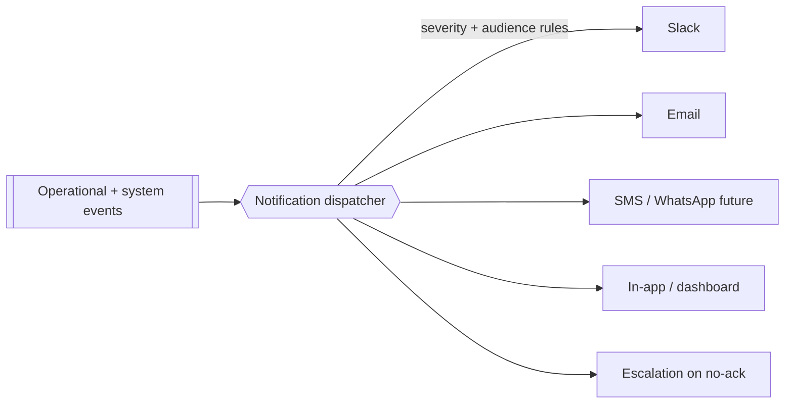

## 14.3 Alert catalogue

Checkout failure · Publishing failure · SEO issue · Broken page · Inventory low · Course full · Consultation cancelled · Journey capacity reached · Payment failure · Webhook failure · AI failure · Search-indexing failure · Editorial review overdue · Performance degradation.

## 14.4 Rules

Each alert has an owner, a channel, a severity, and a de-duplication key. Critical alerts (payment/checkout/webhook failure, performance degradation) escalate if unacknowledged. Alerts are actionable — each links to the object and the remediation workflow. Volume is monitored; a noisy alert is a bug to be tuned, not tolerated.

---

# PART TWELVE — Security & Permissions

## 15.1 Role-based access model

Roles: Editors · Authors · Faculty · Practitioners · Researchers · Administrators · Operations · Finance · Marketing · Leadership. Access is **least-privilege** and **role-scoped**; a person may hold multiple roles, and permissions are additive but always bounded by the clinical partition.

| Role | Can | Cannot |
|---|---|---|
| Author | Draft content | Publish; clear Integrity gate |
| Editor | Edit, schedule, request publish | Clear Integrity gate for clinical/religious content unless also authorised |
| Faculty | Manage own courses, sessions, students | Access clinical records; finance |
| Practitioner | Access own patients' clinical records, briefings | Marketing data; other practitioners' patients |
| Researcher | Research content + non-clinical data | Patient-identifying clinical data |
| Operations | Inventory, bookings, fulfilment | Approve refunds above threshold; clinical records |
| Finance | Ledger, invoices, reports, refund approvals within authority | Clinical records; publish content |
| Marketing | Campaigns, non-clinical CRM, newsletter | Clinical records; finance approvals |
| Administrator | User + system administration | Silent access to clinical content without audit |
| Leadership | Dashboards, approvals within authority | Bypass audit; assign hadith gradings |

## 15.2 Integrity and clinical gates as permissions

Clearing the Integrity gate, assigning/confirming citations, approving refunds above threshold, sending public posts, and issuing purchase orders are **explicit, permissioned actions** — each requires the appropriate role and each writes an audit record.

## 15.3 Audit, approvals, activity history

- **Audit logs** capture every privileged action: who, what, when, before/after, and justification where required. Audit logs are append-only and themselves access-controlled.
- **Approval workflows** back every gated action (publish, refund, PO, public post, media, clinical-record access by non-owning staff).
- **Activity history** per person and per object supports review and incident response.
- Access to clinical records is always logged, even for authorised practitioners.

---

# PART THIRTEEN — Performance

## 16.1 Principle

**Automation must never slow the website.** No workflow, sync, or notification runs in the path of a page render. The reading surface stays static-first and fast; all operational work is asynchronous.

## 16.2 Mechanisms

| Concern | Approach |
|---|---|
| Background jobs | All side effects run in Inngest durable functions, off the request path |
| Queues | Redis/QStash for rate-limited or debounced work (e.g. bulk re-index) |
| Task scheduling | Inngest schedules + Vercel Cron for simple periodic jobs |
| Retry logic | Per-step exponential backoff; dead-letter after max attempts; `system.job_failed` |
| Caching | Targeted cache revalidation on publish — revalidate only affected paths, not global purges |
| Rate limiting | Respect Shopify/Stripe/Cal.com/ESP API limits via token-bucket limiting in the queue layer |
| Webhooks | Verify signatures; acknowledge fast; enqueue work rather than processing inline |
| Monitoring | Sentry for exceptions + tracing; dashboard tracks job success rates, queue depth, webhook health |
| Logging | Structured logs to Axiom/Better Stack, correlation-id-tagged end to end |
| Error recovery | Idempotent, replayable workflows; manual replay from dead-letter; reconciliation jobs restore consistency |

## 16.3 Guardrails

Bulk operations (re-index, re-embed, sitemap regeneration) are chunked and rate-limited so they never saturate downstream APIs or the database. Publish-time revalidation is scoped to affected surfaces. A performance-degradation alert fires on latency or error-rate thresholds.

---

# PART FOURTEEN — Future Automation

## 17.1 Architected-for, not built-now

The event bus and notification dispatcher make the following additive — each is a new consumer of existing events, requiring no change to producers:

- **Mobile notifications** — new channel on the dispatcher.
- **Slack / Microsoft Teams** — operational channels (Slack recommended first).
- **WhatsApp Business / SMS** — via the dispatcher (e.g. Twilio) for reminders and confirmations where consented.
- **AI-assisted operations** — AI proposes drafts, summaries, triage; humans decide (never crosses the sacred boundaries).
- **Inventory forecasting & demand prediction** — models over order + inventory history informing reorder points.
- **Course forecasting** — enrolment prediction informing scheduling and capacity.
- **Publishing recommendations** — AI-suggested topics/gaps from the knowledge graph and search demand.
- **CRM intelligence** — segmentation and next-best-action on non-clinical data.
- **Operational reporting** — scheduled institutional reports assembled from the ledger and dashboards.

## 17.2 Governance of future AI

Every future AI capability inherits the Phase 8 boundary: AI assists; it does not decide clinical, scholarly, or religious matters. Forecasts and recommendations are advisory inputs to human owners.

---

# CONSOLIDATED ARCHITECTURE DELIVERABLES

## 18. Integration architecture

The bus is the integration layer. Each external system connects to it in exactly one way: it **emits** (via webhook or app event) and it is **acted upon** (via its API inside a workflow step). No system calls another directly.

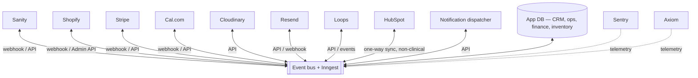

**Integration standards:** every inbound webhook verifies its signature; every outbound API call is rate-limited, retried, and idempotent; every credential is stored as an environment secret and rotated; every integration has a health check surfaced on the dashboard.

## 19. Role and permissions model (summary)

Least-privilege RBAC over ten roles (Part Twelve), with additive roles bounded by the clinical partition; explicit permissioned gate-actions (Integrity approval, citation confirmation, refund/PO approval, public posting, media approval, clinical-record access); append-only audit logging on all privileged actions; approval workflows behind every gate; per-person and per-object activity history.

## 20. Performance strategy (summary)

Static-first reading surface; all side effects asynchronous in durable functions; queues + rate limiting for bulk/throttled work; targeted revalidation; signature-verified fast-ack webhooks; Sentry + structured logging with correlation ids; idempotent, replayable, dead-lettered workflows; reconciliation jobs; performance-degradation alerting.

## 21. Security considerations

- **Data classification:** clinical/PHI and special-category data isolated in a restricted store; never on the bus, never in HubSpot, never in third-party queues (Section 3.5).
- **Access:** least-privilege RBAC; MFA for staff; all clinical access logged.
- **Secrets:** environment-scoped, rotated; no secrets in code or events.
- **GDPR/UK-GDPR:** lawful basis per processing purpose; separate transactional vs marketing consent; data-subject access/erasure honoured across app DB, HubSpot, Resend, Loops, Cal.com; data-residency posture preserved by the sensitive-data rule.
- **Webhooks & APIs:** signature verification; replay protection; least-scope API tokens.
- **Auditability:** append-only audit trail for privileged and gated actions.
- **Vendor risk:** because the orchestrator is managed (Inngest), no sensitive payloads pass through it; Trigger.dev (self-hostable) is the fallback if that posture must change.

## 22. Testing checklist

- [ ] Every event schema has a versioned contract and a validation test.
- [ ] Each workflow is idempotent — replaying an event produces no duplicate side effects.
- [ ] Each workflow retries transient failures and dead-letters after max attempts.
- [ ] Human-gated workflows **block** downstream steps until an approval record exists.
- [ ] Integrity gate cannot be bypassed for Knowledge/clinical/religious content (negative test).
- [ ] Clinical/PHI never appears in an event payload, queue, HubSpot, or log (data-leak test).
- [ ] Every email renders correctly across major clients; RTL/Arabic blocks render correctly; unsubscribe works and syncs across Resend + Loops.
- [ ] Suppression list honoured; suppressed addresses never receive email.
- [ ] Webhook signature verification rejects forged/replayed payloads.
- [ ] Publish propagation reaches every surface in Part Two; consistency-reconciliation detects an injected drift.
- [ ] Inventory: expired/quarantined batch cannot be dispensed (negative test); reorder point triggers draft PO.
- [ ] Finance: reconciliation flags an injected mismatch; refund above threshold requires approval.
- [ ] RBAC: each role can do only what Part Twelve permits (positive + negative per role).
- [ ] Rate limits respected under bulk operations; no API throttling or DB saturation.
- [ ] Page-render performance unchanged with automation live (before/after benchmark).
- [ ] Booking: reschedule/cancel flows fire correct events and communications.
- [ ] Load test of fan-out (single publish → all consumers) within latency budget.

## 23. Production readiness checklist

- [ ] All sending sub-domains have SPF/DKIM/DMARC; domains warmed.
- [ ] All webhooks registered, verified, and health-checked.
- [ ] Dead-letter handling + manual replay tooling in place.
- [ ] Alerting live with owners assigned per alert; escalation configured.
- [ ] Dashboard live and role-scoped; system-health panel green.
- [ ] Audit logging verified append-only; access reviewed.
- [ ] Backups + restore tested for app DB and clinical store.
- [ ] Runbooks written for each critical failure (webhook, payment, publishing, AI, indexing).
- [ ] Secrets rotated; least-scope tokens confirmed.
- [ ] Rollback plan per sub-phase; feature flags on new workflows.
- [ ] Data-subject request procedure tested end to end across all systems.
- [ ] Sign-off from Integrity Ledger owner that no automation crosses the sacred boundaries.

## 24. Acceptance criteria

Phase 8 is accepted when:

1. An editor can publish once and every surface in Part Two updates automatically, with the Integrity gate enforced.
2. Every email category in Part Three sends from the shared institutional template system, on the correct platform, on the correct trigger.
3. The four canonical workflows (Part Four) plus the full workflow inventory run reliably, idempotently, and with human gates intact.
4. The canonical CRM is the source of truth; non-clinical contacts sync to HubSpot; clinical data is provably isolated.
5. Cal.com handles all booking types end to end with automated reminders, preparation, feedback, and rescheduling.
6. Inventory enforces batch/expiry safety and drafts restocks; expired stock cannot be dispensed.
7. Finance derives invoices/VAT/refunds/reports from Stripe/Shopify, reconciles automatically, and gates refunds above threshold.
8. Editorial jobs flag review/links/citations without ever auto-deciding scholarship.
9. The leadership dashboard shows real-time institution state, role-scoped.
10. Alerts route correctly, de-duplicated, with escalation.
11. RBAC, audit logs, and approval workflows pass the negative tests.
12. Website performance is measurably unchanged with automation live.
13. No sensitive data traverses the bus, queues, HubSpot, or logs.

## 25. Migration strategy

Phase 8 is **additive and non-destructive** — it wraps existing systems, it does not replace them.

1. **Stand up the bus first** (Inngest + event contract) with no consumers; verify events flow from Sanity/Shopify/Stripe/Cal.com.
2. **Shadow mode:** run new workflows in log-only mode alongside current manual processes; compare outputs before cutting over.
3. **Cut over one workflow at a time**, behind feature flags, starting with the lowest-risk (e.g. sitemap/search sync), ending with the most sensitive (finance approvals, clinical briefings).
4. **Backfill** CRM and inventory data into the app DB; reconcile against sources.
5. **Deprecate manual steps only after** the automated equivalent has run correctly in production for an agreed window.
6. **Rollback** is per-workflow via feature flag; because workflows are idempotent and the bus is additive, disabling a consumer never corrupts a system of record.

## 26. Implementation roadmap (sub-phases)

| Sub-phase | Scope | Depends on |
|---|---|---|
| **8.0 Foundations** | Event contract, Inngest, app DB, secrets, logging/monitoring, RBAC skeleton, audit log | — |
| **8.1 Publishing automation** | Part Two fan-out, Integrity gate state machine, consistency reconciliation | 8.0 |
| **8.2 Email system** | React Email component library, Resend transactional, suppression/webhooks; Loops deferred to 8.5 | 8.0 |
| **8.3 Core workflows** | Product/course/journey launch, consultation, cart recovery, enrolment, certificates | 8.0–8.2 |
| **8.4 Booking** | Cal.com integration, all event types, reminders/prep/feedback/reschedule | 8.0–8.3 |
| **8.5 CRM + lifecycle email** | Canonical CRM, HubSpot one-way sync, clinical partition, Loops lifecycle | 8.0–8.2 |
| **8.6 Inventory** | Batch/expiry/PO/supplier layer, restock + quarantine workflows | 8.0 |
| **8.7 Finance** | Ledger, invoices/VAT, reconciliation, revenue reports, exports | 8.0, 8.3 |
| **8.8 Editorial ops** | Review/link/citation/SEO/AI-advisory jobs, translation, media approvals | 8.1 |
| **8.9 Dashboard + alerts** | Leadership dashboard, notification dispatcher, alert catalogue | all prior |
| **8.10 Hardening + future hooks** | Full test suite, production readiness, future-channel scaffolding | all prior |

## 27. Developer notes (for Cursor)

- **Build against the event contract, not against services.** A workflow subscribes to an event and calls system APIs inside steps. Never wire Sanity→Shopify (or any pair) directly.
- **Everything idempotent.** Assume every event can be delivered more than once. Use natural idempotency keys (order id, content id + revision).
- **References, not payloads.** Events carry IDs; steps fetch current state. Never embed clinical or special-category data in an event.
- **Gates are code-level, not conventions.** The Integrity gate, refund approval, PO approval, and public-post approval are required states/permissions that *block* progression — not reminders.
- **One template system for email.** All email composes sanctioned React Email components; no per-email styling; identity tokens come from Phase 1.
- **No new visual language anywhere.** Dashboard, emails, and notifications reuse the existing design system exactly.
- **Fast webhooks.** Verify signature, enqueue, acknowledge. Do not process inline.
- **Observability from day one.** Correlation id on every event and step; structured logs; Sentry; dashboard health panel.
- **Feature-flag every new workflow** for shadow-mode → cutover → rollback.

## 28. Operations manual (for the institution)

**Daily:** review the dashboard system-health and alert panels; clear editorial review-due and citation flags; action low-stock/expiry alerts; approve pending POs, refunds, and public posts within authority.

**Weekly:** review deliverability (bounces/complaints); reconcile finance exceptions; review booking utilisation and waiting lists; curate and send the newsletter from the candidate queue.

**Monthly:** audit access and roles; review workflow success rates and tune noisy alerts; review inventory forecasts and reorder points; run the data-subject-request procedure check.

**Always human, never automated:** clearing the Integrity gate; confirming hadith sourcing/grading; clinical judgement in consultations; goodwill/duty-of-care and above-threshold financial exceptions; recalls; public posting.

**When something breaks:** the failing workflow dead-letters and alerts the owner; consult the runbook; fix the cause; replay from the dead-letter; the reconciliation job restores any drifted surface.

## 29. Future scalability

- **New surfaces and channels are new consumers** of existing events — no producer changes.
- **Multi-warehouse** is already modelled (location-scoped quantities) and activates without schema change.
- **Multi-region / additional locations (London, Copenhagen, Riyadh)** are supported by the data-residency-aware design; the sensitive-data rule keeps expansion compliant.
- **Xero/QuickBooks, Salesforce, additional email/notification channels** slot in as integrations behind the bus.
- **AI operations** grow as advisory consumers within the existing governance boundary.
- The institution scales by **adding consumers, not by rewiring systems** — which is the whole point of the event-driven backbone.

---

## Closing note

The objective of Phase 8 is not merely to automate tasks. It is to build the operational backbone of the Sunnah Remedies Institution so that publishing, commerce, education, consultations, journeys, communications, and administration run with consistency, reliability, and minimal manual intervention — while the sacred boundaries of clinical judgement, religious authority, and sourcing integrity remain firmly in human hands. The website increasingly runs itself; the scholars, practitioners, and editors are freed to do the work only they can do. Two Ledgers, One Standard — the Integrity Ledger keeps its veto, now enforced in the architecture itself.

*End of specification.*
