# Sunnah Remedies — Phase 9

## The Living Institution: Community, Membership & Alumni Network

**Implementation Specification for Cursor · Build Blueprint**

> *"Completion of a course is not the end of a journey. It is the moment a student becomes part of the isnād — a chain that continues to transmit, to serve, and to be served."*

---

### How to read this document

This is a **specification**, not source. It contains **no code**. It defines architecture, data models, permissions, workflows, folder structure, integration points, acceptance criteria and an operational manual. Every data structure is expressed as a descriptive table or diagram — Cursor will translate these into the existing stack under its own conventions.

**Non-negotiable constraints inherited from Phases 1–8** (do not violate under any circumstance):

1. **Do NOT redesign the website.** Every Phase 9 surface reuses the existing Phase 1 design system, component library, spacing scale and grid.
2. **Do NOT modify typography.** The five-typeface system (Fraunces, Newsreader, IBM Plex Mono, Amiri, Reem Kufi) is fixed. New surfaces consume existing tokens only.
3. **Do NOT alter layouts** or the institutional design language. New pages are compositions of existing primitives.
4. **The brass isnād rule, the manuscript grid, and deep clinical green (`#0A2B21`) remain the signature elements.** Community surfaces adopt them; they do not reinterpret them.
5. **"Two Ledgers, One Standard" governs this phase.** The Integrity Ledger holds veto power over the Commercial Ledger. No membership, monetisation or engagement mechanic may override scholarly integrity, hadith-sourcing discipline, or duty of care.

Phase 9's job is architectural and relational, not visual. We are not adding pages. We are turning a platform into an institution one belongs to.

---

## Part 0 — Purpose & Definition of Done

By the end of Phase 9, a person should be able to:

- **Belong** — hold a membership that is *earned and meaningful*, with clearly defined access, benefits and permissions.
- **Continue** — keep learning after a course ends, through study circles, revision programmes, office hours and the Alumni Network.
- **Contribute** — participate in moderated, respectful, searchable knowledge discussion grounded in *adab*.
- **Be recognised** — receive verifiable credentials, CPD credits and service recognition that reflect *achievement and service, never popularity*.
- **Be served for life** — a graduate remains connected as an alumnus, a mentor, a practitioner in the directory, and an invited guest to advanced work.

The institution succeeds in this phase when a member says *"I joined an institution,"* not *"I used a website."*

---

## Part 1 — Institutional Community Philosophy → Design Rules

The philosophy in the brief (Knowledge, Service, Scholarship, Professional Development, Brotherhood & Sisterhood, Respect, Compassion, Continuous Learning, Clinical Excellence, Personal Growth) is translated below into **binding design rules** so that intent survives implementation.

| Principle | What we build | What we forbid |
|---|---|---|
| **Adab before engagement** | Conduct acknowledgement gates first post; slow, considered discussion; faculty-highlighted "beneficial" contributions | Public like counts, karma leaderboards, follower counts, viral mechanics |
| **Meaningful participation** | Threaded scholarly discussion, journal clubs, structured study circles, mentorship | Infinite scroll feeds, streak-shaming, notification spam, dark patterns |
| **Recognition = achievement + service** | Verifiable credentials, CPD ledger, service badges reviewed by faculty | Auto-awarded vanity badges, "top poster of the week," reaction-count trophies |
| **Continuous learning** | Learning journeys, revision programmes, alumni CPD, office hours | Course "ends" with a certificate and nothing after |
| **Scholarship integrity** | Hadith/source citation fields on knowledge posts; faculty verification of clinical claims | Unmoderated medical/clinical advice; anonymous unsourced rulings |
| **Compassion & safeguarding** | Duty-of-care flows for mentorship, clinical questions redirected to qualified channels | 1:1 contact without safeguarding acknowledgement; unverified practitioner claims |
| **Two Ledgers** | Integrity review can veto any commercial gate on community access | Paywalling safety-critical guidance; upselling inside a bereavement/illness thread |

**One explicit anti-gamification decision:** the only social signal permitted on a contribution is a non-ranked **"marked beneficial (nāfiʿ)"** indicator that *faculty and moderators* may apply to surface genuinely useful scholarship, plus a private **bookmark**. There are no public counters, no scores, no reaction tallies visible on profiles. "Learning streaks" exist only as a **private** encouragement to the individual, never displayed to others and never used to rank.

---

## Part 2 — System Context & Stack

Phase 9 sits on top of the eight completed phases. It introduces an **Identity & Community data plane** while reusing every existing service.

**Inherited services (unchanged):**

- **Next.js (App Router) + the Phase 1 design system** — presentation only; new routes, no new visual language.
- **Sanity CMS (Phase 2)** — editorial source of truth: courses, lessons, articles, journeys, event *content*, announcements, guideline documents, tier & badge *definitions*.
- **Cloudinary (Phase 3)** — all media: lesson video, event recordings, certificate PDFs, downloads, avatars.
- **Shopify + Stripe (Phase 4)** — products; **Stripe** additionally becomes the billing engine for membership subscriptions.
- **Search / SEO (Phase 5)** — extended to index forum threads, library resources and (consented) directory listings.
- **AI Institution / AI Tutor (Phase 6)** — embedded in the Student Portal and study circles.
- **Analytics & Institutional Intelligence (Phase 7)** — receives the Phase 9 community event stream.
- **Operations & Automation (Phase 8)** — transactional & digest email, scheduled jobs, workflow automation for moderation SLAs, CPD statements, renewals.

**New in Phase 9 (decisions, with rationale):**

| Concern | Decision | Rationale | Alternative (rejected) |
|---|---|---|---|
| **Authentication** | Auth.js (NextAuth v5) with email + OAuth, session strategy JWT-backed by the community DB | Keeps member PII in institution-controlled infrastructure; no per-MAU billing surprises at institutional scale; full control of roles/verification | Clerk (faster, but PII residency and cost less controllable) — acceptable fallback if speed is prioritised |
| **Community data layer** | A dedicated **PostgreSQL** database (EU region — e.g. Neon/Supabase EU), accessed via a typed ORM | Forums, CPD, enrolments, notifications are high-volume, relational, transactional — wrong shape for Sanity | Storing community data in Sanity (rejected: not built for user-generated volume or per-row access control) |
| **Forum / discussion** | **Custom module** on the community DB, using existing design primitives | Design-language coherence, full moderation control, no third-party visual identity, *adab*-first mechanics | Discourse embed (rejected: alien design language, engagement mechanics conflict with philosophy) |
| **Live events** | Video provider embed (e.g. Zoom/Mux/StreamYard) surfaced inside institutional chrome; recordings to Cloudinary | Reuse proven infra; keep the *experience* institutional | Building live streaming (out of scope) |
| **Verifiable credentials** | **Open Badges 3.0 / Verifiable Credentials** model + public verification endpoint | Portable, tamper-evident, professionally respected; mirrors the *ijāzah* concept digitally | Static PDF-only certificates (kept as artefact, but backed by a verifiable record) |
| **Data residency & privacy** | Community DB in the EU; region-aware consent (GDPR + KSA PDPL) | Institution operates in London, Copenhagen, Riyadh | Single-jurisdiction assumption (rejected) |

**Data ownership map (source of truth):**

- *Editorial & definitions* → **Sanity** (course structure, lesson content, tier definitions, badge criteria, event descriptions, guidelines, announcements).
- *People, membership, activity, community* → **Community DB (Postgres)** (accounts, profiles, memberships, enrolments, progress, forum content, CPD, mentorship, registrations, notifications, moderation).
- *Money* → **Stripe** (subscriptions, invoices, entitlements webhook → membership state).
- *Media* → **Cloudinary** (video, PDFs, avatars, recordings).
- *Behavioural analytics* → **Phase 7 warehouse** (event stream, never the operational store).

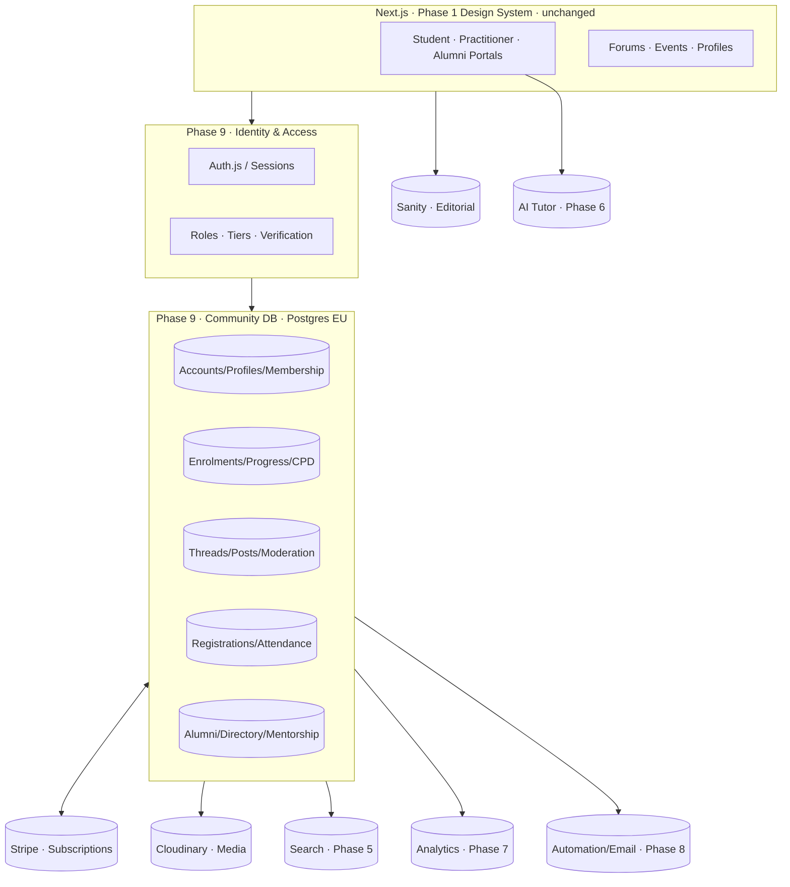

---

## Part 3 — Overall Community Architecture

Phase 9 is organised into **eight bounded contexts**. Each owns its data, exposes a clear internal service boundary, and is independently testable. This keeps the codebase legible for Cursor and lets sub-phases ship without entangling.

| # | Bounded Context | Owns | Consumes |
|---|---|---|---|
| 1 | **Identity & Access** | Accounts, sessions, roles, tiers, verification, permissions | Stripe entitlements |
| 2 | **Membership & Billing** | Membership state, tier grants, benefits resolution | Stripe, Sanity (tier definitions) |
| 3 | **Learning & Campus** | Enrolments, progress, notes, flashcards, assignments, graduation records | Sanity (course content), Cloudinary (video), AI Tutor |
| 4 | **Alumni & Practitioner Network** | Alumni profiles, directory, CPD ledger, mentorship, verification | Learning (graduation), Identity (verification) |
| 5 | **Knowledge Community** | Forums, threads, posts, reactions-as-adab, bookmarks | Identity, Search |
| 6 | **Events** | Event operations, registration, attendance, event certificates | Sanity (event content), Cloudinary (recordings), Video provider |
| 7 | **Recognition & Credentials** | Badges, certificates, CPD credits, verifiable records | Learning, Events, Community service |
| 8 | **Governance & Communications** | Moderation, reports, appeals, roles admin, notifications, announcements | All contexts (cross-cutting) |

**Cross-cutting concerns** (implemented once, used everywhere): authentication, permission checks, audit logging, notification dispatch, analytics event emission, consent enforcement, media handling.

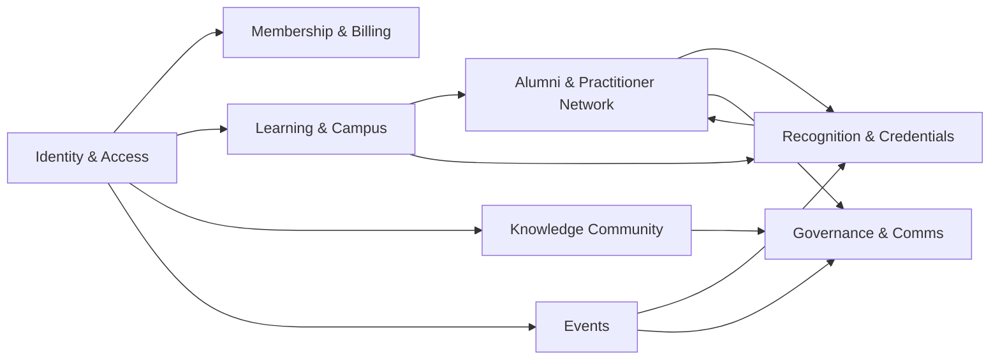

---

## Part 4 — Identity, Membership & Access

### 4.1 Roles (capability-bearing status)

Roles describe **what a person is to the institution** and carry capabilities. A person may hold more than one role (e.g. a Graduate who is also a Practitioner and a Mentor).

| Role | Meaning | Acquired by |
|---|---|---|
| **Visitor** | Unauthenticated | Default |
| **Registered User** | Has an account | Sign-up + email verify |
| **Student** | Enrolled on ≥1 active course | Enrolment |
| **Graduate / Alumnus** | Completed ≥1 programme; holds a graduation record | Programme completion (auto-conferred) |
| **Practitioner** | Verified clinical practitioner | Verification workflow (§4.3) |
| **Researcher** | Verified research contributor | Faculty grant / application |
| **Faculty** | Teaches, verifies clinical content, answers Q&A | Institutional appointment |
| **Moderator** | Enforces conduct within assigned forums | Institutional appointment |
| **Institution Member** | Formal member (tiered) | Membership subscription/grant |
| **Partner** | Organisational relationship | Institutional agreement |
| **Admin** | Full governance | Institutional appointment |
| *Future:* **Donor**, **Volunteer**, **Ambassador** | Reserved | Reserved |

### 4.2 Membership tiers (access & benefit envelope)

Tiers are **orthogonal to roles**. A tier defines the *envelope of access and benefit*; a role defines *standing and capability*. Tier **definitions live in Sanity** (name, price references, benefit copy, permission keys) so the institution edits benefits without a deploy; tier **grants live in the Community DB**.

| Tier | Cadence | Primary audience | Envelope (illustrative) |
|---|---|---|---|
| **Free / Registered** | — | Everyone with an account | Read public library, join General forums, register for open events, save/bookmark |
| **Student** | Course-linked | Enrolled learners | Full campus, course forums, revision, flashcards, AI Tutor, course downloads, office hours |
| **Practitioner** | Monthly / Annual | Verified practitioners | Practitioner Portal, clinical protocols, CPD ledger, private publications, directory listing, practitioner network |
| **Research** | Monthly / Annual | Researchers | Research library, journal clubs, data/resources, collaboration spaces |
| **Institutional** | Annual | Organisations | Seats, cohort management, partner spaces, reporting |
| **Supporting Member** | Monthly / Annual | Well-wishers who fund the mission | Recognition, member communications, event priority, supporter badge |
| *Future:* **Lifetime** | One-time | Committed members | All Supporting benefits, permanent |

**Benefit dimensions each tier populates** (per brief): Access · Benefits · Permissions · Learning pathways · Downloads · Events · Research access · Private library · Discounts · Certificates · Community privileges · Future expansion. Each is expressed as a **permission key** (§4.4), so entitlement is data-driven, not hard-coded.

**Entitlement resolution:** a member's effective permissions = union of (role capabilities) ∪ (tier permission keys) ∪ (verification grants) ∪ (explicit admin grants), minus (active suspensions). Resolved server-side on every request; cached per session; recomputed on membership/role change or Stripe webhook.

### 4.3 Verification (Practitioner, Researcher, Faculty)

Verification protects the public and the institution's name. It is a **reviewed, evidence-based workflow**, never self-asserted.

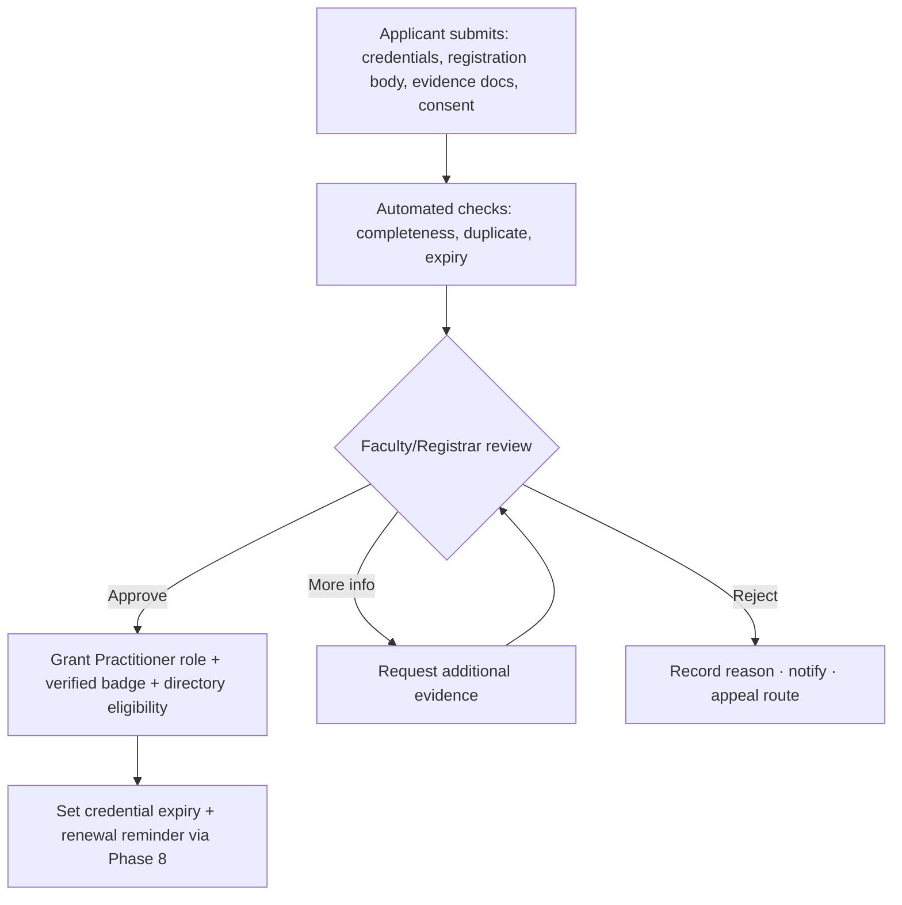

- Evidence documents stored in Cloudinary **private** delivery, access-controlled to Registrar/Faculty only.
- Verified status carries an **expiry**; Phase 8 automation issues renewal reminders and downgrades on lapse.
- A **verified badge** is a *credential*, not decoration — it links to a verification record.
- Hijama / wet-cupping practitioners: verification must reference the Phase 4 clinical governance protocols; directory listing must state scope of practice and duty-of-care disclaimer.

### 4.4 Permission model

**Model:** Role-Based Access Control **augmented by** tier entitlements, verification grants, and per-resource ownership/visibility. Permissions are **capability keys** (verbs on resources), checked at the service boundary — never assumed from UI state.

Representative capability matrix (excerpt — full matrix in Appendix A):

| Capability key | Visitor | Registered | Student | Practitioner | Researcher | Faculty | Moderator | Admin |
|---|:-:|:-:|:-:|:-:|:-:|:-:|:-:|:-:|
| `library.read.public` | ✓ | ✓ | ✓ | ✓ | ✓ | ✓ | ✓ | ✓ |
| `library.read.private` | — | tier | tier | ✓ | ✓ | ✓ | ✓ | ✓ |
| `forum.read` | public | ✓ | ✓ | ✓ | ✓ | ✓ | ✓ | ✓ |
| `forum.post` | — | ✓* | ✓ | ✓ | ✓ | ✓ | ✓ | ✓ |
| `forum.mark_beneficial` | — | — | — | — | — | ✓ | ✓ | ✓ |
| `course.enrol` | — | ✓ | ✓ | ✓ | ✓ | ✓ | ✓ | ✓ |
| `campus.access` | — | — | ✓ | — | — | ✓ | — | ✓ |
| `practitioner.portal` | — | — | — | ✓ | — | ✓ | — | ✓ |
| `directory.list_self` | — | — | — | ✓ (consent) | — | ✓ | — | ✓ |
| `cpd.log` | — | — | — | ✓ | ✓ | ✓ | — | ✓ |
| `mentorship.offer` | — | — | — | alumni | alumni | ✓ | — | ✓ |
| `event.create` | — | — | — | — | — | ✓ | — | ✓ |
| `moderation.act` | — | — | — | — | — | — | ✓ | ✓ |
| `credential.issue` | — | — | — | — | — | ✓ | — | ✓ |
| `governance.admin` | — | — | — | — | — | — | — | ✓ |

*`✓*` = permitted only after Conduct Acknowledgement (§Governance). "tier" = granted by membership tier permission key. "consent" = requires explicit directory consent. "alumni" = requires Graduate role.

### 4.5 Subscriptions & billing (Stripe)

- Membership tiers with a cadence map to **Stripe subscription products**; Free/Student-linked tiers do not bill through subscriptions.
- **Source of truth for *paid* entitlement is Stripe**, mirrored into Community DB via webhooks (`created`, `updated`, `paused`, `cancelled`, `payment_failed`).
- On webhook, recompute entitlements and emit an analytics event. Dunning (failed payment) handled through Phase 8 email; grace period configurable before downgrade.
- **Integrity Ledger veto:** safety-critical guidance (e.g. clinical safety notices, safeguarding info) is **never** placed behind a paywall, regardless of tier. Commercial gating applies only to *enrichment*, never to *safety*.
- Discounts (per tier) applied as Stripe coupons/entitlement flags; student and supporter discounts on the Apothecary reconcile with Phase 4.

---

## Part 5 — Data Architecture

Entities below are **specification-level** (fields described, not typed as DDL). "Ref → Sanity" means the field stores a reference id resolved against Sanity at read time. All user-generated tables carry: `id`, `createdAt`, `updatedAt`, `createdBy`, soft-delete `archivedAt`, and (where relevant) `status`.

### 5.1 Entity catalogue

**Identity & Membership**

| Entity | Key fields | Notes |
|---|---|---|
| `Account` | email, authProviderIds, displayName, roles[], accountStatus, locale, region | One per person |
| `Profile` | accountId, bio, qualifications[], interests[], avatar (Cloudinary), city/region, visibility settings | 1:1 with Account |
| `Membership` | accountId, tierKey, status, source (stripeSubId?), startedAt, renewsAt, grantedBy | Current tier grant |
| `RoleAssignment` | accountId, role, grantedBy, grantedAt, expiresAt? | Multi-role support |
| `VerificationRequest` | accountId, type, evidenceRefs[], status, reviewerId, decisionAt, reason | Practitioner/Researcher/Faculty |
| `ConsentRecord` | accountId, purpose, granted, jurisdiction, capturedAt, withdrawnAt? | GDPR/PDPL evidence |

**Learning & Campus**

| Entity | Key fields | Notes |
|---|---|---|
| `Enrolment` | accountId, courseRef→Sanity, status, progressPct, startedAt | |
| `LessonProgress` | enrolmentId, lessonRef→Sanity, completedAt, secondsWatched | |
| `Assignment` / `Submission` | courseRef, prompt / accountId, body, attachments, grade, feedback | |
| `FlashcardDeck` / `FlashcardReview` | courseRef / accountId, cardRef, easeFactor, dueAt | Spaced repetition schedule |
| `CourseNote` | accountId, courseRef/lessonRef, body, visibility(private) | |
| `GraduationRecord` | accountId, programmeRef→Sanity, conferredAt, ijazahRef, certificateRef | **Triggers Alumnus role** |
| `Transcript` *(future)* | derived from graduation + CPD | |

**Alumni & Practitioner Network**

| Entity | Key fields | Notes |
|---|---|---|
| `AlumniProfile` | accountId, programmes[], graduationYears[], specialisations[], mentorAvailability, directoryConsent | Extends Profile |
| `DirectoryListing` | accountId, visibilityScope, servicesOffered[], scopeOfPractice, location(consented), contactPrefs, verifiedBadgeRef | Opt-in only |
| `CPDRecord` | accountId, activity, categoryKey, credits, evidenceRef, activityDate, verifiedBy? | |
| `CPDCycle` | accountId, year, targetCredits, accruedCredits, statementRef | Annual statement |
| `MentorshipMatch` | mentorId, menteeId, status, goals, safeguardingAck, startedAt, endedAt | Structured, consented |

**Knowledge Community**

| Entity | Key fields | Notes |
|---|---|---|
| `Forum` | key, name, description, accessRule, parentId? | Category tree |
| `Thread` | forumId, authorId, title, tags[], status, pinned, locked | |
| `Post` | threadId, authorId, body, parentId?, attachments[], sourceCitations[], status | `sourceCitations` for hadith/reference integrity |
| `BeneficialMark` | postId, markedBy(faculty/mod), reason | Non-ranked, non-public-count |
| `Bookmark` | accountId, targetType, targetId | Private |
| `Mention` | postId, mentionedAccountId | Drives notification |

**Events**

| Entity | Key fields | Notes |
|---|---|---|
| `Event` | eventRef→Sanity, type, startsAt, endsAt, capacity, accessRule, cpdCredits, recordingRef?, videoJoinRef? | Ops mirror of Sanity content |
| `Registration` | accountId, eventId, status, waitlistPos? | |
| `Attendance` | registrationId, joinedAt, secondsPresent, presenceVerified | Feeds certificate + CPD |
| `EventResource` | eventId, mediaRef, accessRule | |

**Recognition & Credentials**

| Entity | Key fields | Notes |
|---|---|---|
| `BadgeDefinition` | key, name, criteria, image → **Sanity** | |
| `Credential` | accountId, badgeDefRef, issuedAt, evidenceRefs[], verifiableId (Open Badges), revokedAt? | Verifiable |
| `Certificate` | accountId, sourceType(course/event), pdfRef(Cloudinary), verificationCode | Artefact + record |

**Governance & Communications**

| Entity | Key fields | Notes |
|---|---|---|
| `Report` | reporterId, targetType, targetId, reasonCode, notes, status | |
| `ModerationAction` | moderatorId, targetType, targetId, action, reason, expiresAt? | Warning/lock/suspend |
| `Appeal` | accountId, moderationActionId, statement, status, decisionBy | |
| `Notification` | accountId, type, payload, readAt?, channel | In-app + email digest |
| `Announcement` | ref→Sanity, audienceRule, publishedAt | |
| `MessageThread` / `Message` | participants[], subject / senderId, body | Private member/faculty comms |
| `AuditLog` | actorId, action, target, before/after, at | Immutable, security-relevant |

### 5.2 Core relationships

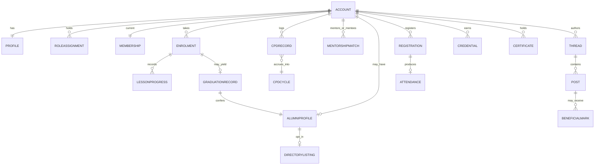

---

## Part 6 — The Student Portal (Digital Campus)

The campus is where a Student *lives* during study. It composes existing design primitives into a personal, calm, scholarly workspace — no feeds, no noise.

**Surfaces:**

- **Dashboard** — current courses, next lesson, upcoming office hours/events, private learning streak (encouragement only), announcements relevant to the student.
- **Course view** — lessons (Cloudinary video), progress, completion, downloadable resources, reading lists, course-scoped discussion (a filtered Forum), faculty contact.
- **Revision suite** — flashcards (spaced repetition), revision programmes, course notes.
- **Assignments** — submission, faculty feedback, grades where applicable.
- **AI Tutor (Phase 6)** — course-context-aware; answers grounded in the institution's verified material; escalates clinical/fatwa-adjacent questions to human faculty rather than improvising.
- **Certificates** — issued on completion; verifiable.
- **Calendar** — office hours, study circles, events; personal.
- **Continuity** — clear signposting that on graduation the student *becomes an alumnus* and gains the Alumni Network (Part 8).

**Guardrails:** the AI Tutor must **never** issue clinical instructions, Hijama technique guidance, dosing, or religious rulings as authoritative; it cites institutional sources and defers to faculty. This is an Integrity Ledger requirement.

*Future:* transcripts, graduation records surfaced to student, alumni access handoff.

---

## Part 7 — The Practitioner Portal

A professional workspace for verified practitioners.

**Surfaces:**

- **Clinical protocols & practice guidelines** — versioned, referencing Phase 4 clinical governance (incl. Hijama/wet-cupping protocols); each carries source integrity and a "last reviewed by faculty" stamp.
- **Clinical updates & announcements** — practitioner-only.
- **Private publications & case studies** — access-controlled library; case studies anonymised and reviewed.
- **Treatment resources, templates, patient resources** — downloadable, versioned.
- **CPD tracking** — log activities, view accrued credits, download annual CPD statement (shared with Alumni CPD ledger — one ledger, Part 8).
- **Professional profile & digital credentials** — verified badge, credentials, scope of practice.
- **Private discussion** — Practitioner Network forum (moderated, peer-level).
- **Directory management** — opt-in listing, consent controls (Part 8).

**Guardrail:** clinical content is faculty-verified; practitioners cannot publish clinical protocols to others without review. The portal distinguishes *institutional guidance* (authoritative, reviewed) from *peer discussion* (clearly labelled, not a substitute for the protocols).

*Future:* practitioner directory public surface, referral network.

---

## Part 8 — The Alumni Network *(First-Class Domain)*

**Strategic premise:** completing a course is the **beginning** of a lifelong relationship with Sunnah Remedies, not its conclusion. The Alumni Network is therefore not a list of "past students" — it is a **structured professional network** and, over time, one of the institution's greatest assets: a self-reinforcing circle where graduates return as mentors, practitioners, contributors and invited guests.

This domain (bounded context #4) is elevated to first-class status: it owns its own data, appears as a top-level portal, and threads through Membership, Recognition, Events, Mentorship, Communications and Analytics.

### 8.1 Becoming an alumnus

Alumnus status is **conferred automatically** the moment a `GraduationRecord` is written (programme completion). No application; it is *earned* by completion.

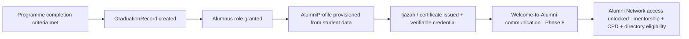

The graduation moment is treated with institutional gravity — it mirrors the *ijāzah*: a chain of transmission. The verifiable credential records *who taught*, *what was completed*, and *when conferred*, giving the graduate a portable, tamper-evident record they carry for life.

### 8.2 Graduate profiles

An `AlumniProfile` extends the member `Profile` with: programmes completed, graduation year(s), specialisations/areas of study, credentials held, current practice (optional, consented), and **mentor availability**. Alumni control visibility granularly (private · members-only · public), defaulting to the most private.

### 8.3 Practitioner directory (verification + consent)

A searchable directory of **verified** practitioners who have **explicitly consented** to be listed.

- **Verification gate:** only Practitioner-verified accounts may list (§4.3).
- **Consent gate:** listing requires explicit, revocable consent; withdrawal removes the listing immediately (GDPR/PDPL right to withdraw).
- **Granular fields:** each listed field (location, contact method, services, scope of practice) is independently consented.
- **Duty of care:** every listing shows scope of practice and a duty-of-care/disclaimer notice; Hijama listings reference the clinical governance scope.
- **Search & filter:** by specialisation, region, programme — respecting consent scope; unlisted alumni are never surfaced.
- **Abuse protection:** rate-limited contact, no bulk export, no scraping surface; contact routed through the institution where the practitioner prefers.

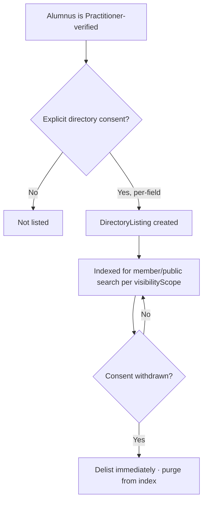

### 8.4 CPD tracking (one ledger, shared with Practitioner Portal)

- Alumni and practitioners maintain a **CPD ledger** (`CPDRecord` → `CPDCycle`).
- Credits accrue **automatically** from institution activities (courses, verified event attendance, journal clubs) and can be **self-logged with evidence** for external activities (faculty-verifiable).
- Categories reflect professional development domains; annual **CPD statements** are generated (Phase 8) and downloadable — valuable for professional bodies.
- CPD becomes a reason to *return* each year — reinforcing lifelong relationship.

### 8.5 Alumni-only webinars & research updates

- A distinct **event type** and **communication channel** gated to the Alumnus role.
- Advanced clinical updates, research briefings, and faculty roundtables — content that assumes prior study.
- Recordings archived to an **alumni library** (Cloudinary, access-controlled).

### 8.6 Mentorship (new students ↔ alumni)

A structured, consented, safeguarding-aware programme where alumni mentor current students.

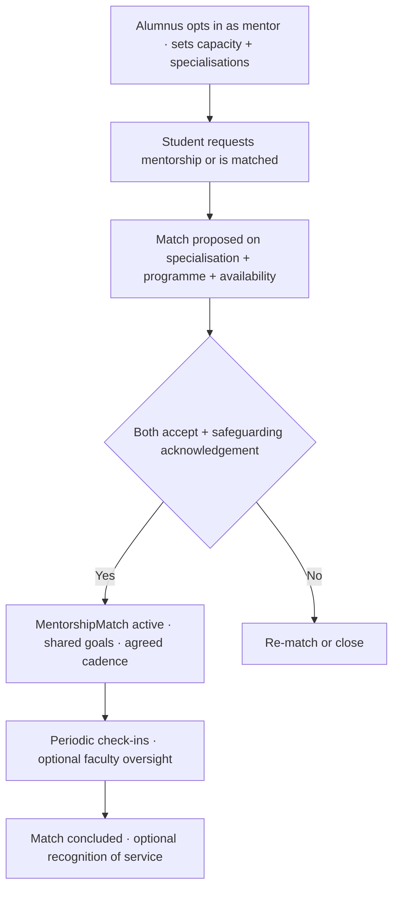

- **Safeguarding:** both parties acknowledge conduct + safeguarding terms; no unsupervised arrangements outside institutional channels are endorsed; concerns route to Governance.
- **Recognition:** sustained mentoring is recognised as *service* (Part 9) — never counted or ranked publicly.

### 8.7 Invitations to advanced workshops & conferences

- Alumni receive **priority registration** and invitation-gated access to advanced workshops, conferences and faculty sessions.
- Implemented via `accessRule` on `Event` referencing Alumnus role + optional programme prerequisites.

### 8.8 Why this compounds

Each graduating cohort enlarges the mentor pool, the directory, the CPD community and the alumni event audience. New students see a visible destination ("I will join *this*"). Alumni find lifelong reasons to return (CPD, advanced events, mentoring, peers). Over years this becomes the institution's most durable asset — a living isnād of practitioners and scholars.

---

## Part 9 — Knowledge Community & Forums

### 9.1 Discussion environment

A moderated, searchable, respectful space for: research discussions, case discussions (anonymised), clinical questions (with safety routing), course discussions, book discussions, journal clubs, faculty Q&A, knowledge sharing, resource recommendations, academic collaboration.

**Integrity mechanics:**

- Knowledge/clinical posts expose an optional **source citation** field (hadith reference, journal citation) — carrying the institution's sourcing discipline into the community.
- **Clinical safety routing:** posts detected as seeking personal medical advice surface a notice directing to qualified care; faculty may convert them to Q&A. The community is for scholarship, not diagnosis.
- **Faculty Q&A** is a distinct, authoritative thread type; faculty answers are marked as such.

### 9.2 Forums (structure)

Structured categories (per brief): General Discussion · Prophetic Medicine · Hijamah · Clinical Practice · Research · Student Lounge · Practitioner Network · Sacred Journeys · Books · Announcements · Questions · Suggestions · *(future)* Regional Communities.

Each forum carries an **access rule** (public / registered / student / practitioner / alumni / faculty) enforced by capability keys.

**Capabilities:** categories, threads, replies, mentions, bookmarks, search, moderation, reporting, attachments, notifications. **Deliberately excluded:** public reaction counts, karma, follower graphs.

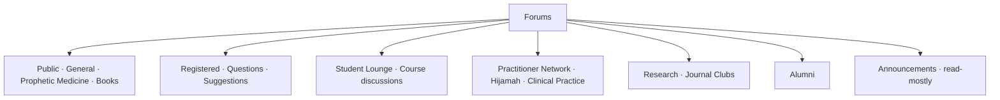

---

## Part 10 — Events

**Types:** webinars, live teaching, conferences, workshops, seminars, research presentations, community gatherings, open days, graduation ceremonies, networking, faculty sessions, Q&A. *(future: hybrid.)*

**Lifecycle:**

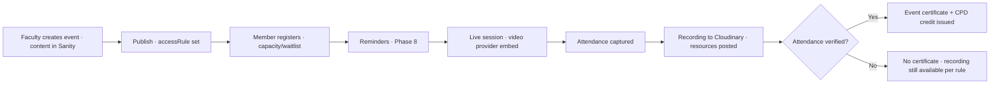

**Capabilities:** registration, attendance, certificates, recordings, resources, event galleries. Alumni/practitioner-gated events use `accessRule`. Certificates are verifiable (Part 12). Graduation ceremonies link to `GraduationRecord`.

---

## Part 11 — Learning Community (Continuous Learning)

Continuity mechanisms that keep learning alive after a course:

- **Reading groups & study circles** — scheduled, faculty- or peer-led, tied to a forum + calendar.
- **Revision programmes** — structured spaced-repetition cycles.
- **Research projects & clinical supervision** — collaboration spaces (researcher/practitioner-gated).
- **Mentorship** — Part 8.
- **Faculty office hours** — bookable slots; calendar-integrated.
- **Peer learning & knowledge pathways** — recommended journeys (e.g. "after this course, continue with…").
- **Learning streaks** — **private only**, encouragement to the individual, never displayed or ranked.
- **Recommended learning journeys** — curated in Sanity, surfaced by role/history.

---

## Part 12 — Recognition & Credentials

Recognition reflects **achievement and service**, never popularity.

| Recognition | Basis | Form |
|---|---|---|
| Course certificate | Course completion | Verifiable certificate + credential |
| CPD credits | Verified activity | CPD ledger entry |
| Practitioner badge | Verification (§4.3) | Verifiable credential |
| Research contribution | Faculty-reviewed contribution | Credential |
| Faculty recognition | Institutional | Credential |
| Community service | Faculty/mod-reviewed service (e.g. sustained mentoring) | Credential |
| Volunteer recognition *(future)* | Programme participation | Credential |
| Milestone awards | Study/service milestones | Credential |

**Digital credentials** follow **Open Badges 3.0 / Verifiable Credentials**: each is tamper-evident, portable, and resolvable at a **public verification endpoint** (verify by code without exposing private data). This mirrors the *ijāzah* — a chain naming the transmitter and the transmitted. Certificates remain as human-facing PDF artefacts (Cloudinary) but are **backed** by the verifiable record. Credentials can be **revoked** (with reason) if verification lapses.

---

## Part 13 — Communication & Notifications

**Channels:** in-app notifications, email (Phase 8), private member communications, faculty messages. **No push spam; digests preferred.**

**Types:** announcements, news, editorial updates, research updates, course updates, journey updates, product updates, private member communications, faculty messages, emergency notices, personalised recommendations.

- **Audience rules** target by role/tier/enrolment/alumni status.
- **Emergency notices** (e.g. safety) bypass digest and are never paywalled (Integrity Ledger).
- **Personalised recommendations** draw on history but respect a member's communication preferences and consent; frequency-capped.
- Every notification type is user-controllable in profile preferences (Part 14). Default to restraint.

---

## Part 14 — Member Profiles & Privacy Controls

**Profile contains:** biography, qualifications, courses completed, certificates, CPD, research, downloads, bookmarks, saved articles/products/courses/journeys, professional interests.

**Privacy controls (default-private):**

- Per-field visibility: private · members-only · public.
- Directory consent (Part 8) is separate and explicit.
- Communication preferences per notification type/channel.
- Data export & deletion (Part 19).
- Clear separation between *private* saves/notes and *public* profile.

---

## Part 15 — Community Governance, Moderation & Safeguarding

**Roles & permissions:** Moderators (scoped to forums), Faculty (content authority + clinical verification), Admin (full), with least-privilege defaults and full `AuditLog`.

**Conduct entry gate:** first contribution requires acknowledging the **Code of Conduct** (rooted in *adab*, respect, sincerity, sound sourcing).

**Moderation flow:**

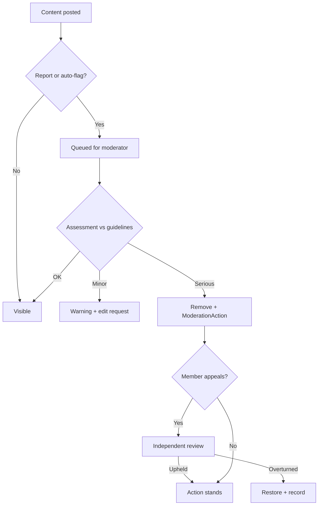

**Supported:** roles, permissions, moderation, reporting, content review, appeals, warnings, suspensions, community guidelines, code of conduct, privacy, safety, **safeguarding**.

**Safeguarding specifics:** mentorship and 1:1 contact carry safeguarding acknowledgement; concerns have a dedicated confidential route to a safeguarding lead; clinical-harm content is escalated immediately; the institution keeps a safeguarding log distinct from ordinary moderation.

**Integrity Ledger authority:** the governance layer, on integrity grounds, can override commercial decisions (e.g. remove misleading health claims even from a paying member or partner).

---

## Part 16 — Community Analytics

Metrics flow to the **Phase 7 warehouse** via an event stream — never computed on the operational store, never used to rank members publicly.

**Measured (institutional health, not vanity):** membership growth, engagement (meaningful participation, not raw volume), forum activity, course participation, event attendance, research participation, downloads, certificates issued, community retention, active members, knowledge-sharing quality (e.g. faculty-marked beneficial), mentorship reach, learning progression, **alumni activation & CPD engagement**, directory health.

**Principles:** privacy-preserving aggregation; no per-member public leaderboards; analytics inform *stewardship* (where to support the community), not competition.

---

## Part 17 — Integration Architecture

Phase 9 is an integrator: it adds one new data plane and wires it to eight existing systems. Each integration below states the **direction**, **trigger** and **contract** (described, not coded).

| System | Direction | Trigger | Contract / Behaviour |
|---|---|---|---|
| **Sanity (Phase 2)** | Read (mostly) | On page render / cache revalidate | Editorial source of truth: course & lesson structure, event content, tier & badge *definitions*, guidelines, announcements. Community DB stores **references**, resolved at read time. Write-back limited to editorial-owned entities. |
| **Cloudinary (Phase 3)** | Read/Write | On media upload / access | Private, access-controlled delivery for lesson video, recordings, certificates, evidence docs, avatars. Signed URLs; no public listing of private assets. |
| **Shopify + Stripe (Phase 4)** | Bi-directional | Checkout / subscription webhooks | Stripe subscriptions ↔ membership tier grants; entitlement webhooks recompute permissions. Discounts reconcile with Apothecary. Shopify products unchanged. |
| **Search (Phase 5)** | Write (index) | On publish/edit/delete/consent-change | Index forum threads, library resources, **consented** directory listings. Delist immediately on consent withdrawal or moderation removal. |
| **AI Tutor (Phase 6)** | Read | Student interaction | Course-context grounding; escalation of clinical/fatwa-adjacent queries to faculty; never authoritative clinical/religious output. |
| **Analytics (Phase 7)** | Write (events) | Domain events | Emit community events (enrolment, completion, graduation, post, registration, attendance, CPD, mentorship, membership change). Warehouse computes metrics. |
| **Ops/Automation & Email (Phase 8)** | Write (jobs) | Scheduled / event-driven | Transactional + digest email, renewal & CPD-statement generation, moderation SLA reminders, verification expiry, welcome-to-alumni sequences. |
| **Auth.js (new)** | Core | Every request | Sessions, identity, role/tier resolution, permission checks at service boundary. |

**Integration principles:** one source of truth per datum (Part 2 map); idempotent webhook handling; every external mutation audited; consent state authoritative over index/search presence.

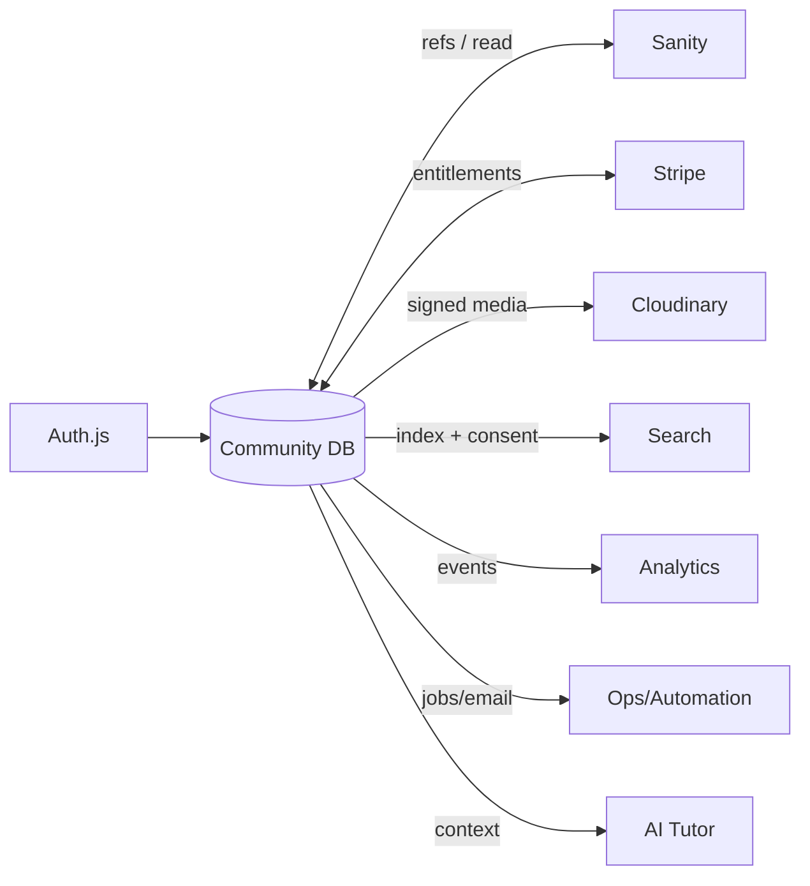

---

## Part 18 — Security Considerations

- **Authentication:** Auth.js; secure session handling; MFA available for Faculty/Moderator/Admin; strong password/OAuth flows. Credential entry is user-side only — the platform never asks members to hand credentials to staff.
- **Authorisation:** deny-by-default; permission checks at every service boundary, never trusting client state; capability keys resolved server-side.
- **Least privilege:** Moderators scoped to assigned forums; verification evidence visible only to Registrar/Faculty; Admin actions audited.
- **Auditability:** immutable `AuditLog` for security-relevant actions (role/tier grants, verifications, moderation, credential issue/revoke, consent changes).
- **Media security:** private Cloudinary delivery + signed URLs for lesson video, recordings, certificates, evidence; no directory enumeration.
- **Input & content safety:** sanitise all user-generated content; attachment type/size limits + malware scanning; rate limits on posting, contact, verification submissions.
- **Abuse resistance:** anti-scraping on directory; contact throttling; report/appeal audit trail; account-takeover monitoring.
- **Secrets:** environment-managed (Appendix D lists names only); never committed; rotated.
- **Webhooks:** signature verification (Stripe), idempotency keys, replay protection.
- **Integrity Ledger enforcement:** security and integrity controls cannot be disabled to satisfy a commercial request.

---

## Part 19 — Privacy & Compliance Model

The institution operates in **London (UK GDPR), Copenhagen (EU GDPR), Riyadh (KSA PDPL)** — build for the strictest applicable standard, region-aware.

- **Lawful basis & consent:** explicit, granular, revocable consent for directory listing, communications, and any public-profile fields; `ConsentRecord` stores purpose, jurisdiction, timestamps.
- **Data minimisation:** collect only what a feature needs; verification evidence retained only as long as required, then purged.
- **Data subject rights:** self-serve **export** and **deletion/erasure**; deletion cascades to community content per policy (author attribution anonymised where content must remain for thread integrity).
- **Right to withdraw:** withdrawing directory/communication consent takes effect immediately (delist, purge from index).
- **Residency:** community DB in the EU; region-aware handling for KSA members.
- **Children/safeguarding:** the community is designed for adults; safeguarding policy governs any interaction; no romantic/private-contact facilitation; concerns escalate to a safeguarding lead.
- **Special-category data:** health-adjacent content (practitioner cases) anonymised and access-controlled; no personal medical advice stored as public content.
- **Cookie/consent:** default to the most privacy-preserving option; non-essential off by default.
- **DPIA:** a Data Protection Impact Assessment is a production-readiness gate for the directory and mentorship features.

---

## Part 20 — Repository / Folder Structure

Phase 9 respects the existing repo. New code sits in clearly bounded modules mapped to the eight contexts. Illustrative structure (adapt to existing conventions — do **not** restructure Phases 1–8):

```
/app
  /(community)                 # new route group, existing design system only
    /portal
      /student                 # Part 6
      /practitioner            # Part 7
      /alumni                  # Part 8  (first-class)
    /membership                # tiers, join, manage
    /forums                    # Part 9
    /events                    # Part 10
    /directory                 # Part 8.3 (consented)
    /profile                   # Part 14
    /credentials/verify        # public verification endpoint (Part 12)
    /governance                # moderation, reports, appeals (role-gated)
/modules
  /identity                    # accounts, sessions, roles, permissions
  /membership                  # tiers, entitlements, Stripe sync
  /learning                    # enrolments, progress, graduation
  /alumni                      # profiles, directory, CPD, mentorship
  /community                   # forums, threads, posts, moderation
  /events                      # registration, attendance, certificates
  /recognition                 # badges, credentials, verifiable records
  /governance                  # moderation, safeguarding, audit
  /communications              # notifications, messaging, digests
/lib
  /permissions                 # capability keys + resolver
  /integrations                # sanity, stripe, cloudinary, search, analytics, ops adapters
  /consent                     # consent capture + enforcement
  /audit                       # audit logging
/db
  /schema                      # community DB schema (per Part 5 catalogue)
  /migrations
/content-schemas               # Sanity: tier defs, badge defs, event content, guidelines
```

---

## Part 21 — Key Workflow Diagrams

Diagrams for graduation→alumni (§8.1), verification (§4.3), directory consent (§8.3), mentorship (§8.6), event→certificate (Part 10) and moderation/appeal (Part 15) appear inline above. Two remaining cross-cutting flows:

**Registration → first meaningful membership**

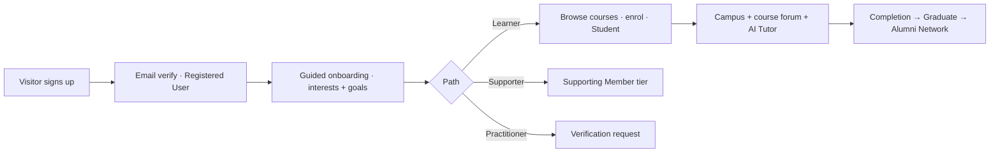

**Membership entitlement recomputation**

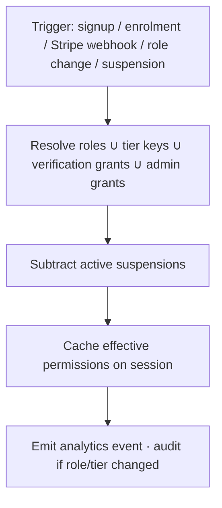

---

## Part 22 — Implementation Roadmap

Sequenced sub-phases; each is independently shippable and testable.

| Sub-phase | Scope | Delivers | Depends on |
|---|---|---|---|
| **9.1 Identity foundation** | Auth.js, accounts, profiles, roles, permission resolver, community DB, audit | People can register/sign in; permissions enforced | — |
| **9.2 Membership & billing** | Tiers (Sanity defs), Stripe subscription sync, entitlement resolution, discounts | Earned, paid/free membership envelopes | 9.1 |
| **9.3 Learning & campus** | Enrolments, progress, notes, flashcards, assignments, AI Tutor embed, certificates | Student Portal live | 9.1, Phases 2/3/6 |
| **9.4 Graduation & credentials** | Graduation records, verifiable credentials, verification endpoint | Completion confers Alumnus + ijāzah credential | 9.3 |
| **9.5 Alumni Network** | Alumni profiles, CPD ledger, alumni events/channel, mentorship | First-class alumni domain | 9.4 |
| **9.6 Practitioner Portal & verification** | Verification workflow, clinical library, CPD, directory (consented) | Practitioners served; directory live | 9.1, 9.5 |
| **9.7 Knowledge Community & Forums** | Forums, threads, posts, citations, bookmarks, mentions, search index | Moderated scholarly discussion | 9.1, Phase 5 |
| **9.8 Events** | Event ops, registration, attendance, recordings, event certificates | Institutional events | 9.4, Phase 3/8 |
| **9.9 Governance & safeguarding** | Moderation, reports, appeals, conduct gate, safeguarding, audit dashboards | Safe, well-governed community | 9.7 |
| **9.10 Communications & analytics** | Notifications, digests, member comms, Phase 7 event stream | Institutional communication + stewardship metrics | all |
| **9.11 Hardening & launch** | Security review, DPIA, load, accessibility, migration | Production readiness | all |

---

## Part 23 — Testing Checklist

- **Unit:** permission resolver (every role×tier×verification combination), entitlement recomputation, CPD accrual, spaced-repetition scheduling, consent enforcement.
- **Integration:** Stripe webhooks (create/update/cancel/failed) → entitlements; Sanity ref resolution; Cloudinary signed delivery; search index add/update/delist on consent withdrawal; analytics event emission.
- **Authorisation:** deny-by-default verified at every boundary; privilege-escalation attempts blocked; moderator scope enforced; directory shows only consented listings.
- **Workflow:** graduation→alumnus conferral; verification approve/reject/appeal; mentorship match + safeguarding gate; event attendance→certificate + CPD; moderation→appeal→restore.
- **Privacy:** export completeness; deletion cascade + anonymisation; consent withdrawal delists immediately; region-aware handling.
- **Security:** input sanitisation/XSS, attachment scanning, rate limits, webhook signature/replay, session/MFA for privileged roles, audit completeness.
- **Non-functional:** performance budgets (inherited from Phase 3) upheld; accessibility (WCAG AA) on all new surfaces; email deliverability; load on forums/events at peak.
- **Content integrity:** clinical safety routing fires; AI Tutor refuses authoritative clinical/religious output; source-citation fields function.

---

## Part 24 — Production Readiness Checklist

- [ ] All 9.x sub-phases feature-complete and tested
- [ ] DPIA completed for directory + mentorship; sign-off recorded
- [ ] Security review + penetration test passed; audit logging verified
- [ ] Consent flows + data export/deletion verified across UK/EU/KSA
- [ ] Stripe webhooks idempotent + signature-verified in production
- [ ] Media private-delivery + signed URLs confirmed; no public leakage
- [ ] Search delisting on moderation/consent-withdrawal verified
- [ ] Moderation, safeguarding + appeal routes staffed and documented
- [ ] Code of Conduct, Community Guidelines, Privacy Notice published
- [ ] Email templates + digests approved (Phase 8); frequency caps set
- [ ] Analytics events flowing to Phase 7; dashboards live
- [ ] Accessibility (WCAG AA) + performance budgets verified on new surfaces
- [ ] Rollback + incident runbook prepared
- [ ] Integrity Ledger review sign-off (no safety content paywalled; no vanity mechanics shipped)

---

## Part 25 — Acceptance Criteria

Phase 9 is **accepted** when:

1. A visitor can register, choose a meaningful membership path, and receive an envelope of access that matches their tier and role — enforced server-side.
2. A student experiences a complete campus (progress, revision, AI Tutor, certificates, calendar) using only the existing design language.
3. On completion, a student is **automatically conferred Alumnus status**, receives a **verifiable credential**, and gains the Alumni Network — with a clear message that this is a beginning.
4. A verified practitioner can access the portal, log CPD, and (with explicit consent) appear in the directory; withdrawing consent delists immediately.
5. Alumni can log CPD, attend alumni-only events, mentor students (with safeguarding), and receive advanced-event invitations.
6. Members can discuss in moderated, searchable, citation-aware forums with **no vanity metrics** present anywhere.
7. Events run end-to-end: register → attend → recording + verifiable certificate + CPD.
8. Recognition is verifiable, revocable, and reflects achievement/service — never popularity.
9. Governance, moderation, appeals and safeguarding function with full audit; the Integrity Ledger can veto commercial gating.
10. Privacy rights (consent, export, deletion, residency) work across all three jurisdictions.
11. No Phase 1–8 design, typography, layout or content was altered.

---

## Part 26 — Migration Strategy

- **Existing customers/students (Phase 4/2):** map to `Account`; provision `Profile`; link prior enrolments/purchases; assign Registered/Student roles by activity.
- **Historic completions:** where completion data exists, backfill `GraduationRecord` and issue verifiable credentials retroactively — welcoming existing graduates into the Alumni Network as a launch gesture.
- **Editorial:** tier & badge definitions authored in Sanity before 9.2/9.4.
- **Approach:** additive and non-destructive; run new plane alongside existing site; feature-flag surfaces per sub-phase; dual-read during transition; no big-bang cutover.
- **Communications:** staged onboarding emails (Phase 8) inviting existing users into membership and, for past graduates, into the Alumni Network.
- **Rollback:** each sub-phase behind a flag; data migrations reversible or forward-fixable; no destructive migration without backup + verification.

---

## Part 27 — Future Scalability & Future Community

Designed-in, not retrofitted:

- **Regional chapters & international communities** — `Forum` tree + region attribute already support geo-scoping; add regional access rules and localisation.
- **Practitioner registry** — the verified directory is the seed; extend to a formal registry with public verification.
- **Research collaborations & faculty network** — researcher/faculty-gated spaces scale into project workspaces.
- **Institution chapters & partners** — Institutional tier + Partner role scale to multi-seat organisations.
- **Volunteer, scholarship & ambassador programmes** — reserved roles (Donor/Volunteer/Ambassador) already modelled; activate with programme workflows + recognition.
- **Global conferences** — Events domain scales to large hybrid events (future hybrid flag).
- **Digital campus expansion** — bounded contexts allow new learning modes without disturbing others.
- **Lifetime membership** — reserved tier; one-time Stripe product + permanent entitlement.

Scalability principles: bounded contexts stay independently deployable; analytics stays off the operational store; consent/permission models are data-driven so new regions/roles need configuration, not rewrites.

---

## Part 28 — Developer Notes (for Cursor)

- **Respect the design system absolutely.** Every new surface = composition of existing Phase 1 primitives + tokens. No new fonts, colours, spacing or components that introduce a new visual language. The brass isnād rule, manuscript grid and `#0A2B21` are reused, not reinterpreted.
- **No code in this document is intentional** — you own implementation choices (ORM, exact schema types, route handlers) within the decisions in Part 2.
- **One source of truth per datum** (Part 2 map). Editorial in Sanity; people/activity in Community DB; money in Stripe; media in Cloudinary; behaviour in Phase 7.
- **Permission checks at the boundary, always.** Never trust the client. Deny by default.
- **Consent is authoritative** over search/index presence and any public visibility.
- **Emit analytics events** from domain actions; never compute metrics on the operational DB.
- **Idempotent webhooks**, signature-verified, with audit.
- **Anti-gamification is a requirement, not a preference.** If a feature introduces a public counter, score, rank or streak-shaming, it is wrong — stop and revisit.
- **Integrity Ledger veto** is enforced in code paths that gate content: safety/safeguarding content is never paywalled.
- **Accessibility (WCAG AA)** and **Phase 3 performance budgets** are acceptance gates, not afterthoughts.
- Ship per sub-phase behind flags; keep Phases 1–8 untouched.

---

## Part 29 — Community Operations Manual

For the humans who will run the living institution.

**Roles & responsibilities**

- **Community Officer** — stewardship of tone, *adab*, onboarding, alumni activation.
- **Membership Director** — tiers, benefits, renewals, supporter relations.
- **Academic Registrar** — verification, graduation records, credentials, CPD statements.
- **Faculty** — teaching, Q&A authority, clinical content verification, office hours, mentorship oversight.
- **Moderators** — day-to-day conduct enforcement within assigned forums.
- **Safeguarding Lead** — confidential concerns, mentorship oversight, escalations.

**Standing operating rhythms**

- **Daily:** moderation queue (SLA target), report triage, safeguarding checks.
- **Weekly:** faculty Q&A cadence, new-verification reviews, welcome of new alumni.
- **Monthly:** events calendar, study-circle scheduling, membership review, community-health metrics review (stewardship, not ranking).
- **Quarterly:** Integrity Ledger review of any commercial/community tensions; CPD statement cycle checkpoints; directory audit (consent + accuracy).
- **Annually:** CPD statements issued; alumni conference/gathering; cohort welcome-to-alumni campaign.

**Playbooks**

- **New member onboarding** — guided path by interest; introduce Code of Conduct; first meaningful action within one session.
- **Verification** — evidence in, faculty review, decision within SLA, expiry reminder scheduled.
- **Moderation & appeals** — assess against guidelines; proportionate action; independent appeal review; everything audited.
- **Safeguarding concern** — confidential route; immediate escalation for harm; documented separately from moderation.
- **Clinical-safety content** — route personal-medical requests to qualified care; never permit unsourced rulings/diagnoses; faculty verify clinical claims.
- **Alumni activation** — on graduation, welcome sequence; offer mentorship/CPD/advanced events; keep the relationship alive year over year.

**Guardrails for operators**

- Never place safety/safeguarding content behind a paywall.
- Never introduce popularity mechanics to boost engagement.
- Never list a practitioner without verification **and** explicit consent.
- Never endorse mentorship or contact outside institutional, safeguarded channels.
- When commercial and integrity interests conflict, the **Integrity Ledger wins** — escalate rather than compromise.

---

## Appendix A — Full Permission Matrix (reference)

Expand the §4.4 excerpt to every capability key across contexts (library, forum, course, campus, practitioner, directory, cpd, mentorship, event, credential, moderation, governance, communications) × every role, annotated with tier/consent/verification conditions. Maintain as the single authoritative source for the permission resolver.

## Appendix B — Notification Catalogue (reference)

Every notification type with: trigger, audience rule, channel (in-app/email/digest), default frequency cap, and user override. Default posture: restraint.

## Appendix C — Moderation Taxonomy (reference)

Report reason codes, severity tiers, standard actions, appeal grounds, safeguarding escalation triggers.

## Appendix D — Environment Variables (names only)

Auth secrets, community DB connection, Stripe keys + webhook secret, Cloudinary credentials, Sanity project/token, search API keys, analytics/ops endpoints. **Names catalogued here; values are environment-managed and never committed.**

## Appendix E — Glossary

*Adab* (etiquette/character) · *Ijāzah* (licence/certification in transmission) · *Isnād* (chain of transmission) · *Khidmah* (service) · CPD (Continuing Professional Development) · Open Badges 3.0 / Verifiable Credentials · Bounded context · Entitlement · Capability key · Two Ledgers (Integrity vetoes Commercial).

---

*End of Phase 9 Implementation Specification. Prepared for Cursor. No redesign, no typography change, no layout change, no code. Build the living institution.*
