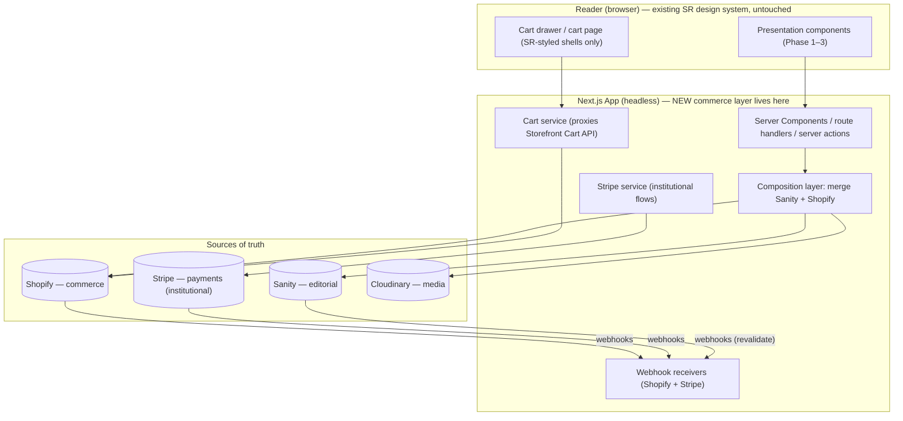

# Sunnah Remedies — Commerce Implementation Specification

## 00 · Master Architecture Specification

*Phase 4: Institutional Commerce. A specification for Cursor. No application code — architecture, contracts, and checklists only.*

**Author:** Lead Commerce Architect
**Status:** Ready for implementation
**Precedes:** all sub-specs (01–08) in this set

---

## 0.1 Prime directive

We are integrating commerce **beneath** an institution, not building a store. The frontend from Phases 1–3 is the institution's identity and is **not to be redesigned, re-typeset, re-laid-out, or replaced.** This specification adds a *data and transaction layer* under existing presentation components. Every new module either (a) feeds an existing component with commerce data, or (b) handles a transaction off-screen. Nothing in this spec introduces new visual design.

**The felt result:** a reader learns from a beautifully documented artefact page, and — almost as an afterthought — is able to acquire it. Commerce is present, quiet, and flawless. The presentation layer always belongs to Sunnah Remedies; Shopify and Stripe simply power the mechanics beneath it.

---

## 0.2 Assumptions to confirm before implementation

State these back to the team; adjust the spec if any differ.

| # | Assumption |
|---|-----------|
| A1 | Frontend is Next.js (App Router) headless, TypeScript, deployed on an edge/serverless platform (e.g. Vercel). |
| A2 | Sanity is the live editorial CMS (Phase 2); Cloudinary is the media layer (Phase 3), unchanged. |
| A3 | A Shopify store exists (or will) as the commerce backend; plan tier TBD (affects checkout branding — see §0.6). |
| A4 | A Stripe account exists for institutional/non-catalog financial flows. |
| A5 | Existing design-system components accept props; we add data, not design. |
| A6 | All Shopify/Stripe API version numbers, rate limits, and checkout-branding capabilities are **verified against current official docs for the pinned API version at build time** — this spec is architectural and version-sensitive details are flagged `[VERIFY]`. |

---

## 0.3 The four sources of truth (the boundary that governs everything)

The single most important rule in this architecture: **each fact has exactly one owner.** No fact is authored in two systems.

| System | Owns (source of truth) | Never owns |
|--------|------------------------|-----------|
| **Sanity** | All editorial: educational copy, short/long description as *narrative*, ingredient history, clinical notes, research, references, FAQs, photography selection & ordering, cross-content links, scholarly framing | Price, inventory, SKU, order state |
| **Shopify** | All commerce state: price, compare-at price, inventory, SKU, barcode, variants, weight, dimensions, country of origin, collections *as commerce facts*, orders, customers, shipping, taxes, discounts, catalog checkout | Narrative/editorial content, photography art direction |
| **Stripe** | Payment infrastructure for **institutional/non-catalog** flows: donations, memberships, subscriptions, instalments, invoices, (optionally) course access | The product catalog, inventory, the shop's checkout |
| **Cloudinary** | Delivery & transformation of all imagery/media (Phase 3) | Business or commerce data |

**The join key.** A Sanity `product` document holds a reference to its Shopify product (stored Shopify product ID + handle + variant IDs). The frontend *composes* the two at render time: Sanity supplies the story and the images; Shopify supplies the live price and availability. See Spec 01.

**Conflict rule (institutional continuity):** where a value could plausibly live in both systems (e.g. a "short description"), Sanity owns the *narrative* version shown to readers; Shopify's equivalent field is used only for its own admin/checkout surfaces. We never show two different truths for the same fact.

---

## 0.4 System architecture (high level)

**Reading of the diagram:** the browser talks only to our Next.js app. Our app composes editorial (Sanity) with commerce (Shopify) and media (Cloudinary) server-side, proxies cart operations to Shopify's Cart API, and handles institutional payments via Stripe. All three backends notify us via webhooks. Secrets never reach the client.

---

## 0.5 The central architectural decision — checkout & payments

**Decision (ADR-001): Two distinct transaction paths.**

1. **Catalog path → Shopify Checkout.** For all physical/catalog products, the cart is built with the Shopify **Storefront Cart API** and the buyer is handed to **Shopify's hosted, branded checkout** (`cart.checkoutUrl`). Shopify processes payment (Shopify Payments — which itself runs on Stripe's rails — plus Shop Pay / Apple Pay / Google Pay accelerated wallets), and natively handles taxes/VAT, shipping rates, discounts, gift cards, address validation, fraud, and abandoned-checkout recovery. This is the robust, PCI-minimal, future-proof path.

2. **Institutional path → Stripe direct.** For flows that are **not** Shopify-catalog transactions — donations, memberships, subscriptions, instalment plans, invoice payments, and (optionally) digital course access — we use **Stripe Payment Intents** with Stripe Elements / Payment Element, Apple Pay & Google Pay via the Payment Request API. These are genuinely Stripe-native and don't belong in Shopify's product checkout.

**Why this resolves the brief's tension.** The brief asks for both "Shopify Checkout" and "Stripe for payment infrastructure." Taken literally as one flow they conflict — Shopify's checkout will not surrender card processing to an external Stripe Payment Intent on standard plans, and the Storefront API's own checkout mutations are deprecated in favour of Cart → `checkoutUrl`. Splitting by *transaction type* honours both: Shopify powers the shop; Stripe powers institutional finance. It also happens to be the lowest-risk, highest-reliability design.

**The alternative we explicitly reject (and why).** A fully custom headless checkout that drives Shopify-catalog orders through direct Stripe Payment Intents (creating orders via the Admin API) is technically possible but: it forfeits Shopify's tax/shipping/discount/fraud/abandoned-cart engines (all of which we'd rebuild imperfectly), increases PCI and reconciliation burden, and runs against Shopify's supported direction. We do not choose brand-purity at the cost of transactional integrity. If, later, the institution moves to Shopify Plus and adopts **Checkout Extensibility**, the hosted checkout can be branded to a very high fidelity — capturing most of the brand-control motive without the risk (see §0.6).

> This decision is logged as **ADR-001** and referenced by Specs 03 and 04.

---

## 0.6 Checkout branding & plan tier `[VERIFY]`

The degree to which Shopify's hosted checkout can carry the institutional identity depends on plan tier and current Shopify capabilities:

- **All tiers:** logo, colours, typography selection, and basic branding via the checkout **Branding API** / admin branding settings.
- **Shopify Plus:** full **Checkout Extensibility** (custom UI extensions, layout, custom fields) for a near-seamless institutional checkout.

**Recommendation:** target the **Branding API** baseline now (fonts/colours/logo tuned to the design system so the handoff is visually continuous), and plan for **Plus + Checkout Extensibility** as the future upgrade path. Confirm exact current capabilities against Shopify docs before committing. Never fork or hack deprecated `checkout.liquid`.

---

## 0.7 Environments & configuration

| Environment | Purpose |
|-------------|---------|
| **Local** | Development against Shopify *development store* + Stripe *test mode* + Sanity dataset (dev) |
| **Preview** | Per-PR deploys; test-mode payments; sandbox webhooks |
| **Staging** | Production-like; full webhook + reconciliation testing; test-mode Stripe, Shopify dev store |
| **Production** | Live keys; strict secrets management (Spec 07) |

All API versions **pinned** (Shopify API version string; Stripe API version) and upgraded deliberately, never floating. Every secret is server-side only (Spec 07). A single typed **configuration module** centralises API versions, endpoints, cache TTLs, and feature flags.

---

## 0.8 Feature flags (phased delivery)

Ship the invisible-commerce core first; gate the "future" items behind flags so they can be built without destabilising launch:

`subscriptions`, `memberships`, `giftCards`, `wishlist`, `saveForLater`, `wholesale`, `practitionerAccounts`, `affiliate`, `courseBundles`, `donations`, `instalments`, `recentlyViewed`, `frequentlyBoughtTogether`. Default **off**; each has its own acceptance criteria (Spec 08).

---

## 0.9 How the sub-specs fit together

| Spec | Covers | Brief sections |
|------|--------|----------------|
| **00** (this) | Philosophy, sources of truth, the checkout/payment decision, environments | Commerce philosophy, architecture overview |
| **01** | Product data model, Sanity↔Shopify linking, sync, collections, inventory | Products, Inventory, Collections, Sanity Integration |
| **02** | Storefront & Admin API usage, GraphQL patterns, caching, rate limiting, error handling, data-flow diagrams | Shopify Architecture, GraphQL, Caching, Errors, Rate limiting |
| **03** | Cart architecture & Shopify checkout handoff | Cart, Checkout |
| **04** | Stripe institutional payments | Stripe (Part Two) |
| **05** | Webhooks, orders, customers, fulfilment, downloads/certificates | Webhooks, Customers, Orders, Shipping, digital fulfilment |
| **06** | Folder structure & component responsibilities | Folder structure, Component responsibilities |
| **07** | Security & performance | Security, Performance |
| **08** | Testing, migration, production readiness, deployment, acceptance | All checklists |

---

## 0.10 Non-negotiables (the acceptance spine)

1. **No redesign.** Zero changes to typography, layout, or visual components. New code is data/logic/route only.
2. **One fact, one owner.** No value authored in two systems; §0.3 boundary enforced.
3. **Editorial-first.** Commerce never interrupts the story; the reader can learn fully before any purchase affordance is emphasised (Spec 02 §data flow, Spec 06 composition).
4. **Real-time truth.** Price and availability shown are live and honest — never stale, never oversold (Spec 01 §inventory).
5. **PCI-minimal.** Card data never touches our servers; Shopify Checkout and Stripe Elements only (Spec 07).
6. **Every webhook idempotent & verified.** Signature-checked, replay-safe (Spec 05, 07).
7. **Instant feel.** Optimistic cart, prefetching, streaming; Core Web Vitals held (Spec 07).
8. **Reversible & observable.** Feature-flagged, logged, monitored; nothing ships that can't be rolled back (Spec 07, 08).

*Proceed to Spec 01.*
