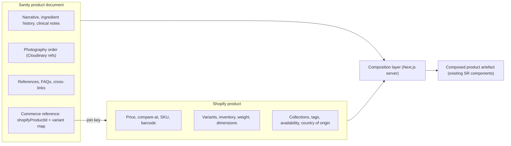
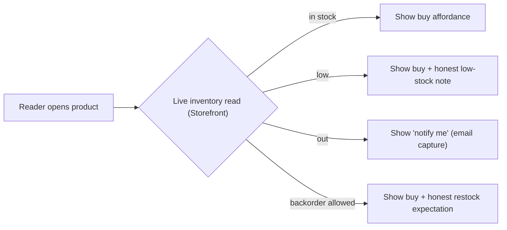

# 01 · Data Model, Sanity↔Shopify Sync, Collections & Inventory

*How editorial and commerce become one product without either owning the other's facts.*
Depends on: Spec 00 (§0.3 sources of truth)

---

## 1.1 The composition principle

A Sunnah Remedies product page is **one artefact assembled from two systems**:

- **Sanity** provides the *artefact's story* — everything that makes a reader learn and trust.
- **Shopify** provides the *artefact's commerce state* — everything needed to transact honestly.

The frontend composes them at render time via a stable join key. Neither system is modified to hold the other's data.

---

## 1.2 The join key & product linking

**Model:** every commerce-enabled product exists as a **Sanity `product` document** that references its **Shopify product**.

The Sanity `product` document stores a small, stable **commerce reference block**:

| Field (Sanity) | Purpose |
|----------------|---------|
| `shopifyProductId` | Immutable Shopify GID — the primary join key |
| `shopifyHandle` | For URL/lookup convenience (mutable; ID is authoritative) |
| `shopifyVariantMap` | Map of Sanity-known variants → Shopify variant GIDs |
| `status` | `active` / `draft` / `archived` (mirrored from Shopify by webhook; Sanity does not author it) |
| `lastSyncedAt` | Diagnostic timestamp |

**Rules:**
- The **Shopify product ID is authoritative** for the link; handles may change and must never be the sole key.
- Editors in Sanity **select** which Shopify product a document maps to (via a custom input that lists Shopify products) — they never *type* IDs by hand.
- A Sanity product with no valid Shopify link renders as **editorial-only** (readable, no purchase affordance) — a safe, honest failure state, not a broken page.



---

## 1.3 Field ownership matrix (the enumerated product data)

Every field the brief lists, assigned to exactly one owner and one surface.

| Product datum | Owner | Notes |
|---------------|-------|-------|
| Product title | **Sanity** (display) / Shopify (commerce) | Sanity title is the reader-facing institutional title; Shopify title used in checkout/admin. Keep aligned via editorial guideline; Sanity wins on the page. |
| Description (long, educational) | **Sanity** | The scholarly, documented narrative |
| Short description | **Sanity** | The one-line institutional summary shown on cards |
| Variants | **Shopify** | Options, prices, availability; Sanity variant map only references them |
| Collections | **Shopify** (commerce grouping) + **Sanity** (editorial grouping) | See §1.6 |
| Tags | **Shopify** | For commerce logic; editorial taxonomy lives in Sanity |
| Availability / stock status | **Shopify** | Real-time (§1.7) |
| SKU | **Shopify** | |
| Barcode | **Shopify** | |
| Inventory quantity | **Shopify** | Never cached long (§1.7) |
| Weight | **Shopify** | Drives shipping |
| Dimensions | **Shopify** | Drives shipping/packaging |
| Country of origin | **Shopify** | Commerce/customs fact; Sanity may *also* narrate provenance editorially |
| Pricing | **Shopify** | Authoritative price |
| Compare-at price | **Shopify** | Honest use only — no fake "was" prices (institutional integrity) |
| Subscriptions *(future)* | **Shopify** (selling plans) or Stripe (institutional) | Flagged; Spec 04 |
| Gift products | **Shopify** product type + **Sanity** presentation | |
| Related products | **Sanity** (editorial curation) with Shopify fallback | Curation is an editorial act, not an algorithm by default (§1.8) |
| Cross-selling | **Sanity** (curated) | Honest, learning-led — not margin-driven (Blueprint ethic) |
| Recently viewed | **Client** (local, privacy-safe) | §1.8 |
| Frequently purchased together | **Shopify order data** (derived) — flagged | §1.8 |

**Institutional guardrail:** `compare-at price`, cross-sell, and related-product placement must follow the institution's honesty standard — no manufactured urgency, no margin-driven ranking. Editorial curation is the default; algorithmic suggestion is opt-in and flagged.

---

## 1.4 Sanity schema additions (data only — no design)

Add to the existing Sanity `product` schema (Phase 2) without altering editorial fields:

- A **`commerce` object** (the reference block, §1.2).
- Optional **`purchaseFraming`** enum: `standard` / `education-first` / `reference-only` — lets editors decide how prominent the purchase affordance is *within the existing design*, honouring "learn before purchasing." (Reference-only = no buy button, e.g. a documented ingredient not yet for sale.)
- **`relatedProducts`** and **`crossReferences`**: editorial references to other Sanity documents (products, articles, ingredients, courses, journeys) — the connective tissue from prior phases.

These are **content fields**, not UI. The existing components decide how to render them.

---

## 1.5 Sync strategy (Shopify → app; Sanity → app)

Two independent flows; neither writes into the other's store.

**A. Editorial (Sanity → app):** static generation + on-demand revalidation. A Sanity publish webhook triggers revalidation of the affected route(s). Editorial is slow-changing, so it is cached aggressively.

**B. Commerce (Shopify → app):** price/availability are **read live** at request time (short cache) or client-side for the most volatile data (inventory). Structural commerce changes (a new variant, a product archived) arrive via **Shopify webhooks** (Spec 05) and trigger revalidation of the composed page.

```mermaid
sequenceDiagram
  participant Editor as Sanity Editor
  participant Sanity
  participant App as Next.js App
  participant Shopify
  Editor->>Sanity: Publish product narrative
  Sanity-->>App: Webhook: revalidate route
  Note over App: Editorial re-cached (slow-changing)
  Shopify-->>App: Webhook: products/update, inventory_levels/update
  Note over App: Composed page revalidated; price/stock re-read live
```

**Optional read-through cache/index:** for listing/search performance, maintain a lightweight **commerce projection** (product handle, title, price range, availability, collection membership) refreshed by webhook. This is a *cache*, never a source of truth, and always reconcilable from Shopify (Spec 05 reconciliation). Inventory is excluded from any long-lived cache.

---

## 1.6 Collections

Two kinds, kept distinct:

**Commerce collections (Shopify)** — the enumerated ranges, used for commerce logic (availability, discounts, checkout):
Apothecary → Black Seed, Honey, Olive Oil, Saffron, Herbal Medicines, Supplements, Books, Equipment; plus Gift Collections and Seasonal Collections.

**Editorial collections (Sanity)** — curated groupings that tell a story (by tradition, by ingredient, by use), which may or may not mirror commerce collections. The connective tissue (ingredient hubs linking product + scholarship + course + journey) lives here.

**Composition:** a collection page pulls its editorial framing from Sanity and its live product membership + availability from Shopify. Membership is a **Shopify fact**; the *narrative around it* is a **Sanity fact**.

**Guardrail:** collections are grouped by honest logic, never by margin (Blueprint Doc 05 §G). Seasonal/gift collections are curated editorially and time-bounded by editorial control, not by dark-pattern urgency.

---

## 1.7 Inventory (real-time, honest)

Inventory is the most volatile and integrity-critical commerce datum. Rules:

- **Read live** from Shopify (Storefront API) at the point the reader needs it (product page, cart) — never served from a long cache.
- **Statuses surfaced** to existing components: `in_stock`, `low_stock` (threshold `[VERIFY]`, configurable), `out_of_stock`, `backorder` (where a product allows overselling with a defined restock/ship expectation).
- **Out of stock** is shown honestly with a **"notify me"** affordance (email capture → back-in-stock trigger) — mirrors Blueprint Doc 01 failure state. No hiding sold-out items to appear larger.
- **Back-order support:** only where Shopify's `inventory policy` permits continued selling; the page states the honest expectation clearly.
- **No overselling:** the cart and checkout revalidate availability at add-to-cart and at checkout handoff; Shopify checkout is the final authority and will block truly-unavailable purchases.
- **Inventory sync:** `inventory_levels/update` webhook triggers revalidation of affected composed pages and the commerce projection (§1.5).



---

## 1.8 Recommendation & discovery data

| Feature | Source | Default behaviour |
|---------|--------|-------------------|
| Related products | Sanity (editorial curation) | Curated by editors; honest, learning-led |
| Cross-selling | Sanity (curated) | Editorial; never margin-ranked |
| Recently viewed | Client-side only | Local storage of handles; privacy-safe; no PII to server; cleared on request |
| Frequently purchased together | Derived from Shopify order history (flagged) | Off by default; when on, presented modestly, never as pressure |

**Privacy note:** "recently viewed" stays client-side and anonymous; no browsing profile is compiled server-side (mirrors the institution's privacy posture). If personalised later, it requires consent and a Tier-3 governance decision.

---

## 1.9 Data-integrity rules

- **Never author a fact twice.** Enforce §0.3 in code review.
- **ID over handle** for all joins.
- **Live inventory, always.** No stale stock, no oversell.
- **Honest compare-at.** A compare-at price must reflect a real prior price.
- **Graceful degradation:** a missing Shopify link → editorial-only page; a Shopify outage → cached editorial still renders with a soft "availability temporarily unavailable" state, never a broken page (Spec 02 error handling).

---

## 1.10 Acceptance criteria (Data & Sync)

- [ ] Every commerce product is a Sanity document linked to a Shopify product by immutable ID.
- [ ] No datum is authored in two systems; the field-ownership matrix is enforced.
- [ ] Editorial is statically generated + webhook-revalidated; commerce price/availability read live.
- [ ] Inventory is real-time; low/out/backorder states honest; "notify me" works; no overselling.
- [ ] Commerce and editorial collections are distinct and composed correctly.
- [ ] Related/cross-sell default to editorial curation; recently-viewed is client-only and private.
- [ ] Missing links and backend outages degrade gracefully to a readable page.

*Proceed to Spec 02.*
