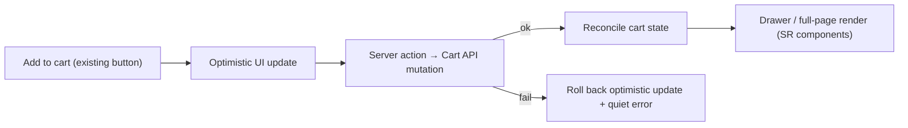
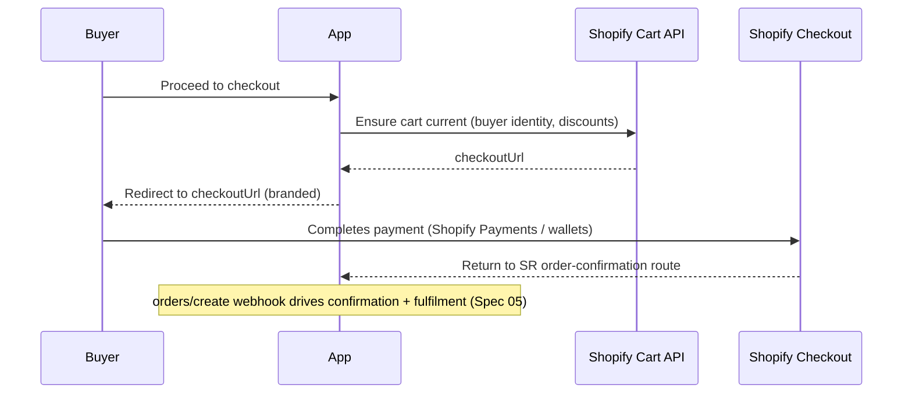

# 03 · Cart & Checkout

*A beautiful institutional cart on our components; Shopify's engine underneath; a branded handoff to checkout.*
Depends on: Spec 00 (ADR-001), 01, 02

---

## 3.1 Principles

- **Never a default Shopify component.** The cart is rendered entirely with the existing Sunnah Remedies design system. Shopify's **Cart API** provides the *state*; SR components provide the *presentation*. (No redesign — we populate existing cart shells with data.)
- **The cart is quiet.** Adding an item is a calm, confident micro-moment, not a celebration. Optimistic and instant (Spec 07).
- **The cart is honest.** Live prices, live availability, transparent estimates, no surprise costs before checkout.
- **Checkout is Shopify's** (ADR-001) — branded to feel continuous with the institution.

---

## 3.2 Cart architecture

**State backend:** the Shopify **Storefront Cart API**. A `cartId` is created on first add and **persisted** (secure, httpOnly cookie preferred; the cart is server-proxied). All mutations (add, update quantity, remove, note, discount, buyer identity) go through our server layer to the Cart API.

**Two presentations, one state:**

| Surface | Use | Notes |
|---------|-----|-------|
| **Cart drawer** | Default quick view on add-to-cart and cart icon | Slide-in using existing SR drawer component; optimistic |
| **Cart full page** | Considered review before checkout | Same state, roomier layout; existing SR page shell |

Both read the same cart; switching between them never loses state.

---

## 3.3 Cart capabilities (enumerated)

| Capability | Behaviour | Owner |
|------------|-----------|-------|
| Quantity | Update per line; validates against live inventory (no oversell) | Cart API |
| Variants | Change/select variant per line | Cart API |
| Remove items | Remove line; quiet undo affordance | Cart API |
| Update quantities | Debounced, optimistic | Cart API |
| Discounts | Apply discount code to cart; reflected in totals; final validation at checkout | Cart API (Shopify discount engine) |
| Gift notes | Per-cart (or per-line) note captured and passed to order | Cart API cart `note` / line attributes |
| Shipping estimates | Show estimated shipping/cost pre-checkout via cart cost + buyer identity/address hint | Cart API estimated cost `[VERIFY fields]` |
| Related products | Editorially curated (Spec 01 §1.8), shown modestly in cart | Sanity |
| Recommended products | Curated; honest, not pressure | Sanity (+ optional Shopify recommendations, flagged) |
| Save for later | **Future** — flagged; client list of handles moved out of active cart | Client + flag |
| Taxes | Indicated as calculated at checkout (Shopify authoritative) | Shopify checkout |

**Institutional guardrails:** no countdown timers, no "only 2 left!" pressure unless it is *true and honest* (a genuine low-stock note is allowed; manufactured scarcity is not). Recommendations in the cart are curated to *complete the artefact* (e.g. a storage vessel for saffron), not to inflate the basket.

---

## 3.4 Add-to-cart flow (the micro-moment)

1. Reader taps the existing buy affordance on a composed product page.
2. **Optimistic update** — the drawer opens and shows the line immediately (Spec 07).
3. Server action calls Cart API to add the line (variant + quantity + any attributes).
4. **Live inventory re-check** — if the variant became unavailable, roll back with a calm message and the "notify me" option (Spec 01 §1.7).
5. Cart totals, estimated cost, and any eligible discounts refresh.
6. Drawer settles into its quiet resting state; the reader can continue learning or proceed.

---

## 3.5 Checkout handoff (ADR-001, catalog path)

**Mechanism:** the cart exposes a **`checkoutUrl`** from the Cart API. Proceeding to checkout **redirects the buyer to Shopify's hosted, branded checkout**. Shopify then owns the remainder of the transaction.

**What Shopify Checkout handles natively (so we don't rebuild it):**

| Brief item | Handled by Shopify Checkout |
|------------|------------------------------|
| Guest checkout | ✓ native |
| Customer login | ✓ (Shopify customer accounts; Spec 05 §customers) |
| Address validation | ✓ native |
| Shipping selection | ✓ native (rates from Shopify shipping config; Spec 05 §shipping) |
| Taxes / VAT | ✓ native (Spec 05 §taxes) |
| Order notes | ✓ (also passed from cart note) |
| Discount codes | ✓ native (validated authoritatively at checkout) |
| Gift cards | ✓ native |
| Draft orders | ✓ (Admin API — for wholesale/practitioner/manual; Spec 05) |
| Abandoned checkout recovery | ✓ native (+ our institutional email tone; Spec 05) |
| Apple Pay / Google Pay / Shop Pay | ✓ accelerated wallets at checkout |

**Branding (Spec 00 §0.6):** checkout is tuned via the Branding API (fonts/colours/logo from the design system) so the handoff is visually continuous; Checkout Extensibility (Plus) is the future upgrade for near-seamless fidelity. The return path lands the buyer back on an **SR-designed order-confirmation route** so the *last* thing they see is the institution, not a generic receipt.

---

## 3.6 Return & confirmation

- After payment, Shopify returns the buyer to our **order-confirmation route** (SR components).
- The confirmation view is composed like any artefact: calm, considered, an **artefact-quality confirmation** (Blueprint Doc 01 "confirmations are artefacts"), not a loud success blast.
- The authoritative confirmation + fulfilment is driven by the **`orders/create` webhook** (Spec 05), not by the redirect alone (redirects can be missed; webhooks are the source of truth for order state).

---

## 3.7 Buyer identity & accounts

- **Guest by default** — no forced account creation (Blueprint non-negotiable).
- Logged-in customers get their identity attached to the cart (buyer identity) so checkout pre-fills and order history links (Spec 05 §customers).
- Login uses Shopify customer accounts `[VERIFY: new customer accounts vs classic]`; the account *surfaces* (order history, addresses, downloads) are rendered in SR components in our app (Spec 05).

---

## 3.8 Edge cases & failure states (all designed)

| Case | Behaviour |
|------|-----------|
| Item sells out while in cart | Flag at cart view + block at checkout; offer "notify me"; never silently drop |
| Discount invalid/expired | Quiet message; cart preserved; totals correct |
| Price changed since add | Show current price honestly; never charge a stale price |
| Cart lost (cookie cleared) | New cart; recently-viewed (client) aids recovery; logged-in carts can persist server-side |
| Checkout URL fails to load | Retry; cart preserved; support contact surfaced |
| Mixed cart (physical + digital) | Allowed; Shopify checkout handles; fulfilment split downstream (Spec 05) |

---

## 3.9 Acceptance criteria (Cart & Checkout)

- [ ] Cart uses only SR design-system components; Cart API supplies state; no default Shopify UI.
- [ ] Drawer and full-page share one live cart; state never lost switching.
- [ ] All enumerated cart capabilities work; inventory validated on add and at checkout (no oversell).
- [ ] Add-to-cart is optimistic, quiet, and rolls back cleanly on failure.
- [ ] Checkout is Shopify hosted via `checkoutUrl`, branded to the design system; return lands on an SR confirmation route.
- [ ] Guest checkout default; login attaches identity; no forced accounts.
- [ ] Order confirmation + fulfilment driven by webhook, not redirect alone.
- [ ] Every cart/checkout edge case has a calm, honest, designed fallback.

*Proceed to Spec 04.*
