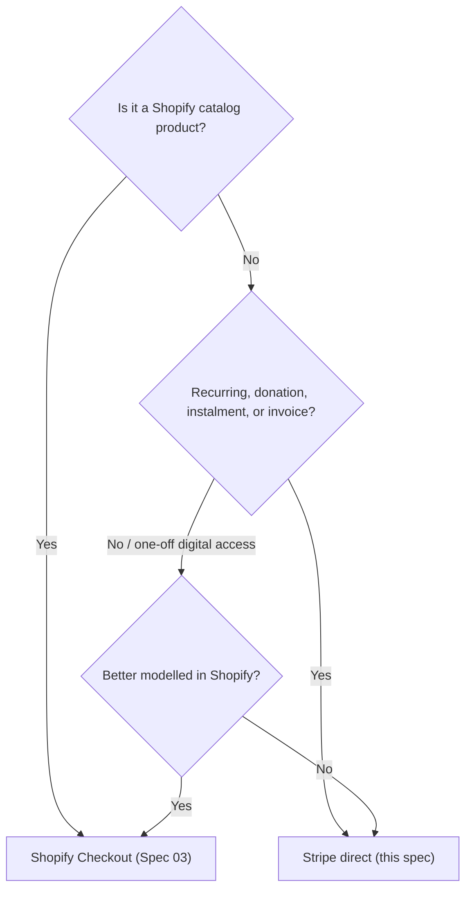

# 04 · Stripe — Institutional Payment Infrastructure

*Stripe powers the institution's non-catalog financial flows. Not the catalog. Not inventory. Not products.*
Depends on: Spec 00 (ADR-001), 05 (webhooks), 07 (security)

---

## 4.1 Scope — what Stripe is and is not for

**Stripe is the payment rail for institutional flows that do not belong in Shopify's product checkout:**

- Donations (Foundation — Blueprint Doc 09)
- Memberships (recurring)
- Subscriptions (institutional, where not modelled as Shopify selling plans)
- Instalment / payment-plan payments (e.g. a course or journey paid in stages)
- Invoice payments (wholesale, practitioner, licensing)
- Course access purchases *(if courses are managed outside the Shopify catalog)*

**Stripe is NOT for:** the product catalog, inventory, variants, or the shop's card processing (that is Shopify Checkout / Shopify Payments, which already runs on Stripe rails). This boundary is ADR-001.

**Decision guide (which rail?):**

---

## 4.2 Core payment model

- **Payment Intents** are the foundation for all one-off and confirmation-based charges. The flow: create a Payment Intent server-side → collect payment client-side via **Stripe Elements / Payment Element** → confirm → resolve via **webhook** (not by trusting the client).
- **Never trust the client for fulfilment.** Entitlements (membership active, course unlocked, donation receipted) are granted **only** on the authoritative Stripe **webhook** (`payment_intent.succeeded`, `invoice.paid`, etc.), never on a client success callback. (Mirrors Spec 03's "webhook is truth.")
- **Card data never touches our servers** — Stripe Elements tokenises in the browser; we hold only Stripe references (PCI scope minimised to SAQ A; Spec 07).

---

## 4.3 Payment methods

| Method | Support |
|--------|---------|
| Cards | ✓ via Payment Element |
| Apple Pay | ✓ via Payment Request API / Payment Element (domain-verified) |
| Google Pay | ✓ via Payment Request API / Payment Element |
| Express Checkout | ✓ Stripe Express Checkout Element (wallets surfaced early) |
| Payment Request API | ✓ underpins the wallet buttons |
| Saved payment methods | ✓ for authenticated members — stored as Stripe **Customer** + PaymentMethods (references only, never raw card data) |
| Bank/local methods (future, international) | Flagged; Payment Element extensibility |

**Presentation:** all payment UIs are wrapped in existing SR components/shells; Stripe Elements are themed to the design system (fonts/colours) so the institution's identity holds. No default Stripe-branded pages.

---

## 4.4 Receipts, refunds & partial refunds

- **Receipts:** issued as **artefact-quality** confirmations in the SR voice (Blueprint Doc 01), triggered on the success webhook. Stripe's native email receipt may be enabled as a backstop but the institutional receipt is primary.
- **Refunds:** initiated server-side (admin action or automated policy) via Stripe Refunds; status surfaced to the customer honestly.
- **Partial refunds:** supported (amount-specified) for instalments, partial cancellations, goodwill.
- **Reconciliation:** refund/return status is reflected in the customer's institutional order/finance view (Spec 05), sourced from webhooks.

---

## 4.5 Failed payments & recovery

| Scenario | Behaviour |
|----------|-----------|
| Card declined | Inline, plain-language reason where available; no blame; alternate method offered (mirrors Blueprint Doc 01 failure state); intent preserved |
| Authentication required (3DS / SCA) | Handled by Payment Element; buyer completes challenge |
| Transient failure | **Retry with backoff**; idempotency key prevents double-charge |
| Recurring payment fails (future subs/memberships) | **Dunning**: retry schedule, honest reminder emails in institutional tone, grace period before access is paused — never an abrupt cut |
| Instalment payment fails | Notify, retry, honest options; access rules per policy |

**Idempotency:** every charge-creating request carries an **idempotency key** so retries never double-charge (Spec 07).

---

## 4.6 Webhooks (Stripe side — detail in Spec 05)

Consumed events (at minimum): `payment_intent.succeeded`, `payment_intent.payment_failed`, `charge.refunded`, and for recurring/invoicing `invoice.paid`, `invoice.payment_failed`, `customer.subscription.updated/deleted`. Each is **signature-verified**, **idempotent**, and **replay-safe** (Spec 05, 07). Entitlement changes happen here.

---

## 4.7 Future flows (flagged; same primitives)

All reuse Payment Intents / Stripe Billing so they add cleanly:

| Flow | Model |
|------|-------|
| Subscriptions | Stripe Billing (Products/Prices + Subscriptions) — institutional, distinct from Shopify selling plans |
| Memberships | Subscription + entitlement grant on `invoice.paid`; tiered access |
| Donations | One-off or recurring Payment Intents/subscriptions; Gift Aid capture (UK) as a future field `[VERIFY]` |
| Instalments | Scheduled invoices or subscription-with-end; access tied to plan status |
| Recurring memberships | As subscriptions; dunning + institutional tone |
| Invoice payments | Stripe Invoicing for wholesale/practitioner/licensing; hosted-invoice or embedded pay |

Each ships behind its feature flag with its own acceptance criteria (Spec 08).

---

## 4.8 Entitlement model (how a payment unlocks access)

Because Stripe handles *non-catalog* value (a membership, a course, a download), we need an **entitlement service**:

- On the authoritative success/paid webhook, grant/extend the relevant **entitlement** (membership tier active-until, course unlocked, download released, certificate visible).
- Entitlements are stored server-side, checked on access, and revoked on `subscription.deleted` / non-payment per policy.
- Digital fulfilment (downloads, certificates, course access) is delivered per Spec 05 §digital fulfilment.
- **Never grant on client callback**; always on webhook.

---

## 4.9 Security posture (summary; full in Spec 07)

- PCI SAQ A via Stripe Elements; no raw card data on our servers.
- Webhook signatures verified; secrets in server-only env/secret store.
- Idempotency keys on all charge operations.
- Stripe fraud tooling (Radar) enabled; rate limiting and logging on payment routes.

---

## 4.10 Acceptance criteria (Stripe)

- [ ] Stripe is used only for institutional/non-catalog flows; ADR-001 boundary enforced.
- [ ] Payment Intents + Elements; card data never touches our servers (SAQ A).
- [ ] Wallets (Apple/Google Pay, Express Checkout) supported; Elements themed to the design system.
- [ ] Entitlements granted only on verified, idempotent webhooks — never client callbacks.
- [ ] Receipts are artefact-quality in the SR voice; refunds & partial refunds supported and surfaced.
- [ ] Failed-payment recovery: honest inline errors, retry with idempotency, dunning for recurring.
- [ ] Future flows (subs, memberships, donations, instalments, invoices) reuse these primitives behind flags.

*Proceed to Spec 05.*
