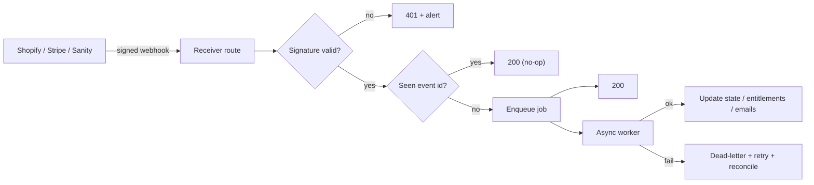

# 05 · Webhooks, Orders, Customers, Fulfilment, Shipping, Taxes & Discounts

*The event backbone and everything downstream of a completed transaction.*
Depends on: Spec 00–04

---

## 5.1 Webhook architecture (the nervous system)

Everything that changes commerce state reaches our app through **verified, idempotent webhooks**. We never poll for state we can be notified about.

**Sources & key events (`[VERIFY exact topics for pinned versions]`):**

| Source | Events | Drives |
|--------|--------|--------|
| **Shopify** | `orders/create`, `orders/updated`, `orders/paid`, `orders/fulfilled`, `orders/cancelled`, `fulfillments/create`+`update`, `refunds/create`, `inventory_levels/update`, `products/create`+`update`+`delete`, `collections/update`, `customers/create`+`update`, `checkouts/create`+`update` (abandoned) | Order views, fulfilment, inventory revalidation, projection updates, abandoned-cart recovery |
| **Stripe** | `payment_intent.succeeded`/`payment_failed`, `charge.refunded`, `invoice.paid`/`payment_failed`, `customer.subscription.updated`/`deleted` | Entitlements, receipts, dunning, finance views (Spec 04) |
| **Sanity** | publish/update | Editorial revalidation (Spec 01) |

**Every webhook handler must:**

1. **Verify signature** — Shopify HMAC; Stripe signing secret. Reject unverified immediately (Spec 07).
2. **Be idempotent** — dedupe by event ID; processing the same event twice is a no-op. (Providers retry; duplicates are normal.)
3. **Ack fast, process async** — return `200` quickly; hand heavy work to a queue/background job so the provider isn't kept waiting and retries aren't triggered by our latency.
4. **Retry + dead-letter** — failed processing retries with backoff; persistent failures land in a **dead-letter queue** for reconciliation and alerting.
5. **Log with correlation IDs** — every event traceable; no PII/secrets in logs (Spec 07).

---

## 5.2 Reconciliation (truth repair)

Webhooks can be missed (outages, deploys). A scheduled **reconciliation job** periodically compares our derived state/projection against the authoritative source (Shopify Admin API for orders/inventory; Stripe for payments/subscriptions) and repairs drift. **The source of truth always wins**; our caches/projections are disposable and rebuildable (Spec 01 §1.5). This is what lets us cache aggressively for speed without ever being *wrong*.

---

## 5.3 Orders

**Order lifecycle surfaced to the customer** (rendered in SR components; data from Shopify Admin API + webhooks):

| State | Source | Customer sees |
|-------|--------|---------------|
| Placed / paid | `orders/create` + `orders/paid` | Artefact-quality confirmation |
| Processing | Admin API | Honest status |
| Fulfilled / shipped | `orders/fulfilled`, `fulfillments/*` | Tracking + institutional dispatch note |
| Delivered | Carrier/Shopify | Arrival follow-up (Blueprint Doc 01 email) |
| Cancelled | `orders/cancelled` | Clear, gracious message |
| Refunded / partial | `refunds/create` | Honest refund status |

**Enumerated order features:** order synchronisation (webhook + reconciliation), order status, tracking, shipping confirmation, invoices (§5.7), refund status, partial refunds, digital fulfilment (§5.6), physical fulfilment (§5.5). All order communications use the **institutional email system** (Blueprint Doc 01 §C) — quiet, precise, artefact-quality — triggered by webhooks, not by the checkout redirect.

---

## 5.4 Customers & accounts

**Model:** Shopify customer accounts are authoritative for identity/order history; the **account surfaces are rendered in SR components** in our app (never Shopify's default account pages).

| Account surface | Source | Notes |
|-----------------|--------|-------|
| Login / identity | Shopify customer accounts `[VERIFY: new vs classic]` | Attaches buyer identity to cart (Spec 03) |
| Order history | Shopify (Admin/Storefront) | Rendered in SR UI |
| Addresses | Shopify customer addresses | Add/edit within SR UI |
| Downloads | Entitlement service (Spec 04 §4.8) | Digital fulfilment (§5.6) |
| Certificates | Academy issued-records (Blueprint Doc 06) + entitlements | Restricted, verifiable |
| Course purchases | Entitlement service / Shopify or Stripe depending on model | §5.6 |
| Invoices | Shopify order invoices + Stripe invoices | §5.7 |
| Wishlist *(future)* | Flagged; client or account-stored | |

**Privacy:** customer PII handled per data-protection posture (Spec 07) — never in URLs/logs; least-data; deletion/rights honoured. Guest checkout never forces account creation.

---

## 5.5 Physical fulfilment & shipping

**Shipping is configured in Shopify** (authoritative for rates at checkout); our app *reflects* it.

| Brief item | Handling |
|------------|----------|
| Zones | Shopify shipping zones |
| Rates | Shopify rate config (weight/dimensions from product data, Spec 01) |
| Collection (in-store pickup) | Shopify local pickup / a defined pickup method |
| Express | Shopify express rate |
| International | Shopify international zones + duties config (future expansion; Spec 00 markets) |
| Digital products | No shipping; fulfilled digitally (§5.6) |
| Mixed carts | Shopify checkout handles physical + digital in one order; fulfilment split downstream |

**Fulfilment operations** connect to the physical dispensary (Handbook Ch 05): a paid order → pick/pack/QC/dispatch → `fulfillments/create` → tracking surfaced + dispatch email. Traceability (batch → dispatch) is maintained operationally (Handbook Ch 05), and the digital order references it.

---

## 5.6 Digital fulfilment (downloads, certificates, courses)

For non-physical value:

- **Trigger:** the authoritative webhook (Shopify `orders/paid` for catalog digital goods; Stripe success/`invoice.paid` for institutional flows) → **entitlement granted** (Spec 04 §4.8).
- **Downloads:** delivered via **time-limited, signed URLs** (no public/guessable links; no PII in the URL — Spec 07). Available in the account and via the confirmation email; a resend/fallback exists (Blueprint Doc 01 §B6 "download link fails" state).
- **Certificates:** surfaced from the Academy issued-records (restricted store, Blueprint Doc 06); verifiable by reference; never a guessable public link.
- **Course access:** entitlement unlocks the course; access checked server-side on each visit; revoked per policy on refund/non-payment.
- **Digital-only orders** skip shipping entirely; mixed carts fulfil the digital part immediately and the physical part via §5.5.

---

## 5.7 Taxes & VAT

- **Automatic tax** is calculated by **Shopify Checkout** (authoritative) for catalog orders — VAT included; international tax handled as markets expand (Spec 00).
- Our app never computes tax itself; it displays Shopify's figures and, pre-checkout, shows estimates clearly as estimates.
- **Stripe flows** (donations/invoices) apply tax per Stripe Tax where relevant `[VERIFY]`; invoices show tax lines honestly.
- Prices are shown tax-inclusive/exclusive per locale convention (UK: VAT-inclusive display) `[VERIFY per market]`.

---

## 5.8 Discounts & promotions

Owned by **Shopify's discount engine** (validated authoritatively at checkout); our cart applies and previews them.

| Brief item | Handling |
|------------|----------|
| Voucher codes | Shopify discount codes; applied at cart, validated at checkout |
| Campaign discounts | Shopify automatic/coded discounts, time-bound |
| Bundles | Shopify bundle mechanisms / curated bundle products |
| Automatic promotions | Shopify automatic discounts |
| Student discounts | Coded or gated (verify eligibility) — flagged; ties to future practitioner/student accounts |
| Launch campaigns | Time-bound coded/automatic discounts, editorially framed |

**Institutional guardrail:** discounts are honest and restrained — no fake urgency, no inflated compare-at to fake a saving (Spec 01 §1.3). Campaigns are editorially framed (Sanity) and commerce-enforced (Shopify).

---

## 5.9 Abandoned checkout recovery

- Shopify emits `checkouts/create`/`update`; abandoned checkouts are recovered via Shopify's native recovery **plus** our **institutional email tone** (Blueprint Doc 01) — one quiet, respectful reminder, never a nagging sequence. Restraint applies (no aggressive dunning on a shop cart).

---

## 5.10 Acceptance criteria (Webhooks & Downstream)

- [ ] Every webhook is signature-verified, idempotent, fast-acked, async-processed, retried, and dead-lettered.
- [ ] A reconciliation job repairs drift against the authoritative source; caches are disposable.
- [ ] Order lifecycle is surfaced in SR components; all comms via the institutional email system, webhook-triggered.
- [ ] Customer account surfaces (history, addresses, downloads, certificates, courses, invoices) render in SR UI; guest checkout preserved; PII protected.
- [ ] Shipping (zones, rates, pickup, express, international, mixed) reflects Shopify config; fulfilment ties to the dispensary with traceability.
- [ ] Digital fulfilment uses entitlements + signed, time-limited links; certificates verifiable; access revocable.
- [ ] Taxes/VAT come from Shopify (catalog) / Stripe Tax (institutional); never self-computed.
- [ ] Discounts run through Shopify's engine, honest and restrained; abandoned recovery is a single respectful reminder.

*Proceed to Spec 06.*
