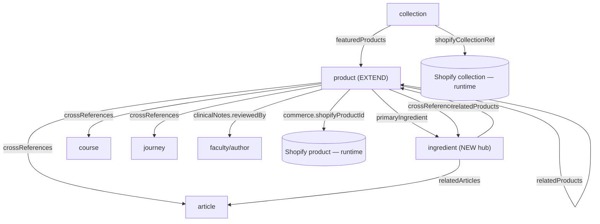

# 09 · Sanity Schema Definition Sheet

*The exact editorial schema for the commerce layer — every document, object, field, type, and rule. Implementable, not code.*
Companion to: Spec 01 (data model & source-of-truth), Spec 06 (composition). Cursor implements these as `defineType`/`defineField` declarations against the existing Phase 2 studio.

---

## 9.1 How to read this sheet

- **Type** column uses Sanity's own type names (`string`, `text`, `slug`, `number`, `boolean`, `datetime`, `url`, `image`, `reference`, `array`, `object`, `block` = Portable Text).
- **Req** = required (validation).
- **SoT** = source-of-truth owner (per Spec 00 §0.3). Every field here is **Sanity-owned editorial**. Commerce facts are *never* added here (see §9.10 forbidden fields).
- **New?** = `NEW` (Phase 4 commerce), `EXISTING` (Phase 2/3 — shown for context, unchanged), or `EXTEND` (existing type, new field added).
- Nothing in this sheet alters the frontend or existing editorial fields; commerce fields are **additive** and grouped so the editorial experience stays primary.

**Naming conventions:** `camelCase` field names; document type names singular (`product`, `ingredient`); object type names descriptive (`commerceReference`). Commerce fields live in a dedicated **field group** (`commerce`) so they never crowd the editorial fields.

---

## 9.2 Type inventory

**Document types**
| Type | New? | Purpose |
|------|------|---------|
| `product` | EXTEND | Editorial artefact; gains the commerce link + framing |
| `collection` | EXTEND/NEW | Editorial framing for a range (distinct from Shopify commerce collection) |
| `ingredient` | NEW | The connective hub — links product + scholarship + course + journey |
| `article` | EXISTING | Knowledge Library (referenced by cross-links) |
| `course` | EXISTING | Academy (referenced by cross-links) |
| `journey` | EXISTING | Sacred Journeys (referenced by cross-links) |
| `faculty` / `author` | EXISTING | Reviewer/author references |

**Object types (reusable)**
| Type | New? | Used by |
|------|------|---------|
| `commerceReference` | NEW | `product` — the join key block |
| `variantReference` | NEW | `commerceReference` — maps editorial variants → Shopify variant GIDs |
| `traditionLayers` | NEW | `product`, `ingredient` — the four-layer honesty structure |
| `clinicalNote` | NEW | `product`, `ingredient` |
| `sourceReference` | NEW | `product`, `ingredient`, `article` — citations (hadith/Qur'an/research) |
| `faqItem` | NEW/EXISTING | `product`, `collection`, `ingredient` |
| `provenanceNote` | NEW | `product`, `ingredient` — editorial provenance narrative |
| `seasonWindow` | NEW | `collection` — editorial time-bounding |
| `cloudinaryAsset` | EXISTING (Phase 3) | All media fields — **referenced, not redefined** |

---

## 9.3 Document: `product` (EXTEND)

### Existing editorial fields (Phase 2 — unchanged, shown for context)
`title` (string), `slug` (slug), `shortDescription` (text/string), `description` (block — the educational narrative), `heroImage` + `gallery` (cloudinaryAsset), `ingredientHistory` (block), and any existing SEO/meta. **Do not modify these.**

### New commerce & editorial fields (Phase 4)

| Field | Type | Req | SoT | New? | Definition / rules |
|-------|------|-----|-----|------|--------------------|
| `commerce` | object → `commerceReference` | Conditional* | Sanity (link) | NEW | The join to Shopify. *Required unless `purchaseFraming = reference-only`. Group: `commerce`. |
| `purchaseFraming` | string (enum) | Yes | Sanity | NEW | How prominent the buy affordance is *within the existing design*. List: `standard`, `education-first`, `reference-only`. Default `standard`. See §9.11. |
| `traditionLayers` | object → `traditionLayers` | No | Sanity | NEW | Four-layer honesty framing for this product's tradition. §9.7 |
| `clinicalNotes` | array of `clinicalNote` | No | Sanity | NEW | Safety/therapeutic notes; each carries a review status. §9.8 |
| `sources` | array of `sourceReference` | No | Sanity | NEW | Citations (hadith/Qur'an/research) backing claims. §9.9 |
| `provenance` | object → `provenanceNote` | No | Sanity | NEW | Editorial provenance *story* (distinct from Shopify country-of-origin fact). |
| `faqs` | array of `faqItem` | No | Sanity | NEW | Product FAQs. |
| `relatedProducts` | array of reference → `product` | No | Sanity | NEW | **Editorial curation** (honest, learning-led — not margin-ranked). Max ~6. |
| `crossReferences` | array of reference → `article`\|`ingredient`\|`course`\|`journey` | No | Sanity | NEW | The connective tissue: learn-more links. |
| `primaryIngredient` | reference → `ingredient` | No | Sanity | NEW | Links product to its ingredient hub. |

\* **Conditional-required rule:** if `purchaseFraming` ≠ `reference-only`, then `commerce.shopifyProductId` must be present. A `reference-only` product is a documented-but-not-sold artefact and needs no Shopify link.

**Field groups (studio tabs):** `Editorial` (default — existing fields), `Scholarship` (traditionLayers, sources), `Clinical` (clinicalNotes), `Commerce` (commerce, purchaseFraming), `Connections` (related, crossReferences, primaryIngredient).

**Preview (studio list display):** title as headline; subtitle shows `purchaseFraming` + link state (e.g. "Standard · linked ✓" or "Reference-only · editorial") + `commerce.status` if present. Media = heroImage.

---

## 9.4 Object: `commerceReference` (NEW)

The join key block. **Read-only where synced from Shopify.**

| Field | Type | Req | Definition / rules |
|-------|------|-----|--------------------|
| `shopifyProductId` | string | Yes | The **authoritative join key**. Shopify GID. Validation: must match `gid://shopify/Product/{digits}`. Immutable in practice. |
| `shopifyHandle` | string | No | Convenience for URL/lookup. **Mutable — never the sole key.** |
| `variantMap` | array of `variantReference` | No | Maps editorially-known variants → Shopify variant GIDs. §9.5 |
| `status` | string (enum) | No | `active` \| `draft` \| `archived`. **`readOnly: true`** — synced from Shopify by webhook (Spec 05); editors never set it. |
| `lastSyncedAt` | datetime | No | **`readOnly: true`** — diagnostic; set by sync. |

**Custom input requirement:** `shopifyProductId` is **selected via a custom Studio input** that lists Shopify products (by title/handle/image) and writes the GID + handle. Editors **never type GIDs by hand**. (Implementation note for Cursor: a custom input component calling the Admin API server-side; out of scope for this sheet's field definitions but required for the field to be usable.)

---

## 9.5 Object: `variantReference` (NEW)

| Field | Type | Req | Definition |
|-------|------|-----|------------|
| `label` | string | Yes | Human label editors recognise (e.g. "50g", "Grade A"). |
| `sanityKey` | string (slug-like) | Yes | Stable internal key for referencing this variant in editorial content. |
| `shopifyVariantId` | string | Yes | Shopify variant GID. Validation: `gid://shopify/ProductVariant/{digits}`. |

**Note:** the variant's *price, availability, SKU* are **not** stored here — they are read live from Shopify by variant GID (source-of-truth boundary). This object only *maps* editorial labels to commerce IDs.

---

## 9.6 Document: `collection` (EXTEND / NEW)

Editorial framing for a range. Distinct from the Shopify commerce collection (Spec 01 §1.6).

| Field | Type | Req | SoT | Definition / rules |
|-------|------|-----|-----|--------------------|
| `title` | string | Yes | Sanity | Editorial collection title. |
| `slug` | slug | Yes | Sanity | Unique. |
| `intro` | block | No | Sanity | The narrative framing of the range. |
| `heroImage` | `cloudinaryAsset` | No | Sanity | Phase 3 media. |
| `shopifyCollectionRef` | object | No | Sanity (link) | `{ shopifyCollectionId (GID), handle }` — optional link to a Shopify commerce collection for live membership. Validation: GID `gid://shopify/Collection/{digits}`. |
| `featuredProducts` | array of reference → `product` | No | Sanity | Editorially featured items (curation). |
| `season` | object → `seasonWindow` | No | Sanity | Editorial time-bounding for seasonal/gift collections. §9.12 |
| `curationNote` | text | No | Sanity | Internal note on the honest logic of the grouping (guardrail: grouped by tradition/use, never by margin). |
| `faqs` | array of `faqItem` | No | Sanity | Optional. |

**Rule:** product *membership* of a commerce collection is a **Shopify fact** resolved at runtime via `shopifyCollectionRef`; `featuredProducts` is editorial curation layered on top. Never store the full membership list here.

---

## 9.7 Object: `traditionLayers` (NEW) — the four-layer honesty structure

Encodes the institution's non-negotiable honesty standard directly in the schema (Handbook Ch 01; Blueprint Doc 02). Used on `product` and `ingredient`.

| Field | Type | Req | Definition |
|-------|------|-----|------------|
| `established` | block | No | What the **Qur'an & authentic Sunnah** establish. |
| `interpreted` | block | No | The **scholarly interpretation** of it. |
| `traditional` | block | No | **Inherited/traditional practice.** |
| `ours` | block | No | **Our own modern preparation or view.** |

**Validation/guardrail:** the composition layer and editorial review ensure these layers render **visibly distinguished** — never blurred into one another (Spec 01 §1.3; enforced editorially via review, Blueprint Doc 02). A product making a tradition claim should have at least the relevant layer(s) populated.

---

## 9.8 Object: `clinicalNote` (NEW)

| Field | Type | Req | Definition |
|-------|------|-----|------------|
| `note` | block | Yes | The clinical/safety content (contraindications, intake guidance, cautions). |
| `reviewStatus` | string (enum) | Yes | `draft` \| `in-clinical-review` \| `approved`. Default `draft`. |
| `reviewedBy` | reference → `faculty`/`author` | No | The clinical reviewer. |
| `reviewedAt` | datetime | No | Set on approval. |
| `medicalAdviceLinePresent` | boolean | No | Confirms the "not a substitute for medical advice" line is placed at the point of decision (Blueprint clinical standard). |

**Publish gate (editorial rule):** clinically-sensitive content should not surface publicly unless `reviewStatus = approved`. Enforced via the studio's publish workflow / a document action (implementation note), not by hiding the field.

---

## 9.9 Object: `sourceReference` (NEW) — citations

Encodes the scholarly standard (attribution + grading). Used on `product`, `ingredient`, `article`.

| Field | Type | Req | Definition / rules |
|-------|------|-----|--------------------|
| `type` | string (enum) | Yes | `hadith` \| `quran` \| `research` \| `book` \| `other`. |
| `citation` | string | Yes | Human-readable citation. |
| `hadithCollection` | string | Cond. | Required when `type = hadith`. |
| `hadithNumber` | string | Cond. | Required when `type = hadith`. |
| `hadithGrading` | string (enum) | Cond. | `sahih` \| `hasan` \| `daif` \| `mawdu` \| `other`. Required when `type = hadith`. Weak/fabricated must be labelled, never presented as sound (Blueprint scholarly standard). |
| `surah` | string | Cond. | Required when `type = quran`. |
| `ayah` | string | Cond. | Required when `type = quran`. |
| `sourceUrl` | url | No | Link to a verified source. |
| `verifiedStatus` | string (enum) | Yes | `verified` \| `unverified`. **The Ibn al-Qayyim rule:** an attribution that cannot be traced to a verified source is marked `unverified` and framed as a modern paraphrase — never rendered as established. Default `unverified`. |

---

## 9.10 Document: `ingredient` (NEW) — the connective hub

The page that unifies product + scholarship + education (Blueprint search §E). Read-heavy editorial; **no commerce facts**.

| Field | Type | Req | SoT | Definition |
|-------|------|-----|-----|------------|
| `name` | string | Yes | Sanity | e.g. "Saffron". |
| `slug` | slug | Yes | Sanity | Unique. |
| `transliteration` | string | No | Sanity | Consistent house transliteration. |
| `arabicName` | string | No | Sanity | |
| `overview` | block | No | Sanity | Introduction. |
| `traditionLayers` | object → `traditionLayers` | No | Sanity | Four-layer framing. §9.7 |
| `history` | block | No | Sanity | Ingredient history. |
| `clinicalNotes` | array of `clinicalNote` | No | Sanity | §9.8 |
| `sources` | array of `sourceReference` | No | Sanity | §9.9 |
| `heroImage` + `gallery` | `cloudinaryAsset` | No | Sanity | Phase 3 media. |
| `relatedProducts` | array of reference → `product` | No | Sanity | Products featuring this ingredient. |
| `relatedArticles` | array of reference → `article` | No | Sanity | |
| `relatedCourses` | array of reference → `course` | No | Sanity | |
| `relatedJourneys` | array of reference → `journey` | No | Sanity | |
| `faqs` | array of `faqItem` | No | Sanity | |

**Note:** this is the hub the search system (Blueprint Doc 01 §E) treats as a first-class type. It holds **no price/stock** — those come from the linked products' Shopify records at runtime.

---

## 9.11 Field: `purchaseFraming` (enum) — detail

A `string` field with `options.list`. Controls how prominent the purchase affordance is **within the existing design** (honours "learn before purchasing"; the frontend decides rendering, this field decides intent).

| Value | Meaning | Composition effect |
|-------|---------|--------------------|
| `standard` | A normal shoppable artefact | Buy affordance present as designed |
| `education-first` | Learning leads; commerce is quieter | Buy affordance present but de-emphasised in the existing layout's available slots |
| `reference-only` | Documented, not for sale | **No buy affordance**; no Shopify link required; renders as pure editorial |

Default `standard`. This is **content intent, not design** — existing components already know how to render each state; we only tell them which.

---

## 9.12 Object: `seasonWindow` (NEW)

Editorial time-bounding for seasonal/gift collections (honest control, not dark-pattern urgency).

| Field | Type | Req | Definition |
|-------|------|-----|------------|
| `startDate` | datetime | No | When the editorial framing begins. |
| `endDate` | datetime | No | When it ends. |
| `isSeasonal` | boolean | No | Flags a time-bound collection. |

**Guardrail:** used for genuine seasonal curation, never to fabricate scarcity or urgency (Spec 05 §5.8 institutional guardrail).

---

## 9.13 Object: `faqItem` & `provenanceNote`

**`faqItem`**
| Field | Type | Req | Definition |
|-------|------|-----|------------|
| `question` | string | Yes | |
| `answer` | block | Yes | |
| `order` | number | No | Manual ordering. |

**`provenanceNote`**
| Field | Type | Req | Definition |
|-------|------|-----|------------|
| `originNarrative` | block | No | The editorial *story* of provenance. |
| `note` | text | No | Internal sourcing note. |

**Reminder:** country-of-origin as a *commerce/customs fact* lives in **Shopify**; `provenanceNote` is the editorial narrative around it (Spec 01 §1.3). Two different purposes, one owner each — never contradict.

---

## 9.14 Forbidden fields (the source-of-truth firewall)

**These must NEVER be added to any Sanity type.** They are Shopify-owned; authoring them in Sanity would create two conflicting truths (Spec 00 §0.3). Enforce in schema review:

`price`, `compareAtPrice`, `currency`, `inventoryQuantity`, `stockStatus`, `availability`, `sku`, `barcode`, `weight`, `dimensions`, `variants` (as authoritative option/price data), `countryOfOrigin` (as the commerce/customs fact), `taxRate`, `shippingWeight`, `discountValue`, `orderData`, `customerData`.

If any of these seems needed in editorial, the answer is a **reference/ID to Shopify** (resolved at runtime), not a copy of the value.

---

## 9.15 Relationships map

---

## 9.16 Composition projection (shape, not code)

The composition layer (Spec 06 §6.4) queries Sanity for **editorial + the join key only**, then merges live commerce from Shopify. The `ProductView` projection selects:

`title, slug, shortDescription, description, heroImage→(Cloudinary url/alt), gallery, ingredientHistory, traditionLayers{established,interpreted,traditional,ours}, clinicalNotes[]{note,reviewStatus}, sources[]{type,citation,grading,verifiedStatus}, provenance, faqs[], purchaseFraming, commerce{shopifyProductId, shopifyHandle, variantMap[]{label,sanityKey,shopifyVariantId}}, relatedProducts[]→(title,slug,heroImage), crossReferences[]→(type,title,slug), primaryIngredient→(name,slug)`

**Critical:** the projection returns **no price and no stock** — only `commerce.shopifyProductId` / variant GIDs. Price and availability are fetched live from Shopify by the composition layer and merged (Spec 02 §2.3). This is the schema-level guarantee of "one fact, one owner."

---

## 9.17 Migration notes

- **Additive only.** Add new fields/objects to the existing `product`; do not alter or remove Phase 2 fields. Add `ingredient` and extend `collection` as new work.
- **Backfill:** for each existing product, link `commerce.shopifyProductId` via the custom input; set `purchaseFraming = standard`; populate `primaryIngredient` where an ingredient hub exists.
- **Reference-only seeding:** documented-but-not-sold artefacts get `purchaseFraming = reference-only` and no Shopify link — a safe, honest state.
- **Read-only sync fields** (`status`, `lastSyncedAt`) are written only by the Shopify webhook sync (Spec 05); never edited by hand.
- **Validation rollout:** introduce the conditional-required rule (§9.3) after backfill so existing drafts don't error en masse.
- **Studio grouping** deployed with the fields so editors immediately see Commerce/Scholarship/Clinical/Connections tabs without editorial clutter.

---

## 9.18 Acceptance criteria (Schema)

- [ ] `product` gains `commerce`, `purchaseFraming`, `traditionLayers`, `clinicalNotes`, `sources`, `provenance`, `faqs`, `relatedProducts`, `crossReferences`, `primaryIngredient` — additively, grouped, Phase 2 fields untouched.
- [ ] `commerceReference` uses immutable `shopifyProductId` (GID-validated) as the join key; `status`/`lastSyncedAt` are read-only synced fields; GIDs are selected via a custom input, never typed.
- [ ] `purchaseFraming` enum works; `reference-only` renders no buy affordance and needs no Shopify link; conditional-required rule enforced.
- [ ] `ingredient` hub exists and links product + scholarship + course + journey; `collection` distinguishes editorial framing from Shopify membership.
- [ ] `traditionLayers` and `sourceReference` encode the four-layer honesty and citation/grading standards; `verifiedStatus` defaults to `unverified`.
- [ ] **No forbidden (Shopify-owned) field** exists in any Sanity type; §9.14 firewall enforced in review.
- [ ] The composition projection returns editorial + join key only — never price or stock.
- [ ] Migration is additive, backfilled, and validation rolled out post-backfill.

*End of the Sanity Schema Definition Sheet. Slots into the Commerce Implementation Specification as Spec 09.*
