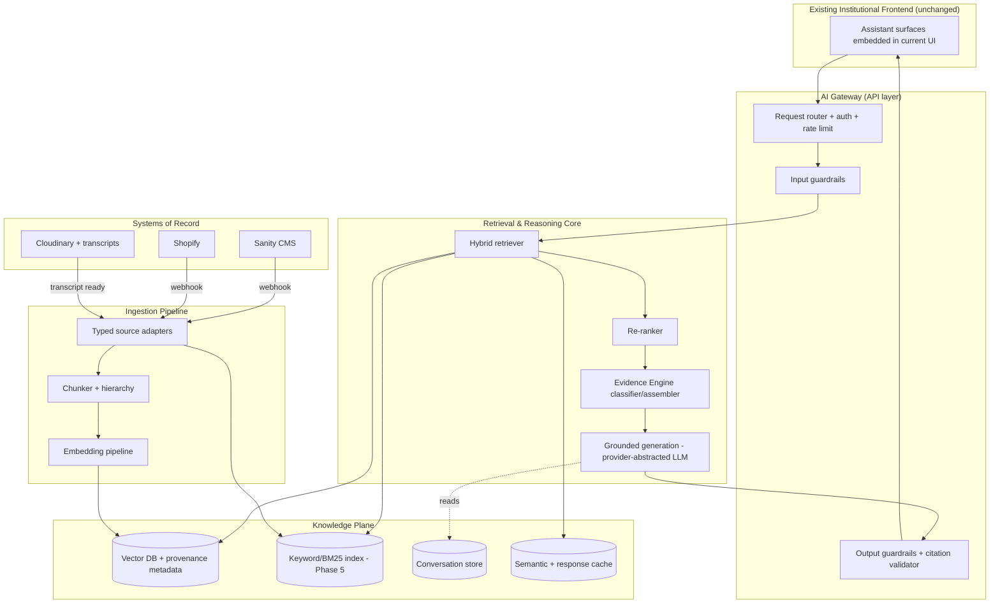
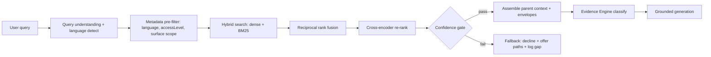
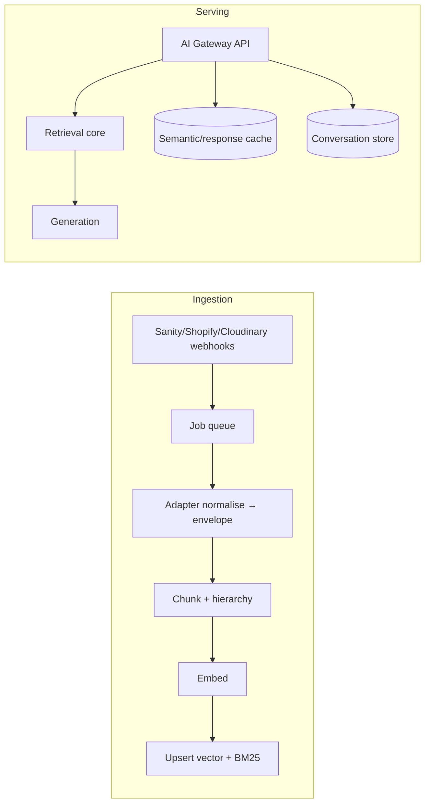

# Sunnah Remedies — Phase 6 Engineering Specification
## The Institutional AI Layer & Evidence Engine

**Document type:** Implementation specification (build blueprint for Cursor)
**Phase:** 6 — Institutional AI Layer
**Status:** Ready for build
**Prepared by:** Chief AI Systems Architect
**Precedes:** Phase 7 (Voice & Mobile), Phase 8 (Fine-tuning compatibility)

---

## 0. Document Control

| Field | Value |
|---|---|
| Scope | Retrieval-grounded institutional AI across all Sunnah Remedies surfaces |
| Non-goals | No frontend redesign · No typography change · No layout change · No model training · No code in this document |
| Depends on | Phase 1 (Design System) · Phase 2 (Sanity) · Phase 3 (Cloudinary) · Phase 4 (Shopify/Stripe) · Phase 5 (Search/SEO/Knowledge) |
| Governing principle | **Two Ledgers, One Standard** — the Integrity Ledger holds veto over the Commercial Ledger |
| Primary directive | Every answer is transparent, referenced, educational, institutionally governed, and grounded in curated Institute knowledge — never the open internet |

> **How to read this document in Cursor.** Each section is a self-contained module. Build order is defined in §20 (Roadmap) and §18 (Deployment). Data contracts (JSON envelopes, schema tables) are *specifications*, not implementation — treat them as the shape to build toward, not code to paste.

---

## 1. Institutional AI Philosophy

The AI layer is not a product feature. It is an **institutional voice** that must inherit the epistemic discipline of the Institute itself.

### 1.1 What the AI *is*

The AI operates as a single grounded intelligence expressed through eight surfaces: research assistant, clinical information assistant, educational tutor, editorial guide, knowledge navigator, product-discovery assistant, course assistant, and consultation assistant. All eight share one retrieval core, one governance layer, and one Evidence Engine.

### 1.2 What the AI is *not*

The AI is **never an authority in itself**. It does not hold opinions, issue rulings (*fatāwā*), diagnose, prescribe, or speak from general knowledge. It is a librarian and a research assistant standing inside the Institute's own archive. When the archive is silent, the AI is silent — and says so.

### 1.3 The five non-negotiables

1. **Grounded** — every substantive claim traces to a retrieved institutional source. No source, no claim.
2. **Cited** — every response carries machine-verifiable citations. Uncited assertions are a defect, not a stylistic choice.
3. **Closed-corpus** — no internet browsing, no answering from the base model's parametric memory when institutional coverage exists. If coverage is absent, the AI declines rather than substitutes.
4. **Deferential** — the AI routes to qualified humans (scholars, clinicians, faculty) for anything requiring judgement, ruling, diagnosis, or prescription.
5. **Transparent about weight** — via the Evidence Engine (§3), the AI never presents revelation, scholarship, empirical research, and folk practice as though they carry identical authority.

### 1.4 Escalation posture

Where judgement is required, the AI recommends — never replaces — the appropriate human pathway: professional consultation, clinical appointment, a course, structured reading, or further research. Escalation is a first-class output, not a failure state.

---

## 2. Knowledge Source Architecture

The corpus is closed and curated. Every source type is ingested through a typed adapter that normalises content into a **Provenance Envelope** (§3.4) before it ever reaches the vector store.

### 2.1 Source registry

| # | Source type | System of record | Ingestion trigger | Atomic unit |
|---|---|---|---|---|
| 1 | Qur'an | Sanity (canonical dataset) | Manual / versioned | Āyah |
| 2 | Authentic Sunnah / Hadith collections | Sanity | On publish | Full narration (never split) |
| 3 | Research papers | Sanity + asset store | On publish | Semantic section |
| 4 | Clinical protocols | Sanity (restricted) | On publish | Protocol step-group |
| 5 | Knowledge Library articles | Sanity | On publish | Heading-scoped block |
| 6 | Products | Shopify → Sanity mirror | Webhook | Structured record |
| 7 | Academy courses & lectures | Sanity | On publish | Lecture segment |
| 8 | FAQs | Sanity | On publish | Q/A pair |
| 9 | Consultation content | Sanity (restricted) | On publish | Topic block |
| 10 | Faculty profiles | Sanity | On publish | Profile record |
| 11 | Editorial articles | Sanity | On publish | Heading-scoped block |
| 12 | Institutional policies | Sanity | On publish | Clause |
| 13 | References & bibliographies | Sanity | On publish | Citation record |
| 14 | Videos / media transcripts | Cloudinary + transcript store | On transcript ready | Timestamped segment |
| 15 | Future publications | Sanity | On publish | Type-dependent |

### 2.2 Ingestion contract

Every adapter must guarantee, before indexing:

- A resolvable **source category** (§3.2) and, where applicable, an **authenticity grade** (§3.3).
- A stable citation object appropriate to the source type (§3.5).
- Language tag(s) and access level.
- Back-reference to the Sanity document ID and revision (for incremental re-index and invalidation).
- Editorial approval flag. **Unapproved content is never retrievable by end users** (it is retrievable only by the Editorial AI in draft context).

No content enters the retrievable corpus without a complete envelope. This is enforced at the pipeline gate (§2.2), not left to editors.

---

## 3. The Institutional Evidence Engine

> This is the defining component of Phase 6 and the reason the system is an *Institute*, not a chatbot. Build it first (§20) — every surface depends on it.

Rather than returning a single undifferentiated answer, the AI classifies **every statement it surfaces** into an epistemic category and renders that provenance visibly. Users see *where* knowledge comes from and *what kind of weight* it carries. This is how the Institute keeps revelation, scholarship, science, and tradition honestly distinguished.

### 3.1 Design intent

- Prevent the flattening of evidence — the failure mode where a folk remedy and a Qur'anic āyah appear equally authoritative because they sit in the same paragraph.
- Make provenance a **structural property of the answer**, enforced by schema, not a stylistic afterthought.
- Give the Integrity Ledger a machine-enforceable hook: a claim with no envelope cannot be rendered.

### 3.2 Source taxonomy

Seven categories. Each is a *kind* of authority, not merely a rung on a single ladder.

| Code | Category | Nature of authority | Rendering colour token* |
|---|---|---|---|
| `QURAN` | Qur'an | Revelatory — doctrinal primacy | `--evidence-revelation` |
| `SUNNAH` | Authentic Sunnah | Revelatory / prophetic — subject to authenticity grading | `--evidence-revelation` |
| `CLASSICAL` | Classical scholarly opinion | Interpretive — juristic/medical heritage | `--evidence-scholarship` |
| `CONTEMPORARY` | Contemporary scholarly opinion | Interpretive — living scholarship | `--evidence-scholarship` |
| `RESEARCH` | Peer-reviewed scientific research | Empirical — efficacy/safety evidence | `--evidence-empirical` |
| `TRADITION` | Traditional practice | Customary — transmitted practice, not proof | `--evidence-tradition` |
| `INSTITUTIONAL` | Institutional guidance | Editorial position of the Institute | `--evidence-institution` |

*Colour tokens reference the existing Phase 1 design system. **Do not introduce new colours** — map to existing institutional tokens (deep clinical green `#0A2B21` family and its established accents). The Evidence Engine is a data and rendering-metadata layer; it must inherit, not extend, the visual identity.

### 3.3 The two-axis epistemic model (critical nuance)

Categories are **not** a single linear ranking. Two distinct axes operate:

- **Doctrinal axis** — what the tradition *establishes*. Here `QURAN` and authentic `SUNNAH` hold primacy; scholarship interprets; tradition and institution do not establish doctrine.
- **Evidentiary axis** — what is *empirically supported* regarding efficacy and safety. Here `RESEARCH` carries weight that revelation was never making a claim on.

The engine must **never** render a statement like "the Qur'an outranks the clinical trial" as if they compete on one scale. Instead it presents each claim under its own category and, where a topic has evidence on both axes, surfaces both side by side. The system prompt (§8) encodes this explicitly.

Within `SUNNAH`, authenticity grading is mandatory and foregrounded:

| Grade | `authenticityGrade` value | Rendering rule |
|---|---|---|
| Ṣaḥīḥ | `sahih` | Rendered normally with grade badge |
| Ḥasan | `hasan` | Rendered normally with grade badge |
| Ḍaʿīf | `daif` | Rendered **only** with explicit weakness notice; never as basis for a health claim |
| Mawḍūʿ | `mawdu` | **Never** surfaced as support; may appear only in an explicit "this attribution is fabricated" corrective context |

This directly protects the Institute's hadith-integrity standard: a weak or fabricated narration can never be dressed as authority.

### 3.4 The Provenance Envelope (data contract)

Every chunk carries this envelope as vector metadata. This is the atomic unit the Evidence Engine operates on.

```json
{
  "chunkId": "sha256-of-content",
  "sourceCategory": "SUNNAH",
  "authenticityGrade": "sahih",
  "epistemicAxis": ["doctrinal"],
  "citation": {
    "type": "hadith",
    "collection": "Ṣaḥīḥ al-Bukhārī",
    "book": "Medicine",
    "number": "5688",
    "narrator": "Abū Hurayrah",
    "grade": "sahih"
  },
  "language": "ar",
  "contentType": "hadith",
  "accessLevel": "public",
  "sanityDocId": "hadith.5688",
  "sanityRev": "rev-8f2c",
  "editorialApproved": true,
  "parentChunkId": "sha256-of-parent",
  "supersedes": null,
  "lastVerifiedAt": "2026-06-14T00:00:00Z"
}
```

### 3.5 Citation object per source type

| Source | Required citation fields |
|---|---|
| Qur'an | `surah`, `ayah`, `surahName`, `translationSource` |
| Hadith | `collection`, `book`, `number`, `narrator`, `grade` |
| Research | `title`, `authors`, `journal`, `year`, `doi` |
| Classical scholarship | `scholar`, `work`, `edition`, `pageOrSection` |
| Contemporary scholarship | `scholar`, `work`/`source`, `year`, `context` |
| Product | `productId`, `title`, `shopifyHandle` |
| Course | `courseId`, `lectureId`, `timestamp` |
| Article/Editorial | `title`, `author`, `slug`, `publishedAt` |
| Policy | `policyId`, `clause`, `version` |

### 3.6 Claim-level attribution (response composition)

The generation layer must emit a **structured response object** in which every claim is bound to one or more source categories and citations. Prose is assembled from this object; prose is never authored free-hand by the model.

```json
{
  "summary": "…",
  "claims": [
    {
      "text": "Cupping is mentioned as a recommended treatment in prophetic tradition.",
      "sourceCategory": "SUNNAH",
      "citations": ["chunkId-a", "chunkId-b"],
      "confidence": 0.91
    },
    {
      "text": "A number of controlled studies report reductions in localised pain following wet cupping.",
      "sourceCategory": "RESEARCH",
      "citations": ["chunkId-c"],
      "confidence": 0.78
    }
  ],
  "warnings": ["…"],
  "escalation": { "recommend": "clinical_consultation", "reason": "…" },
  "related": { "articles": [], "courses": [], "products": [], "consultations": [] }
}
```

**Rendering rule:** the frontend groups claims by `sourceCategory` into an "Evidence Provenance" panel using existing design tokens. The user always sees, at a glance, which parts of an answer are revelation, which are scholarship, which are science, and which are tradition. **A claim object with an empty `citations` array must not render** — it is dropped and logged as a hallucination event (§9.9).

---

## 4. System Architecture Overview



**Key architectural commitments:**

- The AI layer is **additive and embedded** — it consumes the existing frontend components and design tokens. No route, layout, or type change.
- Retrieval is **hybrid** (dense + sparse) and reuses the Phase 5 keyword index rather than duplicating it.
- The Evidence Engine sits **between retrieval and generation** — it classifies and structures context so generation is constrained, not creative.
- Generation is **provider-abstracted**. Recommended: a frontier instruction-following, long-context reasoning model (Claude Sonnet/Opus-class) for its grounding discipline; the interface must allow swapping providers without touching surfaces.

---

## 5. Retrieval-Augmented Generation Architecture

**Directive: implement RAG. Do not train or fine-tune a model in Phase 6.** Institutional content is the single source of truth; the model is a reasoning and language surface over that truth.

### 5.1 Vector database

| Requirement | Rationale |
|---|---|
| Rich metadata filtering | Non-negotiable — Evidence Engine filters on `sourceCategory`, `language`, `accessLevel`, `authenticityGrade` |
| Hybrid search support | Dense + sparse fusion for exact-term recall (drug names, hadith numbers) |
| Namespaces / collections | Isolate languages and access tiers |
| Incremental upsert + delete-by-doc | Content changes must invalidate cleanly |

**Recommended:** a metadata-first vector store — Qdrant or Weaviate (self-host or managed), or `pgvector` on managed Postgres (Supabase/Neon) if the team prefers a single datastore. Pinecone is acceptable as a managed alternative. Decision to be locked in §18; all three satisfy the contract.

### 5.2 Embeddings

- **Multilingual is mandatory** (English, Arabic, Danish at launch). Recommended: Cohere `embed-multilingual-v3` or Voyage multilingual embeddings — both handle Arabic script fidelity well.
- One embedding model across the corpus; store `embeddingModel` + `dimension` on every vector for safe future migration (§21).
- Arabic text is embedded **as-is** (never transliterated for the index); transliteration, if needed, is a separate searchable field.

### 5.3 Chunking strategy (per source type)

| Source | Strategy | Hard rules |
|---|---|---|
| Qur'an | Āyah-level child; sūrah-context parent | Never split an āyah; carry Arabic + translation |
| Hadith | Whole narration = one chunk | **Never split matn**; grade travels with chunk |
| Research | Heading-aware semantic sections, ~512–800 tokens, 15% overlap | Keep tables/figures captions attached |
| Articles/Editorial | Recursive heading-scoped | Preserve heading path in metadata |
| Products | Field-structured record (no free chunking) | Attributes → filterable metadata |
| Courses | Transcript segment + lecture-parent | Carry timestamps for deep-linking |
| Policies | Clause-level | Carry version |

### 5.4 Chunk hierarchy (small-to-big retrieval)

Retrieve on **precise child chunks**; pass the **parent chunk** to generation for context. This keeps retrieval sharp while giving the model enough surrounding text to reason faithfully. `parentChunkId` links the two (§3.4).

### 5.5 Retrieval pipeline



### 5.6 Confidence scoring & thresholds

Confidence = function of (top re-rank score, score margin over next result, corpus coverage of query terms).

| Band | Threshold (tune post-eval) | Behaviour |
|---|---|---|
| High | ≥ 0.75 | Answer fully with citations |
| Medium | 0.55–0.75 | Answer with explicit "partial coverage" note + escalation |
| Low | < 0.55 | **Do not answer substantively.** Offer related covered topics, rephrase prompt, human pathway; log as knowledge gap (§14) |

### 5.7 Hallucination prevention (defence in depth)

1. **Retrieval gate** — no answer below the low threshold (§5.6).
2. **Constrained generation** — model may only assert what appears in provided context; system prompt forbids parametric recall.
3. **Structured output** — claims must carry citation IDs (§3.6).
4. **Citation validation (post-generation)** — every cited `chunkId` is checked against the actually-retrieved set. Any citation not in the set → claim dropped, event logged, response regenerated once, then degraded to "insufficient institutional coverage" if it recurs.
5. **Category consistency check** — a claim's `sourceCategory` must match the category of its cited chunks.

### 5.8 Fallback logic

When coverage fails, the AI never fabricates. It returns one of: (a) closest *covered* topics, (b) a request to rephrase, (c) a human pathway (consultation/faculty/course), (d) an editorial gap acknowledgement. Every fallback is logged for the knowledge-gap dashboard (§12).

### 5.9 Future fine-tuning compatibility

Phase 6 stays RAG-only, but is built so a future tuned model drops in without rearchitecting: keep an immutable, versioned store of (query → retrieved context → approved response → citations) interaction records (§5.9) as a future training/eval corpus. **This store is a byproduct, never a substitute for the source of truth.**

---

## 6. Prompt Architecture

Prompts are layered and versioned. No prompt string is hard-coded in a surface; all live in a governed prompt registry (§9.3).

```
Layer 1 — Institutional Base Prompt   (identity, grounding, citation, refusal, Evidence Engine rules)
Layer 2 — Surface Persona Overlay      (Knowledge / Product / Consultation / Course / Apothecary / Editorial)
Layer 3 — Retrieved Context            (parent chunks + Provenance Envelopes)
Layer 4 — Output Schema Contract       (structured response object, §3.6)
Layer 5 — Conversation State           (summarised history, §10)
```

### 6.1 Institutional Base Prompt (behavioural contract, not verbatim)

The base prompt must instruct the model to: identify as an institutional research assistant and never as an authority; answer **only** from provided context; refuse to use general knowledge or invent information; attach a citation to every claim; distinguish the two epistemic axes (§3.3) and never rank revelation against empirical research on one scale; foreground hadith authenticity grades; never diagnose, prescribe, or issue religious rulings; and recommend the appropriate human pathway whenever judgement is required.

### 6.2 Structured output enforcement

Generation must return the response object in §3.6. If the model returns prose without valid claim/citation structure, the output guardrail rejects and regenerates. **Prose shown to users is rendered from validated structure — never streamed raw from an unvalidated generation.**

---

## 7. AI Surfaces

All surfaces share the retrieval core, Evidence Engine, and governance layer. They differ in **retrieval scope**, **persona overlay**, and **output shape**. None introduces new UI patterns — each renders inside existing Phase 1 components.

### 7.1 AI Knowledge Assistant (Part 4)

- **Scope:** full public corpus.
- **Handles:** "What is Hijāmah?", "What does Islam say about black seed?", "Explain this hadith", "Compare saffron and black seed", "What are the contraindications?"
- **Output:** summary → institutional explanation → referenced evidence (grouped by Evidence Engine category) → relevant hadith → Qur'anic references → clinical notes → warnings → related articles/courses/products/consultations → further reading.
- **Rules:** contraindications and clinical notes are surfaced as **educational institutional content with a consultation recommendation**, never as personalised medical advice. Every hadith carries its grade badge.

### 7.2 AI Product Finder & AI Apothecary (Parts 5 & 8)

- **Scope:** products (Shopify mirror) + linked research, articles, courses, consultations.
- **Handles:** "I have eczema", "I struggle with sleep", "Which herbs support digestion?", "What evidence exists for honey?", "Compare herbs".
- **Output:** suggested products, preparation, usage, evidence (categorised), warnings, contraindications, related ingredients, related research/articles, and consultation recommendation.
- **Hard guardrails:** **never diagnose, never prescribe.** A symptom statement ("I have eczema") triggers educational content + a consultation pathway, not a treatment plan. Commercial suggestions are subordinate to the Integrity Ledger — if evidence is weak or absent, the AI says so even when a product exists.

### 7.3 AI Consultation Assistant (Part 6)

- **Scope:** consultation content + intake schema. Runs **before** booking.
- **Flow:** structured, conversational intake collecting symptoms, goals, duration, current treatment, medical history, lifestyle, preferences.
- **Output:** structured intake summary, suggested consultation type, relevant educational material/products/reading, and a **clinician briefing**.
- **Rules:** the AI **never diagnoses**; the clinician remains solely responsible. Intake data is special-category health data — see §11 (consent, minimisation, retention, erasure). Red-flag/emergency inputs trigger immediate escalation (§9.8), bypassing normal flow.

### 7.4 AI Course Assistant (Part 7)

- **Scope:** enrolled course content only (access-gated by `accessLevel`).
- **Handles:** "Explain Hijāmah", "Summarise today's lecture", "Create revision notes", "Quiz me", "Generate flashcards", "Explain Arabic terminology", "Compare opinions".
- **Output:** explanations, summaries, revision notes, quizzes, flashcards — all with references into course material; tracks progress; supports future certification.
- **Rules:** uses course content only; never leaks other students' data; assessment aids are study tools, not certification decisions.

### 7.5 AI Translation (Part 9)

- **Launch languages:** English, Arabic, Danish. **Future:** French, German, Turkish, Urdu, Malay, Indonesian.
- **Must preserve:** medical terminology, Islamic terminology, **Arabic quotations verbatim** (Qur'an/hadith text is never machine-paraphrased), references, formatting, metadata, internal links.
- **Architecture:** translation is a governed generation task with a terminology glossary (locked Islamic/medical terms) injected as constraints; Qur'an and hadith Arabic are passed through untouched and matched to pre-approved translations, never freely re-translated.

### 7.6 AI Personalisation (Part 10)

- **Segments:** first-time visitor, returning customer, student, practitioner, researcher, patient, healthcare professional.
- **Personalises:** homepage emphasis, recommended reading, courses, products, knowledge topics, search suggestions, events, consultations, newsletter recommendations.
- **Privacy-first model:** personalisation uses (a) declared preferences, (b) coarse consented segments, (c) session context — **not** invasive cross-site tracking. All personalisation is consent-gated with a visible preference centre and a clear "why am I seeing this" affordance. See §11.

### 7.7 Editorial AI (Part 11) — inside Sanity Studio

A governed Studio plugin giving editors: summary generation, internal-link suggestions, FAQ generation, SEO + Open Graph descriptions, citation suggestions, missing-reference detection, related-article suggestions, readability review, **unsupported-claim flagging**, and duplicate-content detection.

> **Evidence Engine integration:** the "flag unsupported claims" tool runs each claim in a draft against the corpus. Any claim with no qualifying institutional source is flagged before publish — the Evidence Engine becomes an editorial gate, not just a reader-facing panel. Editorial AI operates on drafts (unapproved content) and its outputs are **suggestions requiring human approval** (§9.3), never auto-published.


---

## 8. Conversation Architecture

- **Streaming:** responses stream token-by-token via SSE, but **only after** the structured object passes output guardrails — the client renders validated claims progressively, never unvalidated text.
- **History:** stored per session with rolling summarisation to control context size; raw turns retained per retention policy (§11).
- **Memory:** short-term (in-session) by default. Any longer-term memory (e.g., a returning student's progress) is **explicit, consented, and inspectable/erasable** by the user — never silent profiling.
- **Session scope:** conversation state is scoped to a surface and access level; a course session cannot bleed into another course or another user.

---

## 9. AI Governance

The governance layer is where the Integrity Ledger's veto becomes machinery.

### 9.1 Guardrail model

| Stage | Checks |
|---|---|
| **Input** | Query classification: sensitive medical? emergency/red-flag? fatwā request? out-of-scope? prompt injection? PII? language? |
| **Retrieval** | Access-level enforcement; confidence gate (§5.6) |
| **Output** | Citation validation; category consistency; PII scan; disclaimer injection; medical-safety pass |

### 9.2 Permission & access model

Role-based access to content and surfaces: public, registered, student (per-course), practitioner, editor, clinician, admin. `accessLevel` on every chunk is enforced at **retrieval pre-filter**, not at render — restricted content never enters an unauthorised context window.

### 9.3 Content approval & versioning

- No content is retrievable until `editorialApproved = true` (§2.2).
- Every prompt, glossary, and disclaimer template is versioned in a registry with change history and rollback.
- The Evidence Engine taxonomy is itself versioned; re-classification is an auditable event.

### 9.4 Citation validation

Automated (§5.7 step 4) **and** spot-checked: a sample of live answers is queued for human editorial review; disagreements tune thresholds and prompts.

### 9.5 Sensitive medical queries

Health information is delivered as **educational institutional content** with mandatory clinical disclaimers and a consultation pathway. The AI never personalises into diagnosis or prescription. Contraindication content is informational and always paired with "consult a qualified practitioner."

### 9.6 Religious queries

The AI surfaces scholarly positions **with attribution and category labels** (classical vs contemporary) and never issues a ruling (*fatwā*). Requests for a personal ruling are routed to qualified scholars/faculty. Where scholarly opinions differ, the AI presents the range with sources rather than adjudicating.

### 9.7 Clinical disclaimers

A disclaimer template library (versioned, multilingual) is injected by the output guardrail based on query classification — e.g., general health, procedural (Hijāmah/wet cupping), pregnancy/contraindication-sensitive, medication-interaction. Disclaimers are not optional model output; they are guaranteed by the guardrail.

### 9.8 Escalation rules

| Trigger | Action |
|---|---|
| Emergency / red-flag symptoms | Interrupt: direct to emergency services / crisis resources immediately; do not answer informationally |
| Request for diagnosis/prescription | Decline + route to clinical consultation |
| Request for religious ruling | Decline ruling + route to faculty/scholar + present sourced positions |
| Low confidence / knowledge gap | Fallback (§5.8) + log |
| Detected distress | Surface appropriate support resources; prioritise wellbeing over task completion |

### 9.9 Logging, monitoring, compliance

Every interaction logs: query, classification, retrieved sources, citations emitted, confidence, guardrail actions, escalations, latency. Monitoring dashboards track hallucination events, citation-validation failures, escalation rates, and refusal rates. Compliance scope: **UK GDPR and EU GDPR** (London, Copenhagen), plus applicable KSA data rules (Riyadh) — see §11.

---

## 10. AI Infrastructure



- **Embedding pipeline:** queue-driven, idempotent, retriable; records `embeddingModel`/`dimension`.
- **Background & incremental indexing:** webhook-driven incremental upsert on publish; scheduled full re-index for taxonomy/model changes; delete-by-`sanityDocId` on unpublish.
- **Caching:** embedding cache; semantic-query cache (near-duplicate queries); response cache keyed by (query embedding, surface, language, access level) with **invalidation on any cited source's revision change**.
- **API architecture:** thin AI Gateway (edge auth/rate-limit) → core service. Provider-abstracted LLM and embedding interfaces.
- **Integrations:** Sanity (content + Editorial AI), Cloudinary (media/transcripts), Shopify (product truth), Phase 5 search (BM25 reuse), analytics sink.
- **Future-ready:** voice interface and mobile apps consume the **same Gateway API** — no surface logic in clients.

---

## 11. Security & Privacy Architecture

### 11.1 Security

- Authn/z on every AI endpoint; per-role rate limits; abuse detection.
- Prompt-injection defence: treat all retrieved content and user input as **data, not instructions**; system prompt is isolated; retrieved text cannot alter guardrails.
- Secrets in a managed vault; least-privilege service roles; no provider keys in clients.
- Full audit logging; tamper-evident logs for clinical/consultation surfaces.
- Tenant/region isolation across London/Copenhagen/Riyadh where required by law.

### 11.2 Privacy (GDPR/UK GDPR-first)

- **Lawful basis + consent** for personalisation and any retained memory; granular, withdrawable.
- **Special-category data** (consultation intake) — explicit consent, strict minimisation, encrypted at rest/in transit, short retention, access-limited to clinical roles.
- **Data-subject rights:** access, rectification, erasure, portability — conversation and memory stores must support hard delete by user.
- **Data minimisation:** no PII in URLs, logs scrubbed of sensitive content where feasible, pseudonymised analytics.
- **No third-party data leakage:** provider calls use zero/limited-retention terms; no training on institutional or user data without explicit governance sign-off.

---

## 12. Analytics

Event-schema-driven. Metrics: questions asked, most-viewed topics, most-recommended products, most-recommended courses, failed searches, unanswered questions, **knowledge gaps**, editorial opportunities, user satisfaction (thumbs + optional comment), citation usage (which sources are cited most), and performance (latency, cache hit rate).

The **knowledge-gap dashboard** is the flywheel: every low-confidence fallback and unanswered query becomes an editorial backlog item — the Institute's corpus grows precisely where users ask and coverage is thin.

---

## 13. Folder Structure (target)

```
/ai
  /gateway            API routing, auth, rate limiting
  /guardrails
    /input            classifiers: emergency, fatwa, injection, PII, language
    /output           citation validator, category check, disclaimer injector, PII scan
  /retrieval
    /hybrid           dense + BM25 fusion
    /rerank           cross-encoder
    /confidence       scoring + thresholds
  /evidence-engine    taxonomy, envelope schema, claim assembler, provenance panel data
  /generation         provider-abstracted LLM interface, response-schema enforcement
  /prompts            versioned registry (base, personas, disclaimers, glossaries)
  /surfaces
    /knowledge  /product-finder  /apothecary  /consultation
    /course     /translation     /personalisation
  /conversation       history, summarisation, memory (consented)
  /ingestion
    /adapters         one per source type (quran, hadith, research, product, course, …)
    /chunking         per-type strategies + hierarchy
    /embedding        pipeline
    /indexing         incremental + full reindex + invalidation
  /integrations       sanity, cloudinary, shopify, search(phase5), analytics
  /analytics          event schema, knowledge-gap pipeline
  /security           authz, secrets, audit
  /config             thresholds, model config, feature flags
/sanity-plugins
  /editorial-ai       studio tools (summaries, links, unsupported-claim flagging, …)
/docs                 this spec, ADRs, runbooks
/tests                unit, retrieval-eval, guardrail, integration, e2e
```

---

## 14. Data Flow — end-to-end answer

```mermaid
sequenceDiagram
  participant U as User (existing UI)
  participant G as AI Gateway
  participant IG as Input Guardrails
  participant R as Retriever
  participant RR as Re-ranker
  participant EE as Evidence Engine
  participant L as LLM
  participant OG as Output Guardrails
  U->>G: Question
  G->>IG: Classify + safety screen
  IG-->>G: (escalate if emergency/fatwa/diagnosis)
  IG->>R: Filtered query (lang, accessLevel, scope)
  R->>RR: Candidates (dense+BM25)
  RR->>EE: Ranked chunks + envelopes
  EE->>EE: Confidence gate; classify by category/axis
  alt below threshold
    EE-->>OG: Fallback object + log gap
  else sufficient
    EE->>L: Parent context + provenance
    L->>OG: Structured claim/citation object
  end
  OG->>OG: Validate citations, categories, PII, inject disclaimers
  OG-->>U: Provenance-grouped answer (streamed)
```

---

## 15. Performance Strategy

| Target | Goal |
|---|---|
| First token (streamed) | ≤ 1.5 s p50 |
| Full grounded answer | ≤ 5 s p50 |
| Retrieval (pre-generation) | ≤ 400 ms p50 |
| Cache hit rate (common queries) | ≥ 40% after warm-up |
| Availability | ≥ 99.9% for the Gateway |

Levers: semantic + response caching with revision-aware invalidation; parent-context trimming; re-rank only top-K; edge auth; pre-warmed embeddings; async logging. **Performance never overrides guardrails** — a validated answer late beats an unvalidated answer fast.

---

## 16. Testing Checklist

- [ ] **Grounding:** no answer produced below low-confidence threshold; fabrication attempts blocked.
- [ ] **Citation validity:** 100% of rendered claims cite a chunk in the retrieved set; category matches cited source.
- [ ] **Hadith integrity:** ḍaʿīf never used as health-claim basis; mawḍūʿ never surfaced as support; grades always shown.
- [ ] **Evidence Engine:** every claim categorised; revelation and research never rendered on one ranking scale.
- [ ] **No-internet:** verified no external browsing path exists.
- [ ] **Safety:** emergency, diagnosis, prescription, and fatwā triggers escalate correctly.
- [ ] **Access control:** restricted content never retrieved for unauthorised roles; course isolation holds.
- [ ] **Translation:** Arabic Qur'an/hadith passed through verbatim; locked terminology preserved.
- [ ] **Privacy:** consent gating, erasure, minimisation, no PII in logs/URLs verified.
- [ ] **Injection:** retrieved content cannot alter guardrails or system prompt.
- [ ] **Retrieval eval:** curated Q→expected-source set scores above recall/precision targets.
- [ ] **Regression:** prompt/version changes run against the eval set before release.

---

## 17. Acceptance Criteria

1. Every substantive answer across every surface carries verifiable citations grouped by Evidence Engine category.
2. The system answers **only** from the institutional corpus and declines gracefully when coverage is insufficient.
3. Hadith authenticity grades are always surfaced; weak/fabricated narrations are handled per §3.3.
4. No diagnosis, prescription, or religious ruling is ever produced; escalation pathways function.
5. Frontend is unchanged — no new layouts, type, or colours; the AI renders within existing components/tokens.
6. Editorial AI flags unsupported claims against the corpus before publish.
7. GDPR/UK GDPR obligations met, including special-category data handling and erasure.
8. Knowledge-gap dashboard produces an editorial backlog from real fallbacks.
9. Provider-abstracted generation and embedding — swappable without surface changes.
10. Performance targets (§15) met under load.

---

## 18. Deployment Checklist

1. Lock vector DB, embedding model, and generation provider (record as ADRs).
2. Stand up ingestion; backfill full corpus; verify every chunk has a complete envelope.
3. Build + version base/persona/disclaimer prompts and terminology glossaries.
4. Wire guardrails (input + output) and citation validator; run safety suite.
5. Enable surfaces behind feature flags; internal review; Integrity Ledger sign-off.
6. Editorial AI to Sanity Studio (staging → production).
7. Analytics + knowledge-gap dashboard live.
8. Load/perf test; tune thresholds and cache.
9. Privacy/security review; DPIA for consultation surface.
10. Staged rollout: Knowledge Assistant → Apothecary/Product Finder → Course → Consultation → Personalisation.

---

## 19. Migration Strategy

- **Embedding/model migration:** dual-index (old + new namespace), shadow-evaluate, cut over, retire old — enabled by `embeddingModel`/`dimension` stamps (§5.2).
- **Taxonomy evolution:** versioned categories; re-classification runs as an auditable batch; envelopes carry `supersedes`.
- **Content re-index:** always incremental on publish; full re-index only for schema/model/taxonomy changes, run off-peak.
- **Zero user-facing downtime:** migrations happen behind the Gateway; surfaces read a stable interface.

---

## 20. Roadmap — Future AI Capabilities

| Phase | Capability | Notes |
|---|---|---|
| 6 (this) | Evidence Engine + RAG across all surfaces | Foundation |
| 6.1 | Full French/German/Turkish/Urdu/Malay/Indonesian translation | Extend glossary + eval |
| 7 | Voice interface | Same Gateway API; STT/TTS at the edge |
| 7 | Mobile applications | Thin clients over Gateway |
| 8 | Fine-tuning compatibility | Use interaction store (§5.9); **RAG remains source of truth** |
| 8+ | Certification-grade Course AI | Progress → assessment → credential support |

**Build order (critical path):** Evidence Engine → Ingestion + envelopes → Retrieval core + confidence → Guardrails → Knowledge Assistant → remaining surfaces → Editorial AI → Personalisation.

---

## 21. Guiding Reminder

Phase 6 does not add a chatbot. It establishes Sunnah Remedies as the world's first **AI-powered Institute of Prophetic Medicine** — where every answer is transparent, referenced, educational, institutionally governed, and grounded in the curated knowledge of the Institute rather than the open internet. The AI is the Institute's librarian, never its authority. The Evidence Engine is how that promise becomes structural: not a claim the Institute makes, but a property the system enforces.

*Two Ledgers, One Standard — the Integrity Ledger holds the veto.*
